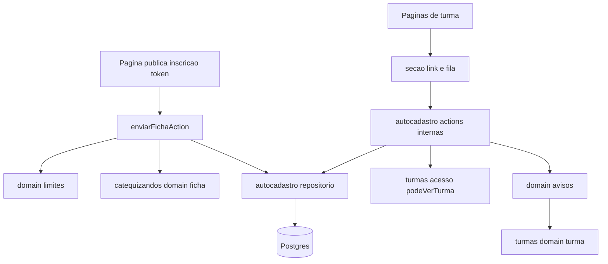
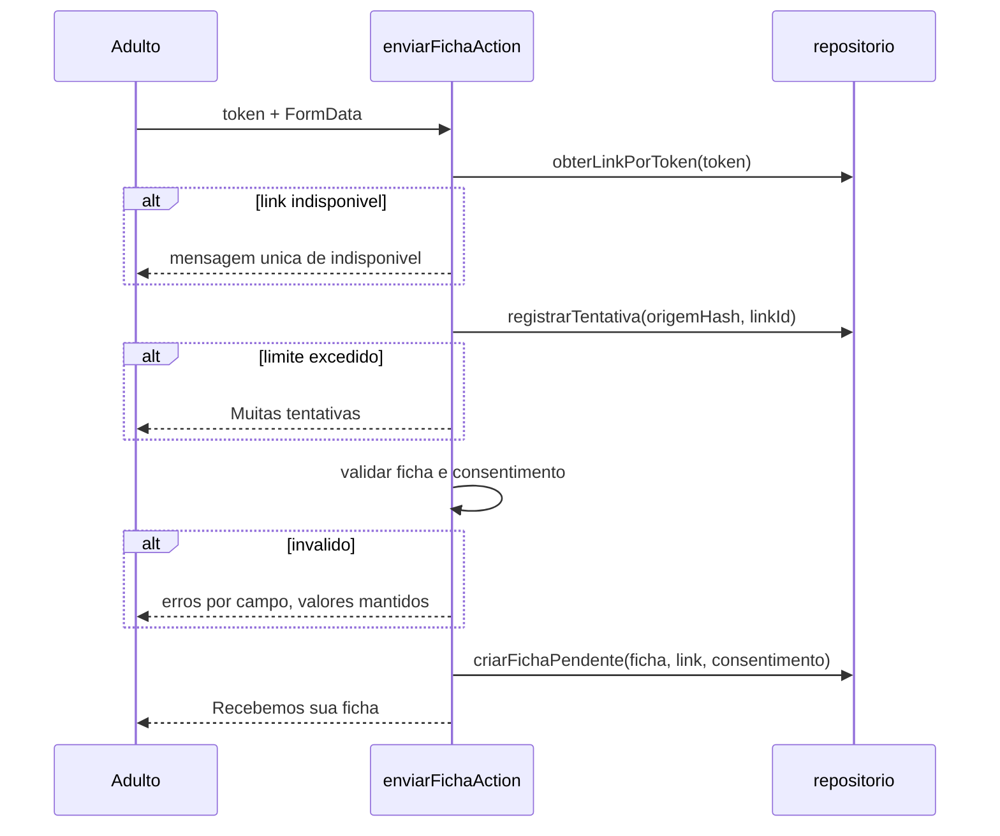
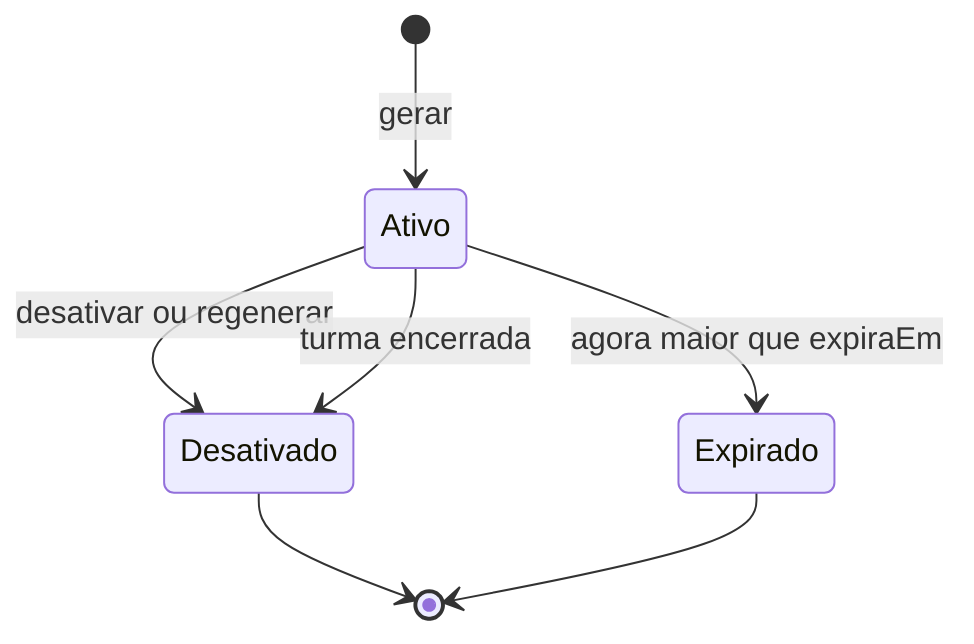

# Design Document — autocadastro-catequizandos

## Overview
Esta funcionalidade cria a primeira área pública do sistema: um link de autocadastro por turma. O adulto abre o link sem login, preenche a própria ficha e consente com o uso dos dados. A ficha entra como pendente, já vinculada à turma. O catequista responsável ou a coordenação revisa a fila da turma e confirma a ficha, o que ativa o catequizando e o inscreve, ou a descarta, o que a exclui.

**Usuários**: adultos convidados (anônimos, pelo celular), catequistas responsáveis pela turma e coordenação.

**Impacto**: adiciona o módulo `autocadastro`, três tabelas, uma rota pública e seções novas nas páginas de turma. Os módulos `catequizandos` e `turmas` não mudam de comportamento.

### Goals
- Link único por turma, com ciclo de vida completo: gerar, copiar, desativar, regenerar e expirar.
- Formulário público com as mesmas validações da ficha interna, consentimento registrado e proteção contra abuso.
- Fila de revisão com avisos de duplicata e de lotação, confirmação atômica (ativação + inscrição) e descarte com exclusão.

### Non-Goals
- Login de catequizandos, envio automático do link, edição da ficha pelo autor e links individuais.
- Mudar a regra de duplicidade ou a recusa de pendentes de `cadastro-catequizandos`.

## Boundary Commitments

### This Spec Owns
- O link de autocadastro da turma: dados, situação (ativo, desativado, expirado) e ações.
- A origem da ficha recebida pelo link: turma, link, consentimento (data e versão) e data de recebimento.
- O texto e a versão do consentimento LGPD.
- O limite de envios do formulário público.
- A fila de pendentes por turma e as ações confirmar com inscrição, corrigir e descartar, restritas às fichas com origem de autocadastro.
- A rota pública `/inscricao/[token]`.

### Out of Boundary
- Campos e regras de validação da ficha (`cadastro-catequizandos`, `domain/ficha.ts`), reutilizados sem alteração.
- Regras de inscrição, de lotação e de encerramento de turma (`gestao-turmas`). Esta spec só lê a lotação e grava a inscrição inicial pelo próprio repositório.
- A recusa de pendentes pela área "Catequizandos" (`cadastro-catequizandos`), que continua valendo.
- A chamada de presença (`controle-presenca`).

### Allowed Dependencies
- `@/modules/turmas/acesso` (`podeVerTurma`) para autorizar o catequista por turma.
- Arquivos puros `domain/*.ts` de módulos upstream: `@/modules/catequizandos/domain/ficha` e `@/modules/turmas/domain/turma` (`estaLotada`, `formatarOcupacao`). Isso exige ampliar a exceção de `structure.md` (ver Migration Strategy).
- `@/modules/compartilhado/*`, `@/modules/auth/dal` (`getSessao`, `requireRole`), `@/lib/prisma`, `@/lib/env`.
- Tabelas `Catequizando`, `SacramentoRecebido`, `Inscricao`, `Turma` e `Designacao`, lidas e escritas pelo repositório do próprio módulo, como já faz `turmas`.

### Revalidation Triggers
- Mudança de campos ou de regras em `criarFichaSchema`.
- Mudança na regra de lotação, na unicidade de inscrição vigente ou na semântica de `encerradaEm`.
- Mudança nas FKs de `Catequizando` (o descarte exclui os filhos explicitamente).
- Inclusão de novas rotas públicas no `matcher` de `src/proxy.ts`.

## Architecture

### Existing Architecture Analysis
- Monolito Next.js 16 (App Router), com Server Components, Server Actions e Prisma 7 sobre Postgres.
- Cada módulo tem `actions.ts` ("use server"), `repositorio.ts` (server-only), `mensagens.ts` e `domain/*.ts` puros.
- A autorização é feita pela DAL em cada página e action. O `proxy.ts` só checa se há cookie de sessão.
- Feedback ao usuário usa `?aviso=<codigo>` com `Aviso`; diálogos de confirmação usam o componente `Confirmacao`.

### Architecture Pattern & Boundary Map

- A fronteira pública (`enviarFichaAction`) não depende de sessão e nunca devolve dados do banco além da turma do próprio link.
- As actions internas sempre passam por `autorizarTurma`, que usa `podeVerTurma`.

### Technology Stack
| Layer | Choice / Version | Role in Feature | Notes |
|-------|------------------|-----------------|-------|
| Frontend | Next.js 16 RSC + React 19 | Página pública e seções da turma | Formulário público funciona sem JS (progressive enhancement) |
| Backend | Server Actions | Envio público e ações de revisão | Sem novas rotas de API |
| Data | Prisma 7 + PostgreSQL | 3 tabelas novas | Migração `autocadastro` |
| Crypto | `node:crypto` | Token (`randomBytes(32)`), hash HMAC-SHA256 do IP | Nova env `AUTOCADASTRO_SEGREDO` |

## File Structure Plan

### Directory Structure
```
src/modules/autocadastro/
├── domain/
│   ├── link.ts            # situacaoDoLink(link, turma, agora); validarExpiracao(data, hoje)
│   ├── consentimento.ts   # VERSAO_CONSENTIMENTO e TEXTO_CONSENTIMENTO
│   ├── limites.ts         # POLITICA_LIMITES e avaliarLimite(contagem, janelaInicio, agora, politica)
│   └── avisos.ts          # avisosDaFicha({duplicados, inscritos, vagas}) → AvisoRevisao[]
├── token.ts               # gerarToken(); hashOrigem(ip) (server-only)
├── origem.ts              # ipDaRequisicao(headers) (server-only)
├── repositorio.ts         # links, fichas de autocadastro, contagem de limites, confirmar/descartar
├── autorizacao.ts         # autorizarTurma(turmaId) → SessaoUsuario | redirect (server-only)
├── mensagens.ts           # MSG_* e CODIGOS_AVISO do módulo
├── actions-publicas.ts    # "use server": enviarFichaAction
└── actions.ts             # "use server": gerarLinkAction, desativarLinkAction, regenerarLinkAction,
                           #   salvarExpiracaoAction, confirmarFichaLinkAction, corrigirFichaLinkAction,
                           #   descartarFichaLinkAction
src/app/inscricao/[token]/
├── page.tsx               # página pública: formulário ou "link indisponível"
└── inscricao.module.css   # layout mobile-first "Acolhedor"
src/app/(interno)/coordenacao/turmas/[id]/pendentes/page.tsx
src/app/(interno)/coordenacao/turmas/[id]/pendentes/[fichaId]/page.tsx
src/app/(interno)/catequista/turmas/[id]/pendentes/page.tsx
src/app/(interno)/catequista/turmas/[id]/pendentes/[fichaId]/page.tsx
src/components/autocadastro/
├── secao-link.tsx         # situação, expiração, contagem e ações do link (1.1–1.8)
├── copiar-link.tsx        # "use client": botão copiar com aviso "Link copiado"
├── formulario-publico.tsx # "use client": campos da ficha + consentimento (useActionState)
├── fila-pendentes.tsx     # lista da fila com avisos
└── revisao-ficha.tsx      # detalhe, correção, confirmar/"Confirmar mesmo assim", descartar
prisma/migrations/<timestamp>_autocadastro/migration.sql
tests/unit/autocadastro/{link,limites,avisos,consentimento}.test.ts
tests/integration/autocadastro/{link,envio,revisao,helpers}.test.ts
tests/e2e/autocadastro.spec.ts
```

### Modified Files
- `prisma/schema.prisma`: modelos `LinkAutocadastro`, `FichaAutocadastro` e `LimiteAutocadastro`, mais as relações inversas em `Turma` e `Catequizando`.
- `src/proxy.ts`: adicionar `inscricao` à lista de exclusões do `matcher`.
- `src/lib/env.ts`: `AUTOCADASTRO_SEGREDO` (obrigatória) e `APP_URL` (se ainda não existir), para montar o link absoluto.
- `src/components/catequizandos/formulario-ficha.tsx`: exportar `CamposFicha` e aceitar a prop `idPrefixo`, para reuso no formulário público e na correção. Sem mudança de comportamento.
- `src/app/(interno)/coordenacao/turmas/[id]/page.tsx` e `src/app/(interno)/catequista/turmas/[id]/page.tsx`: incluir `SecaoLink` e o atalho para a fila (1.8, 5.3).
- `src/app/(interno)/catequista/turmas/page.tsx`: exibir as pendentes por turma em "Minhas turmas" (5.3).
- `.kiro/steering/structure.md`: ampliar a exceção de imports para os `domain/*.ts` puros de módulos upstream.
- `tests/unit/auth/rota-protegida.test.ts`: casos para `/inscricao/...` como rota pública.

## System Flows

### Envio público

A contagem de tentativas é incrementada antes da validação, para que envios inválidos repetidos também contem. Se o limite for excedido, nada é gravado além do contador (4.4).

### Ciclo de vida do link

Os estados "Expirado" e "Desativado por encerramento" são calculados por `situacaoDoLink`, sem job e sem alterar `gestao-turmas`. Depois de desativar, gerar cria um link novo.

### Confirmação
`confirmarFichaLinkAction` segue estes passos:
1. Autoriza a turma.
2. Revalida a ficha com `criarFichaSchema`.
3. Se a turma estiver encerrada, bloqueia (7.6).
4. Se a turma estiver lotada e `confirmarLotacao` for diferente de "1", devolve `lotada`.
5. Em uma transação, executa o update condicional `pendente → ativo` (0 linhas → "já revisada"), cria a `Inscricao` com a entrada em `hojeCivil()` e marca `revisadaEm`.

## Requirements Traceability

| Requirement | Summary | Components | Interfaces / Flows |
|-------------|---------|------------|--------------------|
| 1.1 | Gerar link único | gerarToken, repositorio, SecaoLink | gerarLinkAction |
| 1.2 | Copiar link | CopiarLink | Clipboard API no cliente |
| 1.3 | Um link ativo por turma | repositorio, migração | índice único parcial |
| 1.4 | Desativar | repositorio | desativarLinkAction |
| 1.5 | Regenerar | repositorio, Confirmacao | regenerarLinkAction (transação) |
| 1.6, 1.7 | Expiração opcional | domain/link | salvarExpiracaoAction, validarExpiracao |
| 1.8 | Situação e contagem | domain/link, SecaoLink | situacaoDoLink, contarPendentesDoLink |
| 1.9 | Encerramento desativa | domain/link | situacaoDoLink (turma.encerradaEm) |
| 1.10 | Acesso negado | autorizacao | autorizarTurma |
| 2.1, 2.3 | Formulário sem login, só dados da turma | página pública, repositorio | obterLinkPublico (projeção restrita) |
| 2.2 | Mensagem única de indisponível | domain/link, página pública | situacaoDoLink |
| 2.4, 2.5 | Mobile "Acolhedor", 3 s em 3G | página pública, CSS | RSC sem JS obrigatório |
| 3.1, 3.2 | Mesmas validações, erros por campo | FormularioPublico, criarFichaSchema | enviarFichaAction |
| 3.3, 3.4 | Consentimento obrigatório | domain/consentimento | enviarFichaAction |
| 3.5 | Pendente com consentimento | repositorio | criarFichaPendente |
| 3.6, 3.7 | Confirmação única, sem revelar duplicata | actions-publicas, mensagens | MSG_RECEBIDA |
| 4.1–4.4 | Limites por origem e por link | domain/limites, origem, repositorio | registrarTentativa |
| 5.1, 5.2 | Fila e detalhe | FilaPendentes, RevisaoFicha | listarFila, obterFichaLink |
| 5.3 | Contagem na turma e em "Minhas turmas" | SecaoLink, página de turmas | contarPendentesPorTurma |
| 5.4 | Acesso negado | autorizacao | autorizarTurma |
| 5.5 | Corrigir antes de confirmar | RevisaoFicha | corrigirFichaLinkAction |
| 6.1–6.4 | Aviso de duplicata | domain/avisos, repositorio | buscarCoincidencias, avisosDaFicha |
| 7.1–7.6 | Confirmação com inscrição | actions, repositorio | confirmarFichaLinkAction |
| 8.1–8.4 | Descarte com exclusão | actions, repositorio | descartarFichaLinkAction |

## Components and Interfaces

| Component | Layer | Intent | Req Coverage | Key Dependencies |
|-----------|-------|--------|--------------|------------------|
| domain/link | Domínio | Situação do link e validação da expiração | 1.6–1.9, 2.2 | — |
| domain/consentimento | Domínio | Texto e versão do consentimento | 3.3, 3.5 | — |
| domain/limites | Domínio | Política de janela fixa | 4.1–4.3 | — |
| domain/avisos | Domínio | Avisos de duplicata e lotação | 6.1–6.3, 7.2 | turmas/domain/turma (P0) |
| token / origem | Infra | Token aleatório, IP e hash | 1.1, 4.1 | node:crypto, next/headers |
| repositorio | Persistência | Leitura e escrita do módulo | todos | Prisma (P0) |
| autorizacao | Aplicação | Coordenação ou catequista da turma | 1.10, 5.4 | turmas/acesso (P0), auth/dal |
| actions-publicas | Aplicação | Envio público | 2, 3, 4 | catequizandos/domain/ficha (P0) |
| actions | Aplicação | Link e revisão | 1, 5, 7, 8 | autorizacao, repositorio |
| UI (`components/autocadastro`) | Interface | Seções, fila, revisão e formulário público | 1.2, 1.8, 2.4, 5, 6, 7, 8 | Confirmacao, Aviso, CamposFicha |

### Domínio

#### domain/link
```typescript
export type SituacaoLink = "ativo" | "desativado" | "expirado";
export interface LinkEstado { desativadoEm: Date | null; expiraEm: DataCivil | null }
export function situacaoDoLink(link: LinkEstado, turmaEncerrada: boolean, hoje: DataCivil): SituacaoLink;
export function validarExpiracao(data: DataCivil | null, hoje: DataCivil): { ok: true } | { ok: false; erro: string };
```
- O link expira ao fim do dia de `expiraEm`: um link com `expiraEm` igual a hoje continua ativo. Com a turma encerrada, a situação é "desativado".

#### domain/limites
```typescript
export interface PoliticaLimite { maximo: number; janelaMs: number }
export const POLITICA_LIMITES: { origem: PoliticaLimite; link: PoliticaLimite }; // origem 5/h, link 60/h
export function avaliarLimite(
  atual: { contagem: number; janelaInicio: Date } | null, agora: Date, p: PoliticaLimite,
): { permitido: boolean; proxima: { contagem: number; janelaInicio: Date } };
```

#### domain/avisos
```typescript
export type AvisoRevisao =
  | { tipo: "duplicata"; coincidentes: { id: string; nome: string; visivel: boolean }[] }
  | { tipo: "lotada"; inscritos: number; vagas: number };
export function avisosDaFicha(e: {
  coincidentes: { id: string; nome: string; visivel: boolean }[];
  inscritos: number; vagas: number | null;
}): AvisoRevisao[];
```
- A coincidência é por e-mail normalizado (minúsculas, sem espaços) ou por telefone normalizado (só dígitos), contra catequizandos em qualquer estado, excluindo a própria ficha (6.1).
- `visivel` vale `true` para a coordenação. Para o catequista, vale `true` só se o coincidente tiver inscrição vigente em turma dele (6.2, 6.3). Quando não é visível, a interface mostra apenas "Possível duplicata".

### Persistência

#### repositorio (server-only)
```typescript
export function obterLinkDaTurma(turmaId: string): Promise<LinkResumo | null>;     // inclui contagem de pendentes
export function criarLink(turmaId: string, token: string, userId: string): Promise<void>;
export function desativarLink(turmaId: string): Promise<boolean>;
export function regenerarLink(turmaId: string, token: string, userId: string): Promise<void>; // transação
export function salvarExpiracao(turmaId: string, expiraEm: DataCivil | null): Promise<boolean>;
export function obterLinkPublico(token: string): Promise<LinkPublico | null>;      // só nome, dia, horário, local da turma
export function registrarTentativa(chave: string, politica: PoliticaLimite, agora: Date): Promise<boolean>;
export function criarFichaPendente(f: FichaDados, linkId: string, turmaId: string, consentimento: { em: Date; versao: string }): Promise<void>;
export function listarFila(turmaId: string): Promise<ItemFila[]>;
export function obterFichaLink(turmaId: string, catequizandoId: string): Promise<FichaLinkDetalhe | null>;
export function buscarCoincidencias(email: string | null, telefone: string, ignorarId: string): Promise<Coincidencia[]>;
export function contarPendentesPorTurma(turmaIds: string[]): Promise<Map<string, number>>;
export function confirmarComInscricao(catequizandoId: string, turmaId: string, entrada: DataCivil): Promise<"ok" | "ja-revisada">;
export function descartar(catequizandoId: string, turmaId: string): Promise<"ok" | "ja-revisada">;
export function atualizarFichaPendente(catequizandoId: string, turmaId: string, f: FichaDados): Promise<"ok" | "ja-revisada">; // mantém estado pendente e origem
```
- Sem `x-forwarded-for` (ambiente local), o limite por origem é ignorado e só o limite por link se aplica, para não juntar todos os envios numa única cota (4.3).
- A fila e o descarte continuam acessíveis em turma encerrada; confirmar e corrigir exigem turma aberta.
- `registrarTentativa` faz um upsert numa transação com `SELECT ... FOR UPDATE` e devolve `false` quando o limite é excedido.
- `descartar` exclui `SacramentoRecebido`, `FichaAutocadastro` e `Catequizando` com `estado = 'pendente'`, mas só se existir `FichaAutocadastro` da turma (8.2).

### Aplicação

#### actions-publicas
```typescript
export type EstadoEnvio =
  | { tipo: "inicial" }
  | { tipo: "invalido"; errosCampos: Record<string, string>; valores: Record<string, string>; erroConsentimento?: string }
  | { tipo: "limite" } | { tipo: "indisponivel" } | { tipo: "recebida" };
export async function enviarFichaAction(token: string, anterior: EstadoEnvio, dados: FormData): Promise<EstadoEnvio>;
```
- `recebida` nunca carrega dados (3.6), e a coincidência com cadastros existentes não altera o resultado (3.7).
- Erros inesperados devolvem `indisponivel`, sem stack trace.

#### actions (internas)
- Todas começam com `autorizarTurma(turmaId)`. Ele chama `requireSession` e, se `podeVerTurma` for falso, faz `redirect("/acesso-negado")`. Ações de mudança também exigem que a turma esteja aberta, menos o descarte, que vale em qualquer situação da turma.
- `confirmarFichaLinkAction(turmaId, catequizandoId, anterior, dados)` devolve `{ lotada?: {inscritos, vagas}; erro?: string }` ou faz o redirect com `?aviso=ficha-confirmada`. O padrão de reenvio com `confirmarLotacao=1` é o mesmo de `inscreverAction`.
- `regenerarLinkAction` e `descartarFichaLinkAction` usam `Confirmacao` (1.5, 8.1).

## Data Models

### Physical Data Model
```prisma
model LinkAutocadastro {
  id           String    @id @default(uuid()) @db.Uuid
  turmaId      String    @db.Uuid
  token        String    @unique
  expiraEm     DateTime? @db.Date
  desativadoEm DateTime?
  criadoPorId  String
  createdAt    DateTime  @default(now())
  turma        Turma     @relation(fields: [turmaId], references: [id], onDelete: Restrict)
  fichas       FichaAutocadastro[]
  @@index([turmaId])
  @@map("link_autocadastro")
}

model FichaAutocadastro {
  catequizandoId      String    @id @db.Uuid
  turmaId             String    @db.Uuid
  linkId              String    @db.Uuid
  consentidoEm        DateTime
  versaoConsentimento String
  recebidaEm          DateTime  @default(now())
  revisadaEm          DateTime?
  catequizando        Catequizando     @relation(fields: [catequizandoId], references: [id], onDelete: Restrict)
  turma               Turma            @relation(fields: [turmaId], references: [id], onDelete: Restrict)
  link                LinkAutocadastro @relation(fields: [linkId], references: [id], onDelete: Restrict)
  @@index([turmaId, revisadaEm])
  @@map("ficha_autocadastro")
}

model LimiteAutocadastro {
  chave        String   @id            // "origem:<hmac>" ou "link:<uuid>"
  contagem     Int
  janelaInicio DateTime
  @@map("limite_autocadastro")
}
```
- Índice único parcial na migração SQL: `CREATE UNIQUE INDEX link_ativo_unico ON link_autocadastro(turma_id) WHERE desativado_em IS NULL` (1.3).
- O IP nunca é armazenado em claro: a chave guarda o HMAC-SHA256 com `AUTOCADASTRO_SEGREDO`.
- As fichas confirmadas mantêm `FichaAutocadastro` como prova do consentimento (LGPD).

## Error Handling

### Error Categories and Responses
| Situação | Resposta |
|----------|----------|
| Token inválido, desativado, expirado ou turma encerrada | "Este link não está mais disponível. Fale com seu catequista." (2.2) |
| Limite excedido | "Muitas tentativas. Tente novamente mais tarde." (4.1, 4.2) |
| Ficha inválida | Erros por campo, com os valores mantidos (3.2) |
| Sem consentimento | "Para enviar, é preciso concordar com o uso dos dados." (3.4) |
| Ficha já revisada | "Esta ficha já foi revisada." (7.5) |
| Turma lotada | Aviso com "Confirmar mesmo assim" (7.2) |
| Turma encerrada na confirmação | "A turma está encerrada. A coordenação pode tratar a ficha em Catequizandos." (7.6) |
| Sem permissão | redirect `/acesso-negado` (1.10, 5.4) |

### Monitoring
- `console.error` em falhas inesperadas da action pública, sem dados da ficha nem IP.

## Testing Strategy

### Unit Tests
- `situacaoDoLink`: ativo, desativado, expirado no dia seguinte a `expiraEm`, ativo em `expiraEm` e turma encerrada (1.6–1.9, 2.2).
- `validarExpiracao` rejeita data passada (1.7).
- `avaliarLimite`: abaixo do limite, no limite, janela renovada (4.1–4.3).
- `avisosDaFicha`: duplicata visível e não visível, lotada e vagas nulas (6.1–6.3, 7.2).
- Rota `/inscricao/abc` pública no `matcher` (2.1).

### Integration Tests (banco de teste)
- Gerar com um link já ativo falha. Regenerar invalida o anterior (1.1, 1.3, 1.5).
- Envio válido cria pendente com consentimento e versão. Envio sem aceite não grava nada (3.4, 3.5).
- E-mail duplicado devolve `recebida` (3.7). O sexto envio da mesma origem devolve `limite` e não grava (4.1, 4.4).
- Catequista de outra turma é redirecionado (1.10, 5.4).
- Confirmar ativa e inscreve com a data de hoje. Turma lotada sem a flag não grava. A segunda confirmação devolve "já revisada" (7.1–7.5).
- Descartar remove catequizando, sacramentos e origem. Ficha ativa não pode ser descartada (8.1, 8.2).

### E2E (Playwright)
- O catequista gera e copia o link. Um contexto anônimo abre o link num viewport de 360 px, envia a ficha e vê a confirmação. O catequista vê a fila com contagem 1, confirma, e o catequizando aparece nos inscritos.
- A coordenação desativa o link. O contexto anônimo vê a mensagem de indisponível.
- Descarte com confirmação explícita: a ficha some da fila.

## Security Considerations
- O token tem 256 bits aleatórios em base64url e só dá acesso ao envio. A página pública expõe apenas nome, dia, horário e local da turma.
- O formulário público é protegido contra CSRF pelos mecanismos nativos das Server Actions (checagem de origem).
- As respostas da action pública são indistinguíveis quanto à existência de cadastros (3.7) e ao motivo da indisponibilidade (2.2).
- Coleta mínima: os mesmos campos da ficha interna. O IP é guardado só como hash.

## Performance & Scalability
- A página pública é um RSC com CSS do módulo e um único componente cliente (o formulário), sem bibliotecas novas. Meta: menos de 3 s em 3G (2.5).

## Migration Strategy
1. Atualizar `structure.md` com a ampliação da exceção de imports (domain puro upstream).
2. Migração `autocadastro`: as três tabelas e o índice parcial. Nenhum dado existente é alterado.
3. Adicionar `AUTOCADASTRO_SEGREDO` no `.env.example`, na Vercel e no CI.
