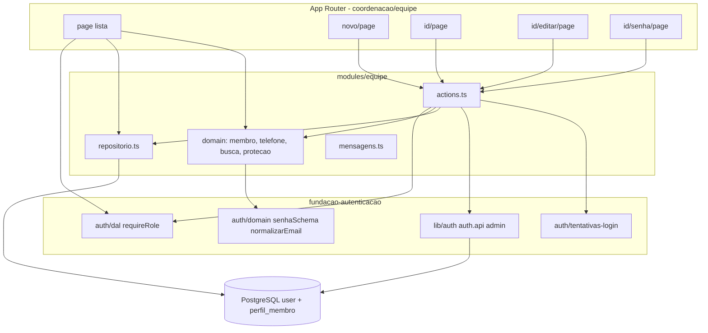
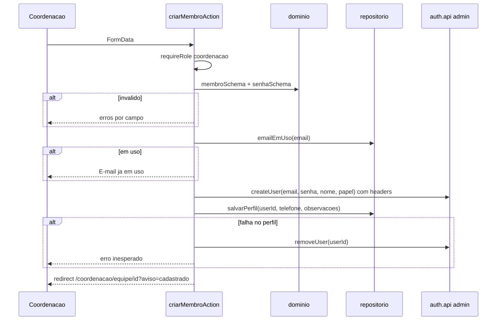
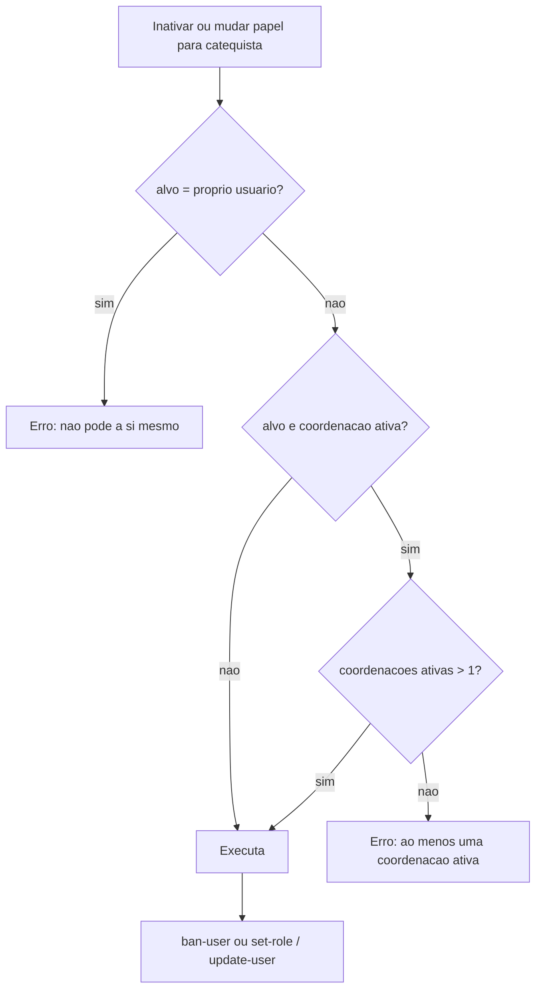

# Design: cadastro-catequistas

## Overview

**Propósito**: dar à coordenação a gestão da **equipe**, isto é, os membros com papel catequista ou coordenação. A coordenação pode:
- cadastrar membros, com contato e conta de acesso;
- buscar e filtrar a equipe;
- editar dados e papel;
- redefinir senhas;
- inativar e reativar membros, sem excluir ninguém.

**Usuários**: somente a coordenação, pelo celular ou pelo computador.

**Impacto**: cria o módulo `equipe`, a tabela `perfil_membro` e a área `/coordenacao/equipe`, e acrescenta o item "Equipe" ao menu da coordenação. Reutiliza sem alterar os contratos da fundação: `requireRole`, `senhaSchema`, `normalizarEmail`, `limparFalhas` e o plugin admin.

### Goals
- Gerir o ciclo de vida da conta de cada membro da equipe inteiramente pela interface.
- Garantir que o sistema nunca fique sem uma coordenação ativa.
- Entregar listas e formulários que sirvam de padrão para as próximas specs (catequizandos e turmas).

### Non-Goals
- Vínculo com turmas, histórico de formação, autocadastro de membros e envio automático de credenciais.
- Troca e recuperação de senha pelo próprio usuário.

## Boundary Commitments

### This Spec Owns
- Entidade **PerfilMembro** (telefone e observações) e a noção de **situação** (ativo = conta não banida).
- As regras de validação da ficha do membro (`membroSchema`) e do telefone brasileiro.
- As regras de proteção da coordenação (Req 7).
- A busca e a paginação da equipe (funções puras reutilizáveis).
- As rotas `/coordenacao/equipe/**` e o item "Equipe" em `menuPorPapel`.
- **Contratos que esta spec estabiliza para as specs seguintes**:
  - `listarMembros({ situacao })` e `MembroResumo`, que `gestao-turmas` usará para listar catequistas ativos;
  - `normalizarBusca`, `filtrarPorTermo` e `paginar`, que servirão às listas de catequizandos;
  - `formatarTelefone` e `telefoneSchema`.

### Out of Boundary
- Login, sessão, bloqueio por tentativas e mensagem de conta desabilitada (fundação: consumidos, não alterados).
- Turmas e responsabilidades (`gestao-turmas`).
- Troca de senha pelo próprio usuário.

### Allowed Dependencies
- Da fundação: `@/modules/auth/dal` (`requireRole`, `getSessao`), `@/modules/auth/domain/{senha,credenciais,papeis}`, `@/modules/auth/tentativas-login` (`limparFalhas`), `@/lib/auth` (`auth.api.*` do plugin admin), `@/lib/prisma`, `AppShell` e `menu-por-papel`.
- Bibliotecas: as mesmas da fundação (Zod, Prisma e Better Auth). Nenhuma nova dependência.
- Regra: `src/modules/equipe/domain` não importa Next, Prisma nem Better Auth.

### Revalidation Triggers
- Mudança em `MembroResumo`, `listarMembros` ou na definição de "situação ativa" afeta `gestao-turmas`.
- Mudança nas funções de busca e paginação afeta as listas das specs seguintes.
- Qualquer ajuste de permissões em `auth-permissoes.ts` (ver o risco do `ban-user`) exige rodar de novo a suíte de autenticação da fundação.

## Architecture

### Architecture Pattern & Boundary Map

O módulo `equipe` segue o mesmo padrão do módulo `auth`:
- um **domínio puro** (validação, telefone, busca, proteção da coordenação);
- um **repositório** (Prisma);
- **Server Actions** finas, que autorizam com `requireRole(["coordenacao"])`, validam e só então chamam o repositório e o `auth.api.*`, repassando os `headers` da coordenação.



### Technology Stack

| Camada | Escolha | Papel nesta spec | Notas |
|---|---|---|---|
| UI | Next.js 16 App Router, React 19 | Lista, formulários, página do membro, `<dialog>` de confirmação | Server Components; formulários como Client Components com `useActionState` |
| Backend | Server Actions + Better Auth 1.7 (plugin admin) | Criar, editar, trocar papel e senha, banir e desbanir, revogar sessões | Sempre com os `headers` da coordenação |
| Dados | Prisma 7 + PostgreSQL | Nova tabela `perfil_membro` | Migração `perfil_membro` |
| Validação | Zod | `membroSchema`, `telefoneSchema`, `senhaSchema` (reuso) | |

## File Structure Plan

### Directory Structure
```
prisma/
├── schema.prisma                       # + model PerfilMembro (1:1 com User)
└── migrations/<ts>_perfil_membro/      # nova migração
src/modules/equipe/
├── domain/
│   ├── telefone.ts                     # normalizarTelefone, formatarTelefone, telefoneSchema, linkWhatsApp, linkLigacao
│   ├── membro.ts                       # membroSchema (criar/editar), tipos DadosMembro, Situacao
│   ├── busca.ts                        # normalizarBusca, filtrarPorTermo, filtrarMembros, paginar
│   └── protecao-coordenacao.ts         # verificarProtecaoCoordenacao
├── repositorio.ts                      # listarMembros, obterMembro, emailEmUso, salvarPerfil, contarCoordenacoesAtivas
├── actions.ts                          # criar, editar, redefinirSenha, inativar, reativar (Server Actions)
└── mensagens.ts                        # textos pt-BR e códigos de aviso (flash)
src/components/equipe/
├── formulario-membro.tsx               # Client: campos do membro (criar e editar; senha só na criação)
├── lista-membros.tsx                   # Server: lista em linhas com borda, estado vazio
├── busca-equipe.tsx                    # Form GET: termo e situação (sem JS obrigatório)
├── paginacao.tsx                       # Links anterior e próxima preservando a query
├── formulario-senha.tsx                # Client: nova senha
├── acoes-situacao.tsx                  # Client: botão com <dialog> de confirmação (inativar/reativar)
└── aviso.tsx                           # Mensagem de sucesso a partir de código fixo (?aviso=)
src/app/(interno)/coordenacao/equipe/
├── page.tsx                            # Lista + busca + paginação (3.x)
├── novo/page.tsx                       # Cadastro (2.x)
└── [id]/
    ├── page.tsx                        # Página do membro (8.x, 6.6)
    ├── not-found.tsx                   # "Membro não encontrado" (8.5)
    ├── editar/page.tsx                 # Edição (4.x)
    └── senha/page.tsx                  # Redefinir senha (5.x)
tests/unit/equipe/                      # telefone, membro, busca, protecao, componentes
tests/integration/equipe/               # repositorio, actions (criar, editar, senha, situação, proteção)
tests/e2e/equipe.spec.ts                # fluxos principais
```

### Modified Files
- `src/components/layout/menu-por-papel.ts`: adiciona `{ rotulo: "Equipe", href: "/coordenacao/equipe" }` para a coordenação (1.1).
- `src/app/globals.css`: estilos de lista, busca, paginação, aviso, página do membro e formulários, seguindo o design system. Os estilos do `<dialog>` ficam num CSS Module próprio do componente `acoes-situacao`.
- `tests/integration/setup.ts` e `tests/e2e/preparar-banco.ts`: incluem `perfil_membro` nas listas de TRUNCATE.

## System Flows

### Cadastro de membro



### Inativar, mudar papel e proteção da coordenação



## Requirements Traceability

| Req | Resumo | Componentes | Interfaces |
|---|---|---|---|
| 1.1 | Área e menu só para a coordenação | menu-por-papel, pages com `requireRole` | `menuPorPapel` |
| 1.2 | Catequista vê "Acesso negado" | pages da equipe | `requireRole(["coordenacao"])` |
| 1.3 | Ação direta rejeitada | actions.ts | `requireRole` antes de validar e escrever |
| 2.1 | Criar membro ativo com conta | criarMembroAction, repositorio | `auth.api.createUser`, `salvarPerfil` |
| 2.2 | Campos obrigatórios e opcionais | membro.ts | `membroCriacaoSchema` |
| 2.3 | Erros por campo | formulario-membro, actions | `EstadoFormulario.errosCampos` |
| 2.4 | Senha mínima | senhaSchema (reuso) | — |
| 2.5 | E-mail em uso | repositorio | `emailEmUso` |
| 2.6 | Papel válido, catequista pré-selecionado | membro.ts, formulario-membro | `papelSchema` |
| 2.7 | E-mail normalizado | membro.ts | `normalizarEmail` (reuso) |
| 2.8 | Telefone BR e formatação | telefone.ts | `telefoneSchema`, `formatarTelefone` |
| 2.9 | "Membro cadastrado" e lembrete | aviso.tsx, mensagens.ts | `?aviso=cadastrado` |
| 2.10 | Senha nunca exibida | actions (não retorna senha), páginas | — |
| 3.1 | Lista ativa em ordem alfabética | page lista, repositorio, busca | `listarMembros`, `filtrarMembros` |
| 3.2 | Busca sem acentos | busca.ts | `normalizarBusca`, `filtrarPorTermo` |
| 3.3 | Filtro de situação | busca.ts, busca-equipe | `Situacao` |
| 3.4 | Estado na URL | busca-equipe (form GET), paginacao | `searchParams` |
| 3.5 | Estado vazio | lista-membros | — |
| 3.6 | Paginação de 20 | busca.ts, paginacao | `paginar` |
| 3.7 | Sem rolagem a 360 px | globals.css | — |
| 4.1 | Salvar edição | editarMembroAction | `auth.api.adminUpdateUser`, `salvarPerfil` |
| 4.2 | Mesmas validações | membro.ts | `membroEdicaoSchema` |
| 4.3 | E-mail em uso por outro | repositorio | `emailEmUso(email, excetoId)` |
| 4.4 | Login com o novo e-mail | adminUpdateUser | — |
| 4.5 | Papel vale na próxima página | DAL da fundação (sem cache) | — |
| 4.6 | Sem senha na edição | formulario-membro (modo edição) | — |
| 5.1 | Nova senha e sessões encerradas | redefinirSenhaAction | `setUserPassword`, `revokeUserSessions` |
| 5.2 | Senha mínima | senhaSchema | — |
| 5.3 | "Senha redefinida" | aviso.tsx | `?aviso=senha-redefinida` |
| 5.4 | Libera o bloqueio de tentativas | redefinirSenhaAction | `limparFalhas` (reuso) |
| 6.1 | Inativar bloqueia e encerra sessões | inativarMembroAction | `banUser` |
| 6.2 | Confirmação nomeada | acoes-situacao (`<dialog>`) | — |
| 6.3 | Login recusado | fundação (BANNED_USER) | — |
| 6.4 | Reativar | reativarMembroAction | `unbanUser` |
| 6.5 | Nunca excluir | actions (sem remoção, exceto compensação) | — |
| 6.6 | Situação visível | lista-membros, página do membro | `MembroResumo.situacao` |
| 7.1 | Não inativar a si mesmo | protecao-coordenacao | `verificarProtecaoCoordenacao` |
| 7.2 | Não remover o próprio papel | protecao-coordenacao | idem |
| 7.3 | Ao menos uma coordenação ativa | protecao-coordenacao, repositorio | `contarCoordenacoesAtivas` |
| 8.1 | Página do membro | [id]/page, repositorio | `obterMembro` |
| 8.2 | Ações conforme a situação | [id]/page, acoes-situacao | — |
| 8.3 | Links de ligação e WhatsApp | telefone.ts | `linkLigacao`, `linkWhatsApp` |
| 8.4 | pt-BR, design system, teclado, 360 px | componentes, globals.css | — |
| 8.5 | Membro não encontrado | [id]/not-found.tsx | `notFound()` |

## Components and Interfaces

| Componente | Camada | Intenção | Reqs | Dependências |
|---|---|---|---|---|
| telefone | domain | Normalizar, validar, formatar e gerar links | 2.8, 8.3 | nenhuma |
| membro | domain | Schemas de criação e edição | 2.2–2.8, 4.2, 4.6 | Zod, auth/domain (senha, credenciais, papeis) |
| busca | domain | Normalização, filtro e paginação | 3.1–3.3, 3.6 | nenhuma |
| protecao-coordenacao | domain | Regras do Req 7 | 7.1–7.3 | papeis |
| repositorio | módulo | Leitura e escrita de membros e perfis | 2.1, 2.5, 3.1, 4.3, 7.3, 8.1 | prisma |
| actions | módulo | Orquestrar as operações | 1.3, 2.x, 4.x, 5.x, 6.x, 7.x | dal, domain, repositorio, auth.api, tentativas-login |
| mensagens | módulo | Textos e códigos de aviso | 2.9, 5.3, 7.x | nenhuma |
| UI da equipe | app/components | Telas | 1.1, 1.2, 3.x, 6.2, 8.x | actions, repositorio (leitura) |

### Domínio (`src/modules/equipe/domain`)

#### telefone.ts
```typescript
/** Só dígitos; aceita 10 ou 11 dígitos (DDD + número). Remove um +55 inicial. */
export function normalizarTelefone(entrada: string): string | null;
/** "11987654321" → "(11) 98765-4321"; "1133334444" → "(11) 3333-4444". */
export function formatarTelefone(digitos: string): string;
export const telefoneSchema: z.ZodType<string>; // saída: só dígitos; mensagem "Informe um telefone com DDD"
export function linkLigacao(digitos: string): string;  // "tel:+5511987654321"
export function linkWhatsApp(digitos: string): string; // "https://wa.me/5511987654321"
```

#### membro.ts
```typescript
import type { Papel } from "@/modules/auth/domain/papeis";
export type Situacao = "ativo" | "inativo";
export type FiltroSituacao = Situacao | "todos";

export const papelSchema: z.ZodType<Papel>;               // "Escolha o papel"
export const membroEdicaoSchema: z.ZodObject<{
  nome: z.ZodString;          // trim, min(1, "Informe o nome"), max(120)
  email: z.ZodPipeline;       // normalizarEmail + email("E-mail inválido")
  telefone: typeof telefoneSchema;
  papel: typeof papelSchema;
  observacoes: z.ZodOptional<z.ZodString>; // trim, max(1000), vazio → undefined
}>;
export const membroCriacaoSchema: typeof membroEdicaoSchema & { senha: typeof senhaSchema };
export type DadosMembro = z.infer<typeof membroEdicaoSchema>;
export type DadosNovoMembro = z.infer<typeof membroCriacaoSchema>;
```

#### busca.ts
```typescript
/** Minúsculas, sem acentos (NFD sem diacríticos) e com espaços colapsados. */
export function normalizarBusca(texto: string): string;
export interface ItemBuscavel { nome: string; email: string; telefone: string | null; situacao: Situacao }
/** Genérico e reutilizável: casa o termo com campos de texto normalizados ou com dígitos. Termo vazio casa com tudo. */
export function filtrarPorTermo<T>(itens: readonly T[], termo: string | undefined, campos: (item: T) => { textos: string[]; digitos?: string | null }): T[];
/** Especialização para a equipe: usa filtrarPorTermo (nome, e-mail e telefone) e depois filtra a situação. */
export function filtrarMembros<T extends ItemBuscavel>(
  itens: readonly T[],
  filtro: { termo?: string; situacao: FiltroSituacao },
): T[]; // ordena por nome (localeCompare "pt-BR")
export interface Pagina<T> { itens: T[]; pagina: number; totalPaginas: number; total: number }
export function paginar<T>(itens: readonly T[], pagina: number, tamanho?: number /* 20 */): Pagina<T>;
```
- `paginar` restringe a página ao intervalo válido: um número inválido ou fora do intervalo vira 1 ou a última página.

#### protecao-coordenacao.ts
```typescript
export type OperacaoSensivel =
  | { tipo: "inativar" }
  | { tipo: "mudar-papel"; novoPapel: Papel };
export type ViolacaoProtecao = "a-si-mesmo" | "proprio-papel" | "ultima-coordenacao";
export function verificarProtecaoCoordenacao(entrada: {
  atorId: string;
  alvo: { id: string; papel: Papel; situacao: Situacao };
  operacao: OperacaoSensivel;
  coordenacoesAtivas: number;
}): ViolacaoProtecao | null;
```
- Regras:
  - inativar a si mesmo resulta em `"a-si-mesmo"`;
  - mudar o próprio papel para catequista resulta em `"proprio-papel"`;
  - se o alvo é coordenação ativa, a operação o removeria da coordenação ativa e `coordenacoesAtivas <= 1`, o resultado é `"ultima-coordenacao"`;
  - mudar para o mesmo papel nunca é uma violação.

### Módulo (`src/modules/equipe`)

#### repositorio.ts (server-only)
```typescript
export interface MembroResumo {
  id: string; nome: string; email: string; papel: Papel;
  telefone: string | null; situacao: Situacao;
}
export interface MembroDetalhe extends MembroResumo { observacoes: string | null; criadoEm: Date }
export function listarMembros(): Promise<MembroResumo[]>;          // todos; o filtro é feito no domínio
export function obterMembro(id: string): Promise<MembroDetalhe | null>;
export function emailEmUso(email: string, excetoId?: string): Promise<boolean>;
export function salvarPerfil(userId: string, dados: { telefone: string; observacoes?: string }): Promise<void>; // upsert
export function contarCoordenacoesAtivas(): Promise<number>;
```
- Papel inválido no banco (`!isPapel`): o registro é omitido da lista. Situação é `banned ? "inativo" : "ativo"`.

#### actions.ts ("use server")
```typescript
export type EstadoFormulario = {
  erro?: string;
  errosCampos?: Partial<Record<"nome" | "email" | "telefone" | "papel" | "observacoes" | "senha", string>>;
  valores?: Partial<Record<"nome" | "email" | "telefone" | "papel" | "observacoes", string>>; // nunca a senha
};
export function criarMembroAction(anterior: EstadoFormulario, dados: FormData): Promise<EstadoFormulario>;
export function editarMembroAction(id: string, anterior: EstadoFormulario, dados: FormData): Promise<EstadoFormulario>;
export function redefinirSenhaAction(id: string, anterior: EstadoFormulario, dados: FormData): Promise<EstadoFormulario>;
export function inativarMembroAction(id: string, anterior: EstadoFormulario): Promise<EstadoFormulario>;
export function reativarMembroAction(id: string, anterior: EstadoFormulario): Promise<EstadoFormulario>;
```
- Toda action começa por `const ator = await requireRole(["coordenacao"])` (1.3) e só depois valida e grava.
- Chamadas `auth.api.*` recebem `headers: await headers()`.
- Em caso de sucesso, fazem `redirect` (fora de try/catch) para a página do membro com `?aviso=<codigo>`.
- **Edição**:
  - se o papel mudou, a action aplica antes `verificarProtecaoCoordenacao` (7.2 e 7.3);
  - atualiza nome e e-mail via `adminUpdateUser`, o papel via `setRole` e o telefone e as observações via `salvarPerfil`.
- **Redefinir senha**: `setUserPassword`, depois `revokeUserSessions` e depois `limparFalhas(email)` (5.1, 5.4).
- **Inativar**: primeiro a proteção, depois `banUser({ userId })`, sem prazo (6.1).
- **Reativar**: `unbanUser` (6.4).
- Erros inesperados: `console.error`, sem dados sensíveis, e a mensagem genérica `MSG_ERRO_INESPERADO`.

#### mensagens.ts
| Código ou constante | Texto |
|---|---|
| `aviso=cadastrado` | "Membro cadastrado. Repasse a senha inicial pessoalmente." |
| `aviso=alteracoes-salvas` | "Alterações salvas" |
| `aviso=senha-redefinida` | "Senha redefinida. Repasse a nova senha pessoalmente." |
| `aviso=inativado` / `aviso=reativado` | "Membro inativado" / "Membro reativado" |
| `MSG_EMAIL_EM_USO` | "Este e-mail já está em uso por outro membro." |
| `a-si-mesmo` | "Você não pode inativar a sua própria conta." |
| `proprio-papel` | "Você não pode remover o seu próprio papel de coordenação." |
| `ultima-coordenacao` | "É preciso manter ao menos uma coordenação ativa." |

### UI

- **Lista** (`/coordenacao/equipe`):
  - `requireRole(["coordenacao"], caminho)`;
  - lê `q`, `situacao` (padrão `ativo`) e `pagina` dos `searchParams`;
  - `listarMembros`, depois `filtrarMembros`, depois `paginar`;
  - o botão primário "Cadastrar membro" leva a `/novo`;
  - as linhas são separadas por borda, e cada uma tem o nome como link, o papel em etiqueta, o telefone formatado e a situação;
  - o estado vazio mostra um link "Limpar busca".
- **Busca**: `<form method="get">` com `role="search"`, rótulos visíveis, `<select>` de situação e botão "Buscar". Funciona sem JavaScript, e a URL é a fonte de verdade (3.4).
- **Página do membro**:
  - dados em lista de definição (`<dl>`);
  - o telefone vira links "Ligar" e "WhatsApp";
  - ações "Editar", "Redefinir senha" e "Inativar" ou "Reativar";
  - a mensagem de sucesso vem de `?aviso=` e usa só códigos conhecidos (`role="status"`).
- **Formulários**:
  - seguem o padrão `CamposX` + `XForm` da tela de login;
  - `noValidate`, erros ligados aos campos com `aria-describedby`;
  - em caso de erro, os valores são reapresentados, exceto a senha;
  - o `<select>` de papel vem com catequista pré-selecionado.
- **Inativar**:
  - botão que abre um `<dialog>` com o título "Inativar {nome}?", o texto explicando o bloqueio e os botões "Inativar" (perigo) e "Cancelar";
  - o foco vai para "Cancelar" e o Esc fecha (6.2);
  - reativar também pede confirmação: "Reativar {nome}?".

## Data Models

### Physical Data Model
```prisma
model PerfilMembro {
  userId      String   @id
  telefone    String   // só dígitos (10 ou 11)
  observacoes String?
  createdAt   DateTime @default(now())
  updatedAt   DateTime @updatedAt
  user        User     @relation(fields: [userId], references: [id], onDelete: Cascade)

  @@map("perfil_membro")
}
// User ganha o campo de relação: perfil PerfilMembro?
```
- A situação vem de `user.banned`. O papel vem de `user.role`. A "data de cadastro" (8.1) vem de `user.createdAt`.
- O `onDelete: Cascade` só é exercido pela compensação na criação, porque não há exclusão de membros.

## Error Handling
- **Validação**: Zod, com erros por campo na mesma página e valores preservados (sem a senha).
- **Regras de negócio**: e-mail em uso e proteção da coordenação viram mensagem geral em `role="alert"`, sem gravar nada.
- **Autorização**: `requireRole` redireciona para `/acesso-negado`. O plugin admin repete a checagem como segunda barreira.
- **Falha parcial na criação**: compensação com `removeUser` e mensagem genérica.
- **Id inexistente**: `notFound()` renderiza a página "Membro não encontrado" (8.5).

## Testing Strategy

### Unit (Vitest)
- `telefone`:
  - `"(11) 98765-4321"`, `"11987654321"` e `"+55 11 98765-4321"` resultam em `"11987654321"`;
  - telefones com 9 ou 12 dígitos são inválidos;
  - a formatação funciona com 10 e com 11 dígitos;
  - os links de ligação e de WhatsApp saem corretos (2.8, 8.3).
- `membro`:
  - campos obrigatórios com as mensagens em pt-BR;
  - e-mail normalizado;
  - papel inválido é recusado;
  - senha de 7 caracteres é recusada na criação;
  - observações vazias viram `undefined` (2.2–2.7).
- `busca`:
  - "joao" encontra "João";
  - "98765" encontra pelo telefone;
  - o filtro de situação funciona;
  - a ordem alfabética respeita pt-BR;
  - `paginar` com 45 itens gera 3 páginas, e uma página fora do intervalo é limitada (3.1–3.3, 3.6).
- `protecao-coordenacao`: todas as combinações do fluxograma (7.1–7.3).
- **Componentes**:
  - `FormularioMembro` mostra erros ligados aos campos, não tem campo de senha no modo edição e vem com catequista pré-selecionado (2.3, 2.6, 4.6);
  - `ListaMembros` mostra o estado vazio (3.5).

### Integração (Vitest + acutis_test)
- **Criar**:
  - cria o usuário com o papel e o perfil;
  - o login funciona com a senha inicial;
  - e-mail duplicado é recusado com a mensagem certa;
  - um catequista chamando a action recebe redirect de acesso negado, e nada é gravado (1.3, 2.1, 2.5).
- **Compensação**: com falha simulada no `salvarPerfil`, nenhum usuário fica gravado.
- **Editar**: e-mail novo loga e o antigo não loga (4.4); e-mail de outro membro é recusado (4.3); o papel alterado reflete no `getSessao` (4.5).
- **Redefinir senha**: a senha antiga falha e a nova funciona; as sessões antigas são invalidadas; um e-mail bloqueado por tentativas é liberado (5.1, 5.4).
- **Inativar e reativar**:
  - após inativar, o login é recusado com `BANNED_USER` e as sessões são revogadas;
  - após reativar, o login volta a funcionar;
  - inativar um membro que é coordenação, havendo 2 coordenações, funciona (valida o risco do `ban-user`) (6.1, 6.3, 6.4).
- **Proteção**:
  - inativar a si mesmo é recusado;
  - a última coordenação não pode ser inativada nem rebaixada, e nada muda no banco (7.1–7.3).

### E2E (Playwright)
- A coordenação cadastra um catequista pela UI, vê "Membro cadastrado", e o novo catequista consegue entrar (2.1, 2.9).
- A busca por nome sem acento encontra o membro, e a URL contém `q=` (3.2, 3.4).
- Inativar pelo dialog, confirmar e ver a situação "Inativo"; o login desse membro mostra "acesso desabilitado" (6.1–6.3).
- Um catequista acessando `/coordenacao/equipe` vê "Acesso negado" (1.2).
- Em 360 px, a lista e o formulário não têm rolagem horizontal (3.7, 8.4).

## Security Considerations
- **Autorização dupla**: `requireRole` na action e a permissão do plugin admin.
- **Senhas**:
  - nunca são registradas em log, retornadas no estado ou exibidas depois do envio (2.10);
  - a redefinição encerra as sessões.
- **Mensagens flash**: só códigos de uma lista fixa, sem refletir texto da URL.
- **Proteção contra perda de administração**: Requisito 7.
- **LGPD**: telefone e observações ficam visíveis apenas para a coordenação. As observações não devem conter dados sensíveis; o formulário exibe uma dica sobre isso.
