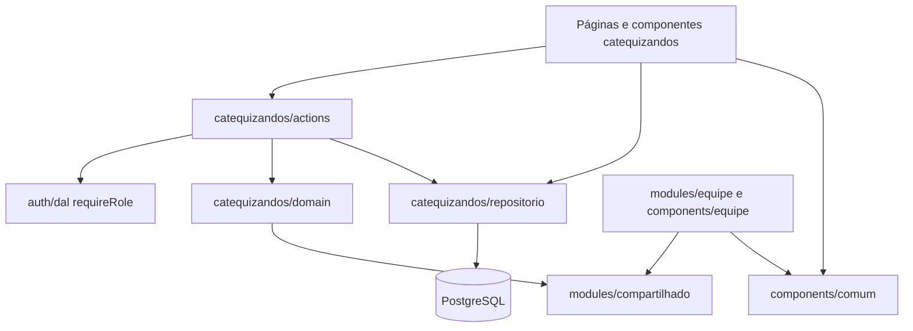
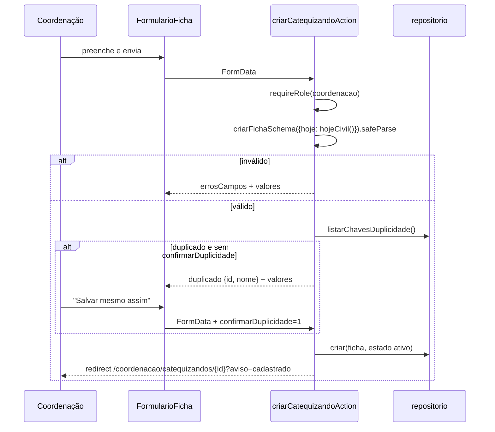
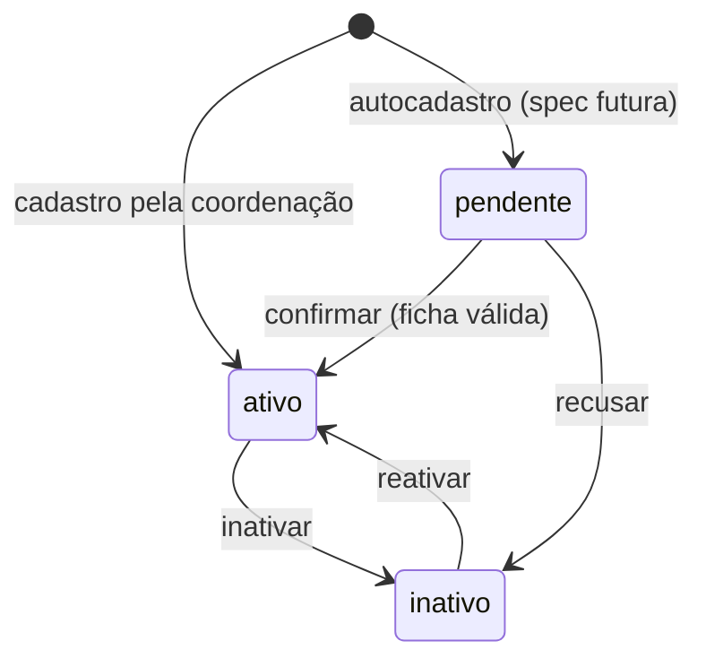

# Design: cadastro-catequizandos

## Overview

Esta spec entrega à coordenação o cadastro dos catequizandos. Cada ficha tem dados pessoais, contato, situação sacramental, observações pastorais e um estado (pendente, ativo ou inativo). A área "Catequizandos" oferece lista com busca e filtros, página do catequizando, cadastro com aviso de possível duplicidade, edição, inativação e reativação, e confirmação ou recusa de fichas pendentes.

O catequizando **não tem conta de acesso**. Por isso a spec não usa o Better Auth nem o plugin admin: toda a persistência é via Prisma. A autorização reutiliza o `requireRole` da fundação.

Para reutilizar o que a equipe já tem sem que um módulo de domínio importe outro (regra do `structure.md`), esta spec extrai as partes genéricas para um módulo compartilhado e componentes comuns, e ajusta a equipe para consumi-los.

### Goals

- Ficha completa com as validações de idade, datas, telefone e e-mail.
- Lista rápida no celular, com busca sem acento, filtros de estado e de sacramento e contador de pendentes.
- Fluxo de estados explícito e testável, sem exclusão.
- Validações reutilizáveis pelo futuro autocadastro.

### Non-Goals

- Turmas, acesso do catequista e presença.
- Criação pública de fichas pendentes, que é a spec `autocadastro-catequizandos`.
- Upload de documentos.
- Busca no banco (`unaccent`/`ILIKE`).

## Boundary Commitments

### This Spec Owns

- As tabelas `catequizando` e `sacramento_recebido`, e o enum `EstadoCatequizando`.
- O módulo `src/modules/catequizandos`: domain, repositório, actions e mensagens.
- A UI em `src/app/(interno)/coordenacao/catequizandos/**` e `src/components/catequizandos/**`.
- A extração para `src/modules/compartilhado` (busca, telefone, datas) e `src/components/comum` (aviso, paginação, confirmação), com a equipe adaptada para usá-los.
- O item "Catequizandos" no menu da coordenação.

### Out of Boundary

- O vínculo com turmas e a visão do catequista, que ficam com `gestao-turmas`.
- O formulário público e a criação de fichas pendentes, que ficam com `autocadastro-catequizandos`. Esta spec só expõe as validações e o estado pendente.
- Login, sessão e papéis, que são da fundação e não mudam.

### Allowed Dependencies

- `@/modules/auth/dal`: `requireRole`.
- `@/modules/auth/domain/credenciais`: `normalizarEmail`.
- `@/modules/compartilhado/*` e `@/components/comum/*`.
- Prisma (`@/lib/prisma`), Zod e Next.

### Revalidation Triggers

- Mudança em `compartilhado/busca`, `compartilhado/telefone` ou nos componentes comuns: revalidar `cadastro-catequistas` (unit, integração e e2e).
- Mudança no schema da ficha ou nos estados: revalidar `autocadastro-catequizandos` e `gestao-turmas` quando existirem.

## Architecture

### Architecture Pattern & Boundary Map

Segue o padrão da fundação e da equipe:

- **Domínio puro** (`domain/`): não importa Next, Prisma nem Better Auth.
- **Repositório** `server-only`.
- **Server Actions** que chamam `requireRole` primeiro, validam, gravam e redirecionam com `?aviso=`.
- **Páginas** Server Components, que chamam `requireRole` e depois leem os dados.



### Technology Stack

| Camada    | Escolha                                  | Papel nesta spec                                            |
| --------- | ---------------------------------------- | ----------------------------------------------------------- |
| Web       | Next.js 16 (App Router, Server Actions)  | Páginas e actions                                           |
| Dados     | Prisma 7 + PostgreSQL 17                 | Duas tabelas novas e um enum                                |
| Validação | Zod 4                                    | Schema da ficha criado por uma factory (hoje, idade mínima) |
| Testes    | Vitest 4 (unit/integration) + Playwright | Ver Testing Strategy                                        |

## File Structure Plan

### Directory Structure

```
src/modules/compartilhado/
├── busca.ts            # normalizarBusca, filtrarPorTermo, paginar, Pagina (movidos da equipe)
├── telefone.ts         # movido da equipe, sem alterações de comportamento
└── datas.ts            # DataCivil, dataCivilSchema, hojeCivil, calcularIdade, formatarData
src/components/comum/
├── aviso.tsx           # Aviso({ mensagem }), com role=status
├── paginacao.tsx       # Paginacao({ base, pagina, totalPaginas, parametros })
├── confirmacao.tsx     # botão + <dialog> genérico (titulo, texto, rotulo, perigo, acao)
└── confirmacao.module.css
src/modules/catequizandos/
├── domain/
│   ├── ficha.ts        # criarFichaSchema, FichaDados, IDADE_MINIMA_PADRAO, sacramentos
│   ├── estado.ts       # EstadoCatequizando, FiltroEstado, transicao()
│   ├── busca.ts        # filtrarCatequizandos (termo, estado, semSacramento)
│   └── duplicidade.ts  # chaveDuplicidade, encontrarDuplicado
├── repositorio.ts      # server-only: listar, obter, criar, atualizar, mudarEstado, contarPendentes
├── actions.ts          # "use server": criar, editar, inativar, reativar, confirmar, recusar
└── mensagens.ts        # códigos de aviso, textos e mensagemDeAviso
src/components/catequizandos/
├── lista-catequizandos.tsx
├── busca-catequizandos.tsx
├── formulario-ficha.tsx       # client: campos, sacramentos e aviso de duplicidade
└── acoes-estado.tsx           # client: usa Confirmacao conforme o estado
src/app/(interno)/coordenacao/catequizandos/
├── page.tsx                   # lista, contador de pendentes e busca
├── novo/page.tsx
└── [id]/
    ├── page.tsx
    ├── editar/page.tsx
    └── not-found.tsx
tests/unit/compartilhado/datas.test.ts
tests/unit/catequizandos/{ficha,estado,busca,duplicidade,mensagens}.test.ts
tests/unit/components/comum/*.test.tsx
tests/unit/components/catequizandos/*.test.tsx
tests/integration/catequizandos/{helpers,repositorio,criar,editar,estados}.test.ts
tests/e2e/catequizandos.spec.ts
```

### Modified Files

- `prisma/schema.prisma` e uma nova migração `*_catequizandos`: modelos `Catequizando` e `SacramentoRecebido` e os enums `EstadoCatequizando` e `Sacramento`.
- `tests/integration/setup.ts` e `tests/e2e/preparar-banco.ts`: incluir `catequizando` e `sacramento_recebido` no TRUNCATE.
- `src/modules/equipe/domain/busca.ts`: mantém `filtrarMembros` e importa o restante de `compartilhado/busca`. Os testes de `normalizarBusca`, `filtrarPorTermo` e `paginar` vão para `tests/unit/compartilhado/busca.test.ts`.
- `src/modules/equipe/domain/telefone.ts`: removido. Os imports da equipe passam a apontar para `compartilhado/telefone`, e o teste é movido para `tests/unit/compartilhado/telefone.test.ts`.
- `src/components/equipe/aviso.tsx` e `paginacao.tsx`: removidos. As páginas da equipe usam os componentes comuns.
- `src/components/equipe/acoes-situacao.tsx`: passa a compor `Confirmacao`, com o mesmo comportamento e os mesmos testes.
- `src/components/layout/menu-por-papel.ts` e o teste do menu: item "Catequizandos" para a coordenação. Também o `app-shell.test.tsx`, por causa da contagem de links.
- `src/app/globals.css`: estilos da lista, do formulário de ficha (fieldset de sacramentos) e da página do catequizando.

## System Flows

### Cadastro com possível duplicidade



### Estados



## Requirements Traceability

| Req     | Resumo                                                           | Componentes                                | Verificação            |
| ------- | ---------------------------------------------------------------- | ------------------------------------------ | ---------------------- |
| 1.1     | Área e menu só para a coordenação                                | menu-por-papel, páginas (`requireRole`)    | unit (menu), e2e       |
| 1.2     | Catequista vê "Acesso negado"                                    | páginas (`requireRole`)                    | e2e                    |
| 1.3     | Actions rejeitam quem não é coordenação                          | actions (`requireRole` primeiro)           | integração             |
| 2.1–2.3 | Obrigatórios, opcionais e erros por campo                        | ficha.ts, formulario-ficha                 | unit, integração       |
| 2.4–2.5 | Data futura; mínimo de 16 anos                                   | ficha.ts, datas.ts                         | unit                   |
| 2.6     | Telefone                                                         | compartilhado/telefone                     | unit                   |
| 2.7     | E-mail opcional normalizado                                      | ficha.ts (`normalizarEmail`)               | unit                   |
| 2.8     | "Catequizando cadastrado"                                        | mensagens, Aviso                           | integração, e2e        |
| 2.9     | Dica das observações                                             | formulario-ficha                           | unit (componente)      |
| 3.1–3.4 | Sacramentos: valor inicial, data e paróquia, validação, descarte | ficha.ts, formulario-ficha                 | unit                   |
| 3.5     | Resumo na lista e detalhe na página                              | lista-catequizandos, página [id]           | unit (componente), e2e |
| 4.1–4.3 | Duplicidade com confirmação                                      | duplicidade.ts, actions, formulario-ficha  | unit, integração       |
| 5.1–5.4 | Lista, busca, filtros de estado e de sacramento                  | busca.ts (catequizandos), página           | unit, e2e              |
| 5.5     | Filtros na URL                                                   | busca-catequizandos (GET), paginacao comum | unit (componente), e2e |
| 5.6–5.7 | Estado vazio e paginação                                         | lista-catequizandos, `paginar`             | unit                   |
| 5.8     | Contador de pendentes                                            | repositorio.contarPendentes, página        | integração, e2e        |
| 6.1–6.2 | Página, idade e links de telefone                                | página [id], datas, telefone               | e2e                    |
| 6.3–6.4 | Edição com as mesmas regras                                      | editarCatequizandoAction                   | integração             |
| 6.5     | Ações conforme o estado                                          | acoes-estado                               | unit (componente)      |
| 6.6     | Não encontrado                                                   | [id]/not-found                             | e2e                    |
| 7.1–7.5 | Estados, inativar e reativar, sem exclusão                       | estado.ts, actions, acoes-estado           | unit, integração       |
| 8.1–8.4 | Confirmar e recusar pendentes                                    | estado.ts, ficha.ts, actions               | unit, integração       |
| 9.1–9.4 | pt-BR, teclado, 360 px, dd/mm/aaaa                               | UI, `formatarData`                         | unit, e2e              |

## Components and Interfaces

| Componente             | Camada     | Intenção                                   | Reqs                         | Dependências               |
| ---------------------- | ---------- | ------------------------------------------ | ---------------------------- | -------------------------- |
| compartilhado/busca    | shared     | Normalização, filtro por termo e paginação | 5.2, 5.7                     | nenhuma                    |
| compartilhado/telefone | shared     | Telefone (movido da equipe)                | 2.6, 6.2                     | Zod                        |
| compartilhado/datas    | shared     | Datas civis e idade                        | 2.4, 2.5, 3.3, 9.4           | Zod                        |
| ficha                  | domain     | Schema da ficha e dos sacramentos          | 2.x, 3.x, 8.2                | compartilhado, auth/domain |
| estado                 | domain     | Máquina de estados                         | 7.x, 8.x                     | nenhuma                    |
| busca (catequizandos)  | domain     | Filtros da lista                           | 5.1–5.4                      | compartilhado/busca        |
| duplicidade            | domain     | Chave e detecção                           | 4.1                          | compartilhado/busca        |
| repositorio            | módulo     | Persistência                               | 2.1, 5.8, 6.x, 7.5           | prisma                     |
| actions                | módulo     | Orquestração                               | 1.3, 2.x, 4.x, 6.x, 7.x, 8.x | dal, domain, repositorio   |
| mensagens              | módulo     | Textos e avisos                            | 2.8, 6.3, 7.2, 7.4, 8.1, 8.3 | nenhuma                    |
| comum (UI)             | components | Aviso, Paginacao, Confirmacao              | 5.5, 7.3, 8.3                | nenhuma                    |

### Compartilhado (`src/modules/compartilhado`)

#### busca.ts

```ts
export function normalizarBusca(texto: string): string;
export function filtrarPorTermo<T>(
  itens: readonly T[],
  termo: string | undefined,
  campos: (item: T) => { textos: string[]; digitos?: string | null },
): T[];
export interface Pagina<T> {
  itens: T[];
  pagina: number;
  totalPaginas: number;
  total: number;
}
export function paginar<T>(itens: readonly T[], pagina: number, tamanho?: number): Pagina<T>; // padrão 20
```

É movido de `equipe/domain/busca.ts` sem mudança de comportamento.

#### telefone.ts

É movido de `equipe/domain/telefone.ts`, com a mesma API: `normalizarTelefone`, `formatarTelefone`, `telefoneSchema`, `linkLigacao` e `linkWhatsApp`.

#### datas.ts

```ts
/** Data civil no formato AAAA-MM-DD (sem hora nem fuso). */
export type DataCivil = string & { readonly __dataCivil: unique symbol };
export const dataCivilSchema: z.ZodType<DataCivil, string>; // "Informe uma data válida"; recusa 2025-02-30
export function hojeCivil(agora?: Date, fuso?: string): DataCivil; // padrão America/Sao_Paulo
export function calcularIdade(nascimento: DataCivil, hoje: DataCivil): number; // anos completos
export function compararDatas(a: DataCivil, b: DataCivil): -1 | 0 | 1;
export function formatarData(data: DataCivil): string; // "dd/mm/aaaa"
```

### Domínio (`src/modules/catequizandos/domain`)

#### ficha.ts

```ts
export const IDADE_MINIMA_PADRAO = 16;
export const SACRAMENTOS = ["batismo", "eucaristia", "crisma"] as const;
export type Sacramento = (typeof SACRAMENTOS)[number];
export const ROTULO_SACRAMENTO: Record<Sacramento, string>; // Batismo, Eucaristia, Crisma

export interface SacramentoFicha {
  recebido: boolean;
  data?: DataCivil;
  paroquia?: string;
}
export interface FichaDados {
  nome: string; // trim, 2–120
  dataNascimento: DataCivil;
  telefone: string; // só dígitos
  email?: string; // normalizarEmail; "" vira undefined
  endereco?: string; // trim, até 300; "" vira undefined
  observacoes?: string; // trim, até 1000; "" vira undefined
  sacramentos: Record<Sacramento, SacramentoFicha>;
}
export function criarFichaSchema(opcoes: {
  hoje: DataCivil;
  idadeMinima?: number;
}): z.ZodType<FichaDados>;
export function lerFichaDoFormulario(dados: FormData): unknown; // mapeia os campos planos para a forma do schema
```

- Nomes dos campos do formulário: `nome`, `dataNascimento`, `telefone`, `email`, `endereco`, `observacoes`, e `{sacramento}Recebido` (checkbox), `{sacramento}Data` e `{sacramento}Paroquia`.
- Regras:
  - A data de nascimento é recusada se for maior que `hoje` ("Informe uma data válida") ou se `calcularIdade < idadeMinima` ("A idade mínima é de 16 anos", com o número vindo do parâmetro).
  - A data de um sacramento é recusada se for maior que `hoje` ou menor que a data de nascimento ("Data do sacramento inválida"). O erro fica associado ao campo `{sacramento}Data`.
  - Quando `recebido = false`, a data e a paróquia são descartadas (3.4).
- As mensagens de nome, telefone e e-mail seguem as da equipe: "Informe o nome", "Informe um telefone com DDD" e "E-mail inválido".
- 8.2 reutiliza o mesmo schema: a ficha gravada é convertida de volta para `FichaDados` e validada com o `hoje` atual.

#### estado.ts

```ts
export const ESTADOS = ["pendente", "ativo", "inativo"] as const;
export type EstadoCatequizando = (typeof ESTADOS)[number];
export type FiltroEstado = EstadoCatequizando | "todos";
export type Operacao = "inativar" | "reativar" | "confirmar" | "recusar";
export function transicao(atual: EstadoCatequizando, op: Operacao): EstadoCatequizando | null;
export function operacoesDisponiveis(atual: EstadoCatequizando): Operacao[];
export const ROTULO_ESTADO: Record<EstadoCatequizando, string>; // Pendente, Ativo, Inativo
```

#### busca.ts

```ts
export interface CatequizandoBuscavel {
  nome: string;
  email: string | null;
  telefone: string;
  estado: EstadoCatequizando;
  sacramentosRecebidos: readonly Sacramento[];
}
export function filtrarCatequizandos<T extends CatequizandoBuscavel>(
  itens: readonly T[],
  filtro: { termo?: string; estado: FiltroEstado; semSacramento?: Sacramento },
): T[]; // termo (nome, e-mail, dígitos do telefone) + estado + sem sacramento; ordem pt-BR por nome
```

#### duplicidade.ts

```ts
export function chaveDuplicidade(nome: string, dataNascimento: DataCivil): string; // normalizarBusca(nome) + "|" + data
export function encontrarDuplicado<
  T extends { id: string; nome: string; dataNascimento: DataCivil },
>(existentes: readonly T[], nome: string, dataNascimento: DataCivil, ignorarId?: string): T | null;
```

Só o cadastro verifica duplicidade (Req 4). O parâmetro `ignorarId` fica disponível para o autocadastro.

### Módulo (`src/modules/catequizandos`)

#### repositorio.ts (server-only)

```ts
export interface CatequizandoResumo {
  id: string;
  nome: string;
  dataNascimento: DataCivil;
  telefone: string;
  email: string | null;
  estado: EstadoCatequizando;
  sacramentosRecebidos: Sacramento[];
}
export interface CatequizandoDetalhe extends CatequizandoResumo {
  endereco: string | null;
  observacoes: string | null;
  criadoEm: Date;
  sacramentos: Record<Sacramento, SacramentoFicha>;
}
export function listarCatequizandos(): Promise<CatequizandoResumo[]>;
export function obterCatequizando(id: string): Promise<CatequizandoDetalhe | null>;
export function criarCatequizando(ficha: FichaDados, estado: EstadoCatequizando): Promise<string>;
export function atualizarFicha(id: string, ficha: FichaDados): Promise<void>; // transação: dados + substitui sacramentos
export function mudarEstado(
  id: string,
  de: EstadoCatequizando,
  para: EstadoCatequizando,
): Promise<boolean>; // updateMany where estado=de; false se não mudou
export function contarPendentes(): Promise<number>;
```

- `mudarEstado` usa condição no `where` para evitar corrida entre duas transições.
- O `id` que chega da URL é tratado como texto opaco. Se não for um UUID válido, é tratado como inexistente.

#### actions.ts ("use server")

```ts
export type EstadoFicha = {
  errosCampos?: Partial<Record<string, string>>;
  erro?: string;
  valores?: Record<string, string>; // reapresentação dos campos
  duplicado?: { id: string; nome: string };
};
export async function criarCatequizandoAction(
  anterior: EstadoFicha,
  dados: FormData,
): Promise<EstadoFicha>;
export async function editarCatequizandoAction(
  id: string,
  anterior: EstadoFicha,
  dados: FormData,
): Promise<EstadoFicha>;
export async function inativarCatequizandoAction(
  id: string,
  anterior: EstadoFicha,
): Promise<EstadoFicha>;
export async function reativarCatequizandoAction(
  id: string,
  anterior: EstadoFicha,
): Promise<EstadoFicha>;
export async function confirmarFichaAction(id: string, anterior: EstadoFicha): Promise<EstadoFicha>;
export async function recusarFichaAction(id: string, anterior: EstadoFicha): Promise<EstadoFicha>;
```

- **Todas as actions:**
  - chamam `requireRole(["coordenacao"])` antes de ler qualquer dado;
  - chamam `redirect` fora do try/catch;
  - em erro inesperado, registram no log só o id e devolvem `MSG_ERRO_INESPERADO`.
- **Criar:** valida a ficha, verifica duplicidade (`confirmarDuplicidade` ausente → devolve `duplicado`), grava com estado `ativo` e redireciona para `/coordenacao/catequizandos/{id}?aviso=cadastrado`.
- **Editar:** valida, chama `atualizarFicha` (sem mudar o estado) e redireciona com `?aviso=alteracoes-salvas`.
- **Transições:**
  - A action obtém o catequizando e calcula `transicao(atual, op)`.
  - Se o resultado for `null`, devolve `erro: MSG_TRANSICAO_INVALIDA`.
  - Na confirmação, a action revalida a ficha gravada. Se for inválida, devolve `erro: MSG_FICHA_INVALIDA` (8.2).
  - Em seguida chama `mudarEstado` e redireciona com o código de aviso da operação.

#### mensagens.ts

| Código (`?aviso=`)  | Texto                      |
| ------------------- | -------------------------- |
| `cadastrado`        | "Catequizando cadastrado." |
| `alteracoes-salvas` | "Alterações salvas."       |
| `inativado`         | "Catequizando inativado."  |
| `reativado`         | "Catequizando reativado."  |
| `ficha-confirmada`  | "Ficha confirmada."        |
| `ficha-recusada`    | "Ficha recusada."          |

Constantes:

- `MSG_POSSIVEL_DUPLICADO`: "Já existe um catequizando com este nome e data de nascimento."
- `MSG_FICHA_INVALIDA`: "A ficha tem dados que precisam ser corrigidos. Edite a ficha antes de confirmar."
- `MSG_TRANSICAO_INVALIDA`: "Esta ação não está disponível para a situação atual."
- `MSG_ERRO_INESPERADO`.
- `mensagemDeAviso(codigo: unknown): string | null`.

### UI

#### Componentes comuns (`src/components/comum`)

- `Aviso({ mensagem }: { mensagem: string | null })`: renderiza `<p role="status" className="aviso">`, ou nada quando a mensagem é nula.
- `Paginacao({ base, pagina, totalPaginas, parametros }: { base: string; pagina: number; totalPaginas: number; parametros: Record<string, string | undefined> })`: omite parâmetros vazios e `pagina=1`.
- `Confirmacao({ rotuloAbrir, titulo, texto, rotuloConfirmar, perigo, acao })`: `acao` é `(anterior: { erro?: string }) => Promise<{ erro?: string }>`. Usa `<dialog>` modal, "Cancelar" com autoFocus, Esc fecha, alerta de erro dentro do diálogo e `useId` no título.

#### Catequizandos (`src/components/catequizandos`)

- **`ListaCatequizandos({ catequizandos, hoje })`:** em cada linha, nome como link, idade, telefone formatado, selos dos sacramentos recebidos (por exemplo "B · E · C", com texto acessível) e estado. Quando vazia, mostra o estado vazio com "Limpar busca".
- **`BuscaCatequizandos({ termo, estado, semSacramento })`:** form GET com `q`, `estado` (ativo, pendente, inativo, todos) e `sem` (vazio, batismo, eucaristia, crisma), com rótulos visíveis.
- **`FormularioFicha({ modo, acao, valoresIniciais? })`:**
  - Campos da ficha, com um fieldset por sacramento: checkbox "Recebido"; data e paróquia visíveis e habilitadas só quando marcado. Sem JavaScript, os campos ficam visíveis e são descartados no servidor.
  - Dica das observações.
  - No aviso de duplicidade (role=alert), link para a ficha existente e o botão "Salvar mesmo assim", que envia `confirmarDuplicidade=1` com os valores preenchidos.
  - Segue o padrão do `FormularioMembro`: `useActionState`, `aria-describedby`, `key` do estado e botão desabilitado durante o envio.
- **`AcoesEstado({ nome, estado, inativar, reativar, confirmar, recusar })`:** mostra só as operações de `operacoesDisponiveis(estado)`. As ações "Inativar" e "Recusar ficha" usam `Confirmacao` com perigo. "Reativar" e "Confirmar ficha" também passam por `Confirmacao`, sem perigo.

#### Páginas (`src/app/(interno)/coordenacao/catequizandos`)

- **Lista:**
  - Lê `q`, `estado` (padrão `ativo`, valor inválido vira `ativo`), `sem` (valor inválido é ignorado) e `pagina`.
  - Mostra `Aviso`, o contador "N fichas pendentes" com link para `?estado=pendente` (só quando N > 0), a busca, a lista, a paginação e o botão "Cadastrar catequizando".
- **Novo:** `FormularioFicha` em modo `criacao`.
- **Detalhe `[id]`:**
  - `notFound()` quando o catequizando não existe.
  - Lista de definição com nome, data de nascimento e idade, telefone (links de ligação e de WhatsApp, este com o aviso de nova aba), e-mail, endereço, sacramentos (Recebido/Não recebido, com data e paróquia quando houver), observações, estado e data de cadastro.
  - `Aviso`, link "Editar" e `AcoesEstado`.
- **Editar:** `FormularioFicha` em modo `edicao`, com os valores atuais.
- **`not-found`:** "Catequizando não encontrado", com link para a lista.
- Todas as páginas chamam `requireRole(["coordenacao"], caminhoExato)` e têm título "… — Acutis Catequese".

## Data Models

### Physical Data Model

```prisma
enum EstadoCatequizando {
  pendente
  ativo
  inativo
  @@map("estado_catequizando")
}

enum Sacramento {
  batismo
  eucaristia
  crisma
  @@map("sacramento")
}

model Catequizando {
  id             String               @id @default(uuid())
  nome           String
  dataNascimento DateTime             @db.Date
  telefone       String
  email          String?
  endereco       String?
  observacoes    String?
  estado         EstadoCatequizando   @default(ativo)
  createdAt      DateTime             @default(now())
  updatedAt      DateTime             @updatedAt
  sacramentos    SacramentoRecebido[]

  @@index([estado])
  @@map("catequizando")
}

model SacramentoRecebido {
  catequizandoId String
  sacramento     Sacramento
  data           DateTime?    @db.Date
  paroquia       String?
  catequizando   Catequizando @relation(fields: [catequizandoId], references: [id], onDelete: Restrict)

  @@id([catequizandoId, sacramento])
  @@map("sacramento_recebido")
}
```

- A presença de uma linha em `sacramento_recebido` significa que o sacramento foi recebido.
- A conversão entre `@db.Date` e `DataCivil` fica no repositório, usando `toISOString().slice(0, 10)`, que é seguro porque o Prisma devolve datas `@db.Date` à meia-noite UTC.
- `onDelete: Restrict` reforça que não há exclusão.
- O e-mail não é único: dois catequizandos podem compartilhar e-mail (por exemplo, um casal).

## Error Handling

- **Validação:** `errosCampos` com a primeira mensagem de cada campo, e `valores` para reapresentar o formulário.
- **Duplicidade:** estado `duplicado`, sem gravar nada.
- **Transição inválida ou ficha inválida na confirmação:** `erro` exibido como alerta dentro do diálogo.
- **Catequizando inexistente:** `notFound()` nas páginas. Nas actions, o erro inesperado genérico.
- **Falha de banco:** log com o id (sem dados pessoais) e `MSG_ERRO_INESPERADO`.

## Testing Strategy

### Unit (Vitest)

- **`compartilhado/datas`:**
  - `calcularIdade` com aniversário hoje, ontem e amanhã, e com 29/02;
  - `dataCivilSchema` recusando 2025-02-30 e texto livre;
  - `formatarData`;
  - `hojeCivil` às 23h30 de São Paulo, que em UTC já é o dia seguinte.
- **`ficha`:**
  - obrigatórios com as mensagens;
  - data de nascimento futura;
  - 15 anos e 364 dias recusado, 16 anos exatos aceito;
  - `idadeMinima` customizada;
  - e-mail vazio vira undefined e o e-mail é normalizado;
  - sacramento não recebido descarta data e paróquia;
  - data do sacramento antes do nascimento ou no futuro recusada;
  - `lerFichaDoFormulario` com checkboxes.
- **`estado`:** tabela completa de `transicao` e `operacoesDisponiveis`.
- **`busca` (catequizandos):** "jose" encontra "José", dígitos do telefone, filtro de estado, `semSacramento` e ordem.
- **`duplicidade`:** a chave ignora caixa e acento, e `ignorarId` funciona.
- **`mensagens`:** código desconhecido resulta em null.
- **Componentes:**
  - `Paginacao` e `Confirmacao` comuns;
  - lista (idade, selos, estado vazio);
  - busca (valores atuais);
  - formulário (erros ligados aos campos, fieldset de sacramentos, aviso de duplicidade com "Salvar mesmo assim" levando `confirmarDuplicidade`, dica das observações);
  - `AcoesEstado` mostrando só as ações do estado.
- **Menu:** "Catequizandos" aparece só para a coordenação.

### Integração (Vitest + acutis_test)

- **Repositório:** criar com sacramentos e ler de volta, com as datas preservadas; `atualizarFicha` substitui os sacramentos; `mudarEstado` condicional devolve false quando o estado de origem já mudou; `contarPendentes`.
- **Criar:**
  - catequista é redirecionado sem gravar nada;
  - válido redireciona com `cadastrado` e grava o estado `ativo`;
  - duplicado sem confirmação não grava; com `confirmarDuplicidade=1` grava;
  - erros por campo trazem os valores.
- **Editar:** alterações salvas e o estado inalterado, inclusive para uma ficha pendente (8.4).
- **Estados:**
  - inativar e reativar;
  - confirmar uma pendente válida;
  - confirmar uma pendente inválida (criada direto no banco com idade abaixo do mínimo) é recusado sem mudar o estado;
  - recusar deixa inativa e a linha continua existindo;
  - transição inválida (reativar quem está ativo) devolve erro.

### E2E (Playwright)

- Cadastrar com crisma recebida, ver "Catequizando cadastrado" e a página com a idade e os links.
- A busca sem acento e o filtro "sem crisma" aparecem na URL.
- O aviso de duplicidade aparece e "Salvar mesmo assim" grava.
- Inativar pelo diálogo mostra "Inativo".
- Uma ficha pendente (criada pelo preparo do teste) aparece no contador e é confirmada.
- A catequista vê "Acesso negado".
- A lista, o formulário e a página não têm rolagem horizontal a 360 px.
- Um id inexistente mostra "Catequizando não encontrado".
- Os e2e da equipe continuam passando após a extração dos componentes comuns.

## Security Considerations

- Dupla barreira: `requireRole` nas páginas e nas actions.
- Dados pessoais (LGPD):
  - só a coordenação acessa;
  - nada de dados pessoais em logs;
  - a URL leva só o termo de busca digitado pela própria coordenação, os filtros e o id opaco;
  - a dica nas observações orienta a registrar só o necessário.
- O `?aviso=` aceita só códigos fixos. Não há texto livre vindo da URL.
- O `id` da URL é validado como UUID antes da consulta.
