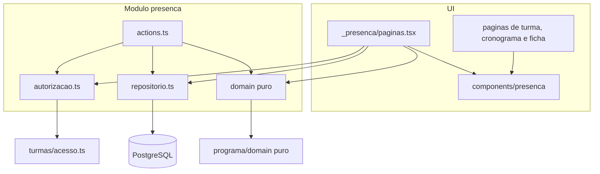
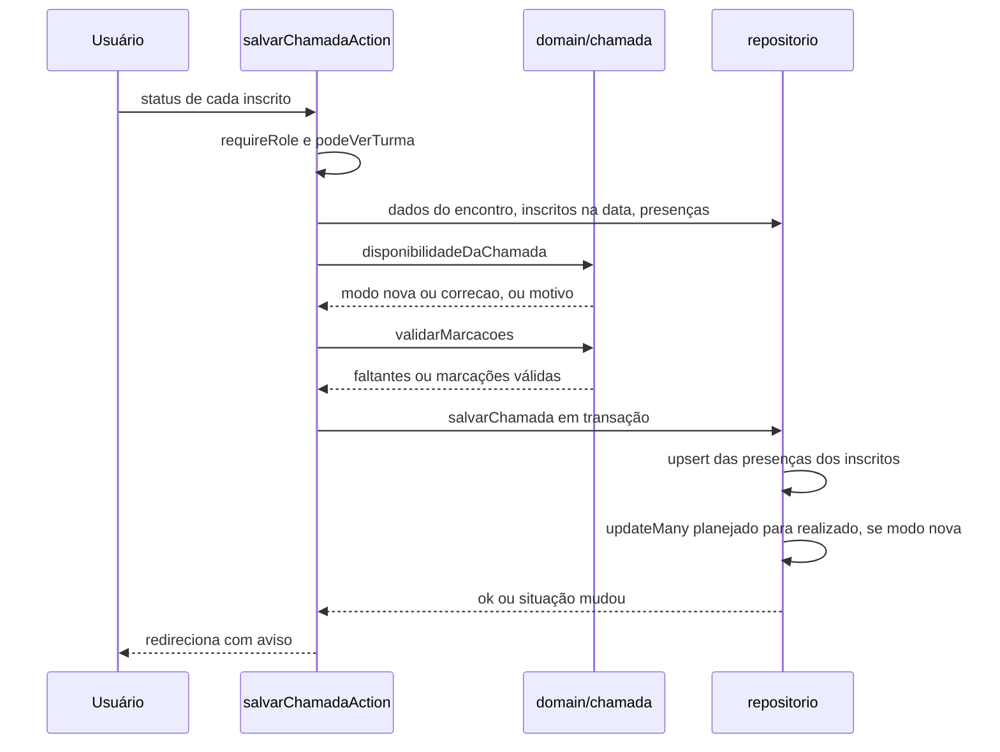
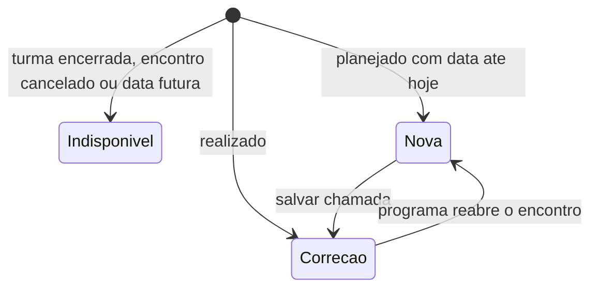
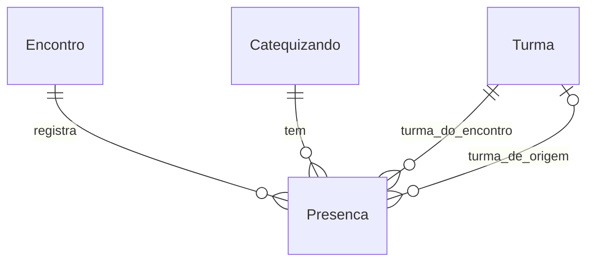

# Design Document

## Overview
**Purpose**: Esta feature entrega o registro da presença nos encontros e o acompanhamento da frequência dos catequizandos.
**Users**: O catequista faz a chamada das turmas em que é responsável, inclusive pelo celular; a coordenação faz a chamada de qualquer turma, define o limite de frequência e acompanha os alertas.
**Impact**: Hoje as turmas têm encontros planejados (`programa-catequese`), mas nenhum registro do que aconteceu neles. A spec acrescenta o módulo `presenca`, uma tabela de presenças, o limite de frequência e telas de chamada, de visitantes e de frequência. Também acrescenta blocos às páginas da turma, do cronograma e da ficha do catequizando.

### Goals
- Registrar presente, ausente ou justificado por catequizando e por encontro, com correção posterior (2, 3).
- Registrar visitantes que repõem um tema (4) e acompanhar o programa de cada catequizando, inclusive reposições (8).
- Calcular frequência por catequizando e por turma e alertar abaixo do limite configurável (5, 6, 7).
- Manter o cálculo como funções puras com testes unitários.

### Non-Goals
- Gestão de encontros, de temas e de inscrições; exportação, PDF e relatórios; notificações; QR code.
- Alerta por temas pendentes sem relação com o percentual.
- Limite por turma: o limite é um só para o sistema.

## Boundary Commitments

### This Spec Owns
- A **presença**: registro de um catequizando num encontro, com status e marca de visitante.
- A regra de **quem consta na chamada** (inscrição vigente na data do encontro) e a de **quando a chamada está disponível**.
- O cálculo de **frequência**, o **limite de frequência** (valor e padrão) e o critério de **alerta**.
- O cálculo de **tema cumprido** e de temas pendentes por catequizando.
- A transição `planejado → realizado` **provocada por salvar a chamada** (a situação em si continua sendo do `programa`).
- Os contratos: `domain/frequencia.ts`, `domain/chamada.ts`, `domain/progresso-catequizando.ts` e as ações do módulo.

### Out of Boundary
- Criar, editar, cancelar e reabrir encontros; cadastrar temas (`programa-catequese`).
- Inscrever, transferir e desligar catequizandos; encerrar turmas (`gestao-turmas`).
- Estado do catequizando e inativação (`cadastro-catequizandos`).
- Qualquer saída de relatório, notificação ou certificado (specs futuras).

### Allowed Dependencies
- `@/modules/turmas/acesso` (`podeVerTurma`, `podeVerCatequizando`), conforme a exceção de `structure.md` de 2026-10-01.
- Arquivos puros `domain/*.ts` de módulos upstream, conforme a exceção de 2026-10-03: `@/modules/programa/domain/encontro` (`TRANSICOES`, `SituacaoEncontro`) e `@/modules/programa/domain/tema` (tipos de tema).
- `@/modules/auth/dal` (`requireRole`, `requireSession`), `@/modules/compartilhado/{datas,busca}`, `@/lib/prisma`, `@/components/comum/*`.
- Dados de encontros, inscrições, catequizandos e temas são lidos pelo **repositório do próprio módulo**, nunca pelos repositórios dos módulos upstream.
- Proibido: importar `repositorio.ts` ou `actions.ts` de `programa`, `turmas` ou `catequizandos`.

### Revalidation Triggers
- Mudança no significado de `Encontro.situacao`, nas `TRANSICOES` ou na semântica de reabertura (`programa-catequese`).
- Mudança em `Inscricao.dataEntrada` e `dataSaida` ou na regra de transferência (`gestao-turmas`); a regra de "inscrito na data" depende delas.
- Mudança na assinatura de `podeVerTurma` ou `podeVerCatequizando`.
- Mudança nos campos de `Presenca` ou em `StatusPresenca` (consumidores futuros: relatórios e certificados).
- Novo prop `complemento` de `components/programa/cronograma.tsx` (contrato entre as duas specs).

## Architecture

### Existing Architecture Analysis
- Monolito Next.js 16 com módulos por domínio em `src/modules/<modulo>/{domain,repositorio,actions,mensagens}`. As regras ficam em `domain/` (puras), a persistência em `repositorio.ts` (`server-only`) e as mutações em `actions.ts` (`"use server"`).
- As páginas dos dois papéis são finas e delegam a componentes compartilhados (`src/app/(interno)/_encontros/paginas.tsx`). Cada rota chama `requireRole` com o caminho exato.
- As ações usam `useActionState` com um estado `{ erro?, errosCampos?, valores? }`, e as confirmações usam `?aviso=<codigo>` na URL.
- As colunas do Postgres usam camelCase; as migrações têm SQL manual para índices e restrições que o Prisma não expressa.

### Architecture Pattern & Boundary Map


**Architecture Integration**:
- **Padrão escolhido**: módulo `presenca` na mesma forma de `programa`: domínio puro, repositório, ações e componentes por funcionalidade.
- **Direção de dependência**: `domain` ← `repositorio` ← `actions` ← `app/components`. O domínio não importa framework, `server-only` nem persistência. Nenhuma camada importa a da direita.
- **Padrões preservados**: acesso por turma reavaliado a cada chamada; `?aviso=`; `useActionState`; textos em `mensagens.ts`; migração com SQL manual.
- **Componentes novos**: justificados na seção Components and Interfaces.
- **Conformidade com o steering**: TypeScript strict sem `any`; Zod nos limites; Conventional Commits; toda regra de negócio com teste.

### Technology Stack

| Layer | Choice / Version | Role in Feature | Notes |
|-------|------------------|-----------------|-------|
| Frontend | Next.js 16 (App Router), React Server Components | Páginas de chamada, visitantes e frequência | Um componente cliente só para a chamada (marcar todos, contadores) |
| Backend | Server Actions, Zod | Salvar chamada, visitantes e limite | Sem rotas de API |
| Data | PostgreSQL + Prisma 7 | Tabelas `presenca` e `limite_frequencia` | Restrições `CHECK` em SQL manual |
| Testes | Vitest, Playwright | Unitários do domínio, integração das ações, e2e da chamada | Viewport móvel no e2e |

## File Structure Plan

### Directory Structure
```
src/modules/presenca/
├── domain/
│   ├── frequencia.ts              # STATUS_PRESENCA, LIMITE_PADRAO, contarPresencas, somarContagens, calcularFrequencia, emAlerta, limiteSchema, ordenarPorFrequencia
│   ├── chamada.ts                 # disponibilidadeDaChamada, inscritoNaData, montarLinhas, lerMarcacoes, validarMarcacoes, podeGerenciarVisitantes
│   └── progresso-catequizando.ts  # calcularProgressoCatequizando (cumpridos, pendentes, origem do cumprimento)
├── autorizacao.ts                 # server-only: autorizarTurma, autorizarCatequizando, exigirCoordenacao
├── repositorio.ts                 # server-only: leituras e escritas de presença, visitantes, agregados e limite
├── actions.ts                     # "use server": salvarChamada, adicionarVisitante, removerVisitante, salvarLimite
└── mensagens.ts                   # códigos de aviso e textos
src/components/presenca/
├── chamada-form.tsx               # cliente: lista de status por inscrito, marcar todos, contadores, erro mantendo marcações
├── status-presenca.tsx            # rótulo e ícone de cada status (texto + ícone)
├── lista-visitantes.tsx           # visitantes do encontro, com remoção
├── busca-visitante.tsx            # busca por nome e confirmação
├── sem-tema-do-encontro.tsx       # inscritos que ainda não cumpriram o tema do encontro
├── resumo-chamada.tsx             # contagem por encontro realizado (complemento do cronograma)
├── chamada-de-hoje.tsx            # bloco da página da turma: encontro de hoje sem chamada
├── frequencia-turma.tsx           # frequência da turma e tabela de inscritos com percentual e alerta
├── frequencia-catequizando.tsx    # frequência por turma, presenças e progresso na ficha
├── alertas-frequencia.tsx         # lista de baixa frequência (área "Frequência")
└── formulario-limite.tsx          # limite de frequência (coordenação)
src/app/(interno)/_presenca/paginas.tsx   # PaginaChamada, PaginaVisitantes, PaginaFrequencia (compartilhadas entre os papéis)
src/app/(interno)/coordenacao/turmas/[id]/encontros/[encontroId]/chamada/page.tsx
src/app/(interno)/coordenacao/turmas/[id]/encontros/[encontroId]/chamada/visitantes/page.tsx
src/app/(interno)/coordenacao/frequencia/page.tsx
src/app/(interno)/catequista/turmas/[id]/encontros/[encontroId]/chamada/page.tsx
src/app/(interno)/catequista/turmas/[id]/encontros/[encontroId]/chamada/visitantes/page.tsx
src/app/(interno)/catequista/frequencia/page.tsx
prisma/migrations/<data>_presenca/migration.sql
tests/unit/presenca/{frequencia,chamada,progresso-catequizando,mensagens}.test.ts
tests/unit/components/presenca/*.test.tsx
tests/integration/presenca/{helpers,repositorio,chamada-actions,visitantes-actions,limite-actions,agregados}.test.ts
tests/e2e/presenca.spec.ts
```

### Modified Files
- `prisma/schema.prisma`: enum `StatusPresenca`, modelos `Presenca` e `LimiteFrequencia`, campos de relação `presencas` em `Turma`, `Encontro` e `Catequizando` (e a relação nomeada `PresencaOrigem` em `Turma`).
- `tests/integration/setup.ts` e `tests/e2e/preparar-banco.ts`: incluir `presenca` e `limite_frequencia` no `TRUNCATE`.
- `src/components/layout/menu-por-papel.ts` e os testes do menu e do app-shell: item "Frequência" para os dois papéis.
- `src/components/programa/cronograma.tsx`: prop opcional `complemento?: (encontro: EncontroResumo) => ReactNode`, renderizada em cada linha. A aparência e o comportamento atuais não mudam quando a prop não é passada.
- `src/app/(interno)/_encontros/paginas.tsx`: no cronograma, passa `complemento` com o link "Fazer chamada" e o `ResumoChamada`.
- `src/app/(interno)/{coordenacao,catequista}/turmas/[id]/page.tsx`: blocos `ChamadaDeHoje` e `FrequenciaTurma`.
- `src/app/(interno)/{coordenacao,catequista}/catequizandos/[id]/page.tsx`: bloco `FrequenciaCatequizando`.
- `src/app/globals.css`: estilos da chamada (controle segmentado de status), dos alertas e dos blocos de frequência.

## System Flows

### Salvar a chamada


Decisões do fluxo:
- A lista esperada de inscritos é recalculada no servidor; o formulário nunca define quem consta.
- Se a transição condicional não atualizar nenhuma linha, a transação é revertida e a pessoa vê a mensagem de situação alterada.
- Em modo `correcao` o encontro já é `realizado` e não há transição; só as presenças dos inscritos são atualizadas.

### Disponibilidade da chamada


## Requirements Traceability

| Requirement | Summary | Components | Interfaces | Flows |
|-------------|---------|------------|------------|-------|
| 1.1 | Coordenação e catequista fazem chamada | autorizacao, actions | `autorizarTurma` | Salvar a chamada |
| 1.2 | Consulta de frequência por papel | autorizacao, _presenca/paginas | `autorizarTurma`, `turmasDoUsuario` | — |
| 1.3 | Só a coordenação altera o limite | autorizacao, actions | `exigirCoordenacao`, `salvarLimiteAction` | — |
| 1.4 | Catequista sem acesso vai a "Acesso negado" | autorizacao | `autorizarTurma`, `autorizarCatequizando` | — |
| 1.5 | Ação direta sem permissão é rejeitada | actions, autorizacao | todas as ações chamam a autorização antes de ler dados | — |
| 2.1 | Chamada lista os inscritos na data, sem pré-seleção | domain/chamada, repositorio | `inscritoNaData`, `montarLinhas`, `inscritosNaData` | Disponibilidade |
| 2.2 | Status por inscrito e "Marcar todos como presentes" | chamada-form | `StatusPresenca` | — |
| 2.3 | Salvar registra, marca realizado e confirma | actions, repositorio | `salvarChamadaAction`, `salvarChamada` | Salvar a chamada |
| 2.4 | Salvar exige todos marcados | domain/chamada, chamada-form | `validarMarcacoes` | Salvar a chamada |
| 2.5 | Sem chamada se cancelado, futuro ou turma encerrada | domain/chamada | `disponibilidadeDaChamada` | Disponibilidade |
| 2.6 | Sem inscritos não salva | domain/chamada | `validarMarcacoes` (lista vazia) | Salvar a chamada |
| 2.7 | Cabeçalho e totais por status | chamada-form, _presenca/paginas | `contarPresencas` | — |
| 2.8 | Acesso à chamada pelo cronograma e pela turma | resumo-chamada, chamada-de-hoje, cronograma | `complemento` | — |
| 3.1 | Correção mostra os status já registrados | domain/chamada, chamada-form | `montarLinhas` | Disponibilidade |
| 3.2 | Salvar a correção atualiza e confirma | actions, repositorio | `salvarChamada` (modo correcao) | Salvar a chamada |
| 3.3 | Inscrito posterior entra na correção | domain/chamada, repositorio | `inscritoNaData`, `montarLinhas` | — |
| 3.4 | Reaberto mantém presenças fora do cálculo | repositorio | agregados com `encontro.situacao = realizado` | — |
| 3.5 | Salvar o reaberto é nova chamada preenchida | domain/chamada | `montarLinhas`, `disponibilidadeDaChamada` | Disponibilidade |
| 3.6 | Presença de inscrito nunca é excluída | repositorio, schema | só `upsert`; chaves `Restrict` | — |
| 4.1 | Ação "Adicionar visitante" só com tema | domain/chamada, _presenca/paginas | `podeGerenciarVisitantes` | — |
| 4.2 | Busca lista só nome e turma de origem | busca-visitante, repositorio | `buscarVisitantes` | — |
| 4.3 | Confirmar registra presente e identifica | actions, lista-visitantes | `adicionarVisitanteAction` | — |
| 4.4 | Sem tema não oferece visitante | domain/chamada | `podeGerenciarVisitantes` | — |
| 4.5 | Duplicado é impedido | schema, actions | índice único e mensagem | — |
| 4.6 | Remover visitante recalcula progresso | actions, repositorio | `removerVisitanteAction` | — |
| 4.7 | Visitante fora das frequências e só presente | schema, repositorio | `CHECK` e filtro `visitante = false` | — |
| 4.8 | Inscrição do visitante não muda | repositorio | nenhuma escrita em `inscricao` | — |
| 4.9 | Visitantes separados dos inscritos na chamada | lista-visitantes, chamada-form | — | — |
| 5.1 | Fórmula com justificado como ausência | domain/frequencia | `calcularFrequencia` | — |
| 5.2 | Só encontros em que constava na chamada | repositorio | agregados por presença | — |
| 5.3 | Percentual inteiro e contagens | domain/frequencia | `calcularFrequencia` | — |
| 5.4 | "Sem encontros registrados" | domain/frequencia, frequencia-turma | `percentual: null` | — |
| 5.5 | Inscritos com frequência, ordenáveis | frequencia-turma | `ordenarPorFrequencia` | — |
| 5.6 | Frequência por turma na ficha | frequencia-catequizando | `frequenciaPorTurma` | — |
| 5.7 | Lista de presenças na ficha | frequencia-catequizando | `presencasDoCatequizando` | — |
| 5.8 | Mesmas regras em todas as telas | domain/frequencia | única fonte de cálculo | — |
| 6.1 | Frequência da turma sem visitantes | domain/frequencia | `somarContagens`, `calcularFrequencia` | — |
| 6.2 | Frequência e alertas na página da turma | frequencia-turma | `frequenciaDaTurma` | — |
| 6.3 | Contagens no cronograma | resumo-chamada | `resumoPorEncontro` | — |
| 6.4 | Turma sem chamada mostra estado vazio | domain/frequencia | `percentual: null` | — |
| 6.5 | Turma encerrada consultável | frequencia-turma, repositorio | leituras sem filtro de turma aberta | — |
| 7.1 | Padrão 75% | domain/frequencia, repositorio | `LIMITE_PADRAO`, `obterLimite` | — |
| 7.2 | Salvar limite de 1 a 100 | actions, repositorio | `salvarLimiteAction`, `salvarLimite` | — |
| 7.3 | Limite inválido é rejeitado | domain/frequencia | `limiteSchema` | — |
| 7.4 | "Baixa frequência" sem arredondar | domain/frequencia | `emAlerta` | — |
| 7.5 | Sem encontros não alerta | domain/frequencia | `emAlerta` (total 0 é falso) | — |
| 7.6 | Lista da coordenação em ordem crescente | alertas-frequencia, repositorio | `alertasDeFrequencia` | — |
| 7.7 | Lista do catequista só das suas turmas | alertas-frequencia, repositorio | `alertasDeFrequencia(turmaIds)` | — |
| 7.8 | Estado vazio positivo | alertas-frequencia | — | — |
| 7.9 | Alerta por texto e ícone | alertas-frequencia, status-presenca | — | — |
| 7.10 | Limite exibido na área | _presenca/paginas | `obterLimite` | — |
| 7.11 | Recalcula ao mudar o limite | repositorio | cálculo sob demanda, sem cache | — |
| 7.12 | Item de menu "Frequência" | menu-por-papel | `menuPorPapel` | — |
| 8.1 | Tema cumprido por presente, na turma ou visitante | domain/progresso-catequizando | `calcularProgressoCatequizando` | — |
| 8.2 | Progresso e temas pendentes na ficha | frequencia-catequizando | `cumpridosDoCatequizando` | — |
| 8.3 | Cumprimento na turma ou por reposição | domain/progresso-catequizando | `TemaCumprido.visitante` | — |
| 8.4 | Ausente e justificado não cumprem | repositorio | filtro `status = presente` | — |
| 8.5 | Inscritos que ainda não cumpriram o tema | sem-tema-do-encontro, repositorio | `inscritosSemOTema` | — |
| 8.6 | Temas desativados fora do progresso | domain/progresso-catequizando | lista só de temas ativos | — |
| 8.7 | Reposição não altera a frequência | domain/frequencia, repositorio | filtro `visitante = false` | — |
| 9.1 | Turma encerrada bloqueia chamada e visitantes | domain/chamada, actions | `disponibilidadeDaChamada` | Disponibilidade |
| 9.2 | Visita em turma encerrada preservada | repositorio, schema | sem exclusão em cascata | — |
| 9.3 | Presenças preservadas ao desligar ou inativar | schema, repositorio | chaves `Restrict` | — |
| 9.4 | Sai de inscritos vigentes e alertas | repositorio | `alertasDeFrequencia` (inscrição vigente) | — |
| 9.5 | Visitas de desligado preservadas | repositorio | sem exclusão | — |
| 9.6 | Nada exclui presenças | schema | `onDelete: Restrict` | — |
| 10.1 | Páginas em pt-BR no design system | components/presenca, globals.css | — | — |
| 10.2 | Chamada em coluna única, tocável, sem rolagem horizontal | chamada-form, globals.css | — | — |
| 10.3 | Operável só com teclado | chamada-form | grupos de rádio nativos | — |
| 10.4 | Status por texto e ícone | status-presenca | — | — |
| 10.5 | Datas e horários no formato brasileiro | components/presenca | `formatarDataComDia` | — |
| 10.6 | Falha mantém marcações e permite repetir | chamada-form, actions | `EstadoPresenca.valores` | — |

## Components and Interfaces

| Component | Domain/Layer | Intent | Req Coverage | Key Dependencies (P0/P1) | Contracts |
|-----------|--------------|--------|--------------|--------------------------|-----------|
| domain/frequencia | Domínio | Cálculo de frequência, limite e alerta | 5.1-5.4, 5.8, 6.1, 6.4, 7.1, 7.3-7.5, 8.7 | — | Service |
| domain/chamada | Domínio | Disponibilidade, lista da chamada e validação | 2.1, 2.4-2.6, 3.1, 3.3, 3.5, 4.1, 4.4, 9.1 | programa/domain/encontro (P0) | Service |
| domain/progresso-catequizando | Domínio | Temas cumpridos e pendentes | 8.1, 8.3, 8.4, 8.6 | — | Service |
| autorizacao | Servidor | Acesso por turma e papel | 1.1-1.5 | turmas/acesso (P0), auth/dal (P0) | Service |
| repositorio | Persistência | Leituras, agregados e escritas | 2-9 | Prisma (P0) | Service |
| actions | Servidor | Salvar chamada, visitantes e limite | 1.5, 2.3, 3.2, 4.3, 4.5, 4.6, 7.2 | autorizacao, repositorio, domínio (P0) | Service, State |
| components/presenca | UI | Telas e blocos | 2.2, 2.7-2.8, 4.9, 5.5-5.7, 6.2-6.3, 7.6-7.10, 10 | domínio (P0) | State |

### Domínio

#### domain/frequencia

| Field | Detail |
|-------|--------|
| Intent | Única fonte do cálculo de frequência, do limite e do alerta |
| Requirements | 5.1, 5.2, 5.3, 5.4, 5.8, 6.1, 6.4, 7.1, 7.3, 7.4, 7.5, 8.7 |

**Responsabilidades e restrições**
- Funções puras, sem I/O, que recebem contagens já filtradas (só encontros realizados e `visitante = false`).
- Justificado entra no total e não no numerador.
- O alerta compara `presentes × 100 < limite × total`, sem arredondar. O percentual exibido usa `Math.round`.

**Contracts**: Service [x]

```typescript
export const STATUS_PRESENCA = ["presente", "ausente", "justificado"] as const;
export type StatusPresenca = (typeof STATUS_PRESENCA)[number];
export const LIMITE_PADRAO = 75;

export interface ContagemFrequencia {
  presentes: number;
  ausentes: number;
  justificados: number;
  total: number; // presentes + ausentes + justificados
}

export interface Frequencia extends ContagemFrequencia {
  percentual: number | null; // inteiro de 0 a 100; null quando total é 0
}

export function contarPresencas(status: readonly StatusPresenca[]): ContagemFrequencia;
export function somarContagens(contagens: readonly ContagemFrequencia[]): ContagemFrequencia;
export function calcularFrequencia(contagem: ContagemFrequencia): Frequencia;
export function emAlerta(contagem: ContagemFrequencia, limite: number): boolean;
export function limiteSchema(): z.ZodType<number>; // inteiro de 1 a 100, mensagem em pt-BR
export function ordenarPorFrequencia<T extends { frequencia: Frequencia; nome: string }>(
  itens: readonly T[],
): T[]; // menor percentual primeiro; sem encontros por último; desempate por nome
```
- Pré-condição: `total = presentes + ausentes + justificados`.
- Pós-condição: `emAlerta` é falso quando `total` é 0.

#### domain/chamada

| Field | Detail |
|-------|--------|
| Intent | Regras de disponibilidade, de quem consta e de validação da chamada |
| Requirements | 2.1, 2.4, 2.5, 2.6, 3.1, 3.3, 3.5, 4.1, 4.4, 9.1 |

**Responsabilidades e restrições**
- `inscritoNaData`: `dataEntrada ≤ data` e (`dataSaida` nula ou `data < dataSaida`).
- `disponibilidadeDaChamada` aplica, nesta ordem: turma encerrada, encontro cancelado, encontro planejado com data futura. Encontro `planejado` com data até hoje devolve `nova`; `realizado`, `correcao`.
- `montarLinhas` une os inscritos elegíveis com os registros existentes (que não sejam de visitantes), em ordem alfabética, preenchendo o status quando existe e deixando `null` quando não.
- Um catequizando que já é visitante no encontro não entra nas linhas.

**Contracts**: Service [x]

```typescript
export type ModoChamada = "nova" | "correcao";
export type MotivoSemChamada = "turma-encerrada" | "cancelado" | "data-futura";

export type Disponibilidade =
  | { disponivel: true; modo: ModoChamada }
  | { disponivel: false; motivo: MotivoSemChamada; mensagem: string };

export interface LinhaChamada {
  catequizandoId: string;
  nome: string;
  status: StatusPresenca | null;
}

export function disponibilidadeDaChamada(
  encontro: { situacao: SituacaoEncontro; data: DataCivil },
  turma: { encerrada: boolean },
  hoje: DataCivil,
): Disponibilidade;

export function inscritoNaData(
  inscricao: { dataEntrada: DataCivil; dataSaida: DataCivil | null },
  data: DataCivil,
): boolean;

export function montarLinhas(
  elegiveis: readonly { catequizandoId: string; nome: string }[],
  registros: readonly { catequizandoId: string; nome: string; status: StatusPresenca; visitante: boolean }[],
): LinhaChamada[];

export type MarcacoesLidas = Map<string, StatusPresenca>;
export function lerMarcacoes(dados: FormData, ids: readonly string[]): Map<string, StatusPresenca | null>;

export type ResultadoValidacao =
  | { ok: true; marcacoes: MarcacoesLidas }
  | { ok: false; razao: "sem-inscritos" }
  | { ok: false; razao: "faltantes"; faltantes: string[] };
export function validarMarcacoes(
  linhas: readonly LinhaChamada[],
  lidas: ReadonlyMap<string, StatusPresenca | null>,
): ResultadoValidacao;

export function podeGerenciarVisitantes(
  encontro: { temaId: string | null; situacao: SituacaoEncontro; data: DataCivil },
  turma: { encerrada: boolean },
  hoje: DataCivil,
): boolean; // exige tema, turma aberta e chamada disponível
```

#### domain/progresso-catequizando

| Field | Detail |
|-------|--------|
| Intent | Temas cumpridos e pendentes de um catequizando, com a origem do cumprimento |
| Requirements | 8.1, 8.3, 8.4, 8.6 |

**Contracts**: Service [x]

```typescript
export interface TemaCumprido {
  temaId: string;
  titulo: string;
  numero: number;
  turmaNome: string;
  data: DataCivil;
  visitante: boolean;
}

export interface ProgressoCatequizando {
  cumpridos: TemaCumprido[];
  total: number;
  pendentes: TemaDoProgresso[]; // tipo de programa/domain/progresso, ordem do programa
}

export function calcularProgressoCatequizando(
  temasAtivos: readonly TemaDoProgresso[],
  presencas: readonly {
    temaId: string;
    turmaNome: string;
    data: DataCivil;
    visitante: boolean;
  }[], // só status presente em encontro realizado
): ProgressoCatequizando;
```
- Se o mesmo tema tiver mais de uma presença, vale a de data mais antiga.
- Temas fora de `temasAtivos` (desativados) não contam (8.6).

### Servidor

#### autorizacao

| Field | Detail |
|-------|--------|
| Intent | Reavaliar papel e acesso à turma a cada chamada |
| Requirements | 1.1, 1.2, 1.3, 1.4, 1.5 |

```typescript
export function autorizarTurma(turmaId: string): Promise<SessaoUsuario>;
export function autorizarCatequizando(catequizandoId: string): Promise<SessaoUsuario>;
export function exigirCoordenacao(): Promise<SessaoUsuario>;
export function turmasDoUsuario(sessao: SessaoUsuario): Promise<string[] | "todas">;
```
- `autorizarTurma` usa `requireSession` e `podeVerTurma`; sem acesso, `redirect("/acesso-negado")` antes de ler qualquer dado.
- `turmasDoUsuario` devolve `"todas"` para a coordenação e, para o catequista, os ids das turmas abertas em que é responsável (via repositório do módulo, `designacao` com `removidoEm` nulo).

#### repositorio

| Field | Detail |
|-------|--------|
| Intent | Único ponto de acesso ao banco para presenças, agregados, visitantes e limite |
| Requirements | 2 a 9 |

**Responsabilidades e restrições**
- Os agregados filtram `encontro.situacao = realizado` e `visitante = false` (5.2, 6.1, 8.7). O progresso do catequizando usa `status = presente`, qualquer `visitante` e `encontro.situacao = realizado`.
- `salvarChamada` roda em transação: `upsert` por `(encontroId, catequizandoId)` de cada marcação e, em modo `nova`, `updateMany` em `encontro` com `situacao = planejado`. Se `count` for 0, lança `SituacaoMudou` e a transação é revertida.
- `adicionarVisitante` grava `visitante = true`, `status = presente`, `turmaId` do encontro e `turmaOrigemId` da inscrição vigente do catequizando, lida na mesma transação.
- Nenhuma função exclui presenças de inscritos. `removerVisitante` só apaga linhas com `visitante = true`.
- Todo `id` recebido é validado como UUID; id inválido nega sem lançar.

**Contracts**: Service [x]

```typescript
export interface DadosDoEncontro {
  id: string;
  turmaId: string;
  turmaNome: string;
  turmaEncerrada: boolean;
  data: DataCivil;
  horario: string;
  situacao: SituacaoEncontro;
  temaId: string | null;
  temaTitulo: string | null;
  temaNumero: number | null;
}

export interface RegistroPresenca {
  catequizandoId: string;
  nome: string;
  status: StatusPresenca;
  visitante: boolean;
  turmaOrigemNome: string | null;
}

export interface Elegivel { catequizandoId: string; nome: string }

export interface ContagemPorCatequizando { catequizandoId: string; nome: string; contagem: ContagemFrequencia }

export interface Alerta {
  catequizandoId: string;
  nome: string;
  turmaId: string;
  turmaNome: string;
  contagem: ContagemFrequencia;
}

export interface CandidatoVisitante {
  catequizandoId: string;
  nome: string;
  turmaOrigemId: string;
  turmaOrigemNome: string;
}

export function dadosDoEncontro(turmaId: string, encontroId: string): Promise<DadosDoEncontro | null>;
export function inscritosNaData(turmaId: string, data: DataCivil): Promise<Elegivel[]>;
export function presencasDoEncontro(encontroId: string): Promise<RegistroPresenca[]>;
export function salvarChamada(
  e: { encontroId: string; turmaId: string; modo: ModoChamada },
  marcacoes: ReadonlyMap<string, StatusPresenca>,
): Promise<"ok" | "situacao-mudou">;

export function buscarVisitantes(turmaId: string, encontroId: string, termo: string): Promise<CandidatoVisitante[]>;
export function adicionarVisitante(
  e: { encontroId: string; turmaId: string },
  catequizandoId: string,
): Promise<"ok" | "duplicado" | "indisponivel">;
export function removerVisitante(encontroId: string, catequizandoId: string): Promise<boolean>;

export function resumoPorEncontro(turmaId: string): Promise<Map<string, ContagemFrequencia & { visitantes: number }>>;
export function frequenciaDaTurma(turmaId: string): Promise<ContagemPorCatequizando[]>; // inscritos vigentes
export function frequenciaPorTurma(catequizandoId: string): Promise<{ turmaId: string; turmaNome: string; ciclo: number; atual: boolean; contagem: ContagemFrequencia }[]>;
export function presencasDoCatequizando(catequizandoId: string): Promise<{ data: DataCivil; turmaNome: string; temaTitulo: string | null; status: StatusPresenca; visitante: boolean }[]>;
export function cumpridosDoCatequizando(catequizandoId: string): Promise<{ temaId: string; turmaNome: string; data: DataCivil; visitante: boolean }[]>;
export function temasAtivosNumerados(): Promise<TemaDoProgresso[]>;
export function inscritosSemOTema(turmaId: string, data: DataCivil, temaId: string): Promise<Elegivel[]>;
export function alertasDeFrequencia(turmaIds: readonly string[] | "todas", limite: number): Promise<Alerta[]>;
export function obterLimite(): Promise<number>; // LIMITE_PADRAO se não houver linha
export function salvarLimite(percentual: number): Promise<void>;
```
- `buscarVisitantes` retorna só catequizandos `ativo` com inscrição vigente em **outra turma aberta**, que ainda não constam no encontro (inscritos, visitantes), com busca por `normalizarBusca` do nome (4.2).
- `alertasDeFrequencia` considera só inscrição vigente (`dataSaida` nula) em turma aberta, aplica `emAlerta` e ordena por percentual crescente (9.4, 7.6, 7.7).

#### actions

| Field | Detail |
|-------|--------|
| Intent | Mutações do módulo com autorização, validação e redirecionamento |
| Requirements | 1.5, 2.3, 3.2, 4.3, 4.5, 4.6, 7.2, 7.3, 10.6 |

**Contracts**: Service [x] / State [x]

```typescript
export type EstadoPresenca = {
  erro?: string;
  errosCampos?: Partial<Record<string, string>>;
  faltantes?: string[]; // ids dos inscritos sem status
  valores?: Record<string, string>; // devolve as marcações já feitas
};

export function salvarChamadaAction(turmaId: string, encontroId: string, base: string, anterior: EstadoPresenca, dados: FormData): Promise<EstadoPresenca>;
export function adicionarVisitanteAction(turmaId: string, encontroId: string, base: string, catequizandoId: string): Promise<EstadoPresenca>;
export function removerVisitanteAction(turmaId: string, encontroId: string, base: string, catequizandoId: string): Promise<EstadoPresenca>;
export function salvarLimiteAction(anterior: EstadoPresenca, dados: FormData): Promise<EstadoPresenca>;
```
- Pré-condições: usuário autenticado; acesso à turma (`autorizarTurma`) ou coordenação (`exigirCoordenacao`); `base` validada contra as duas bases do cronograma, como em `programa`.
- Pós-condições: sucesso redireciona para `base` com `?aviso=` (`chamada-salva`, `chamada-atualizada`, `visitante-adicionado`, `visitante-removido`, `limite-salvo`); erro devolve `EstadoPresenca` sem alterar dados.
- Erros: turma encerrada, chamada indisponível, tema ausente, visitante duplicado ou indisponível, situação alterada e falha inesperada têm mensagem própria em `mensagens.ts`.

### UI

Componentes só de apresentação (linha de resumo mais nota):
- **chamada-form** (cliente, State): uma coluna de linhas com um grupo de rádios nativos por inscrito. Cada opção mostra texto e ícone, com área mínima de toque de 44 px. Oferece "Marcar todos como presentes" e totais por status atualizados ao marcar. Os inscritos sem status ficam destacados com o aviso de `faltantes`. Em erro, mantém as marcações (10.6).
- **status-presenca**: rótulo e ícone por status, usados na chamada, na ficha e nos alertas (7.9, 10.4).
- **lista-visitantes** e **busca-visitante**: lista de visitantes com turma de origem e botão de remoção com confirmação (`Confirmacao`); a busca é um formulário GET por nome.
- **sem-tema-do-encontro**: lista dos inscritos que ainda não cumpriram o tema do encontro (8.5).
- **resumo-chamada**: "N presentes · N ausentes · N justificados · N visitantes" por encontro realizado (6.3).
- **chamada-de-hoje**: na página da turma, destaca o encontro de hoje que ainda não teve chamada, com link (2.8).
- **frequencia-turma**: percentual da turma, quantidade em alerta e tabela dos inscritos vigentes com o percentual, as contagens e "Baixa frequência" (5.5, 6.2). A ordenação por nome ou por menor frequência vem de `?ordem=`.
- **frequencia-catequizando**: percentual por turma, lista de presenças e progresso com temas pendentes (5.6, 5.7, 8.2, 8.3).
- **alertas-frequencia** e **formulario-limite**: lista da área "Frequência" e campo do limite, este só para a coordenação (7.2, 7.6-7.10).

**Implementation Notes**
- Integração: as páginas compartilhadas ficam em `_presenca/paginas.tsx`; as rotas chamam `requireRole` com o caminho exato e delegam, como em `_encontros/paginas.tsx`.
- Validação: o servidor refaz toda validação; o formulário só ajuda.
- Risco: `cronograma.tsx` é do módulo `programa`; a prop opcional `complemento` mantém o contrato anterior intacto.

## Data Models

### Domain Model
- **Presenca** (agregado raiz): um registro por catequizando e encontro, com status, marca de visitante e turma de origem.
- **LimiteFrequencia**: valor único do sistema.
- Invariantes: visitante é sempre `presente`; visitante tem `turmaOrigemId` diferente de `turmaId`; não visitante não tem `turmaOrigemId`.

### Logical Data Model

- `Presenca.turmaId` repete a turma do encontro; o encontro nunca muda de turma.
- Todas as chaves estrangeiras são `Restrict`: nada apaga presenças por cascata (3.6, 9.3, 9.6).

### Physical Data Model
```prisma
enum StatusPresenca {
  presente
  ausente
  justificado

  @@map("status_presenca")
}

model Presenca {
  id             String         @id @default(uuid())
  encontroId     String
  turmaId        String
  catequizandoId String
  status         StatusPresenca
  visitante      Boolean        @default(false)
  turmaOrigemId  String?
  createdAt      DateTime       @default(now())
  updatedAt      DateTime       @updatedAt
  encontro       Encontro       @relation(fields: [encontroId], references: [id], onDelete: Restrict)
  turma          Turma          @relation(fields: [turmaId], references: [id], onDelete: Restrict)
  turmaOrigem    Turma?         @relation("PresencaOrigem", fields: [turmaOrigemId], references: [id], onDelete: Restrict)
  catequizando   Catequizando   @relation(fields: [catequizandoId], references: [id], onDelete: Restrict)

  @@unique([encontroId, catequizandoId])
  @@index([turmaId, catequizandoId])
  @@index([catequizandoId])
  @@map("presenca")
}

model LimiteFrequencia {
  id         Int      @id @default(1)
  percentual Int
  updatedAt  DateTime @updatedAt

  @@map("limite_frequencia")
}
```

Restrições em SQL manual na migração:
```sql
ALTER TABLE presenca ADD CONSTRAINT presenca_visitante_ck
  CHECK (NOT visitante OR (status = 'presente' AND "turmaOrigemId" IS NOT NULL AND "turmaOrigemId" <> "turmaId"));
ALTER TABLE presenca ADD CONSTRAINT presenca_origem_ck
  CHECK (visitante OR "turmaOrigemId" IS NULL);
ALTER TABLE limite_frequencia ADD CONSTRAINT limite_frequencia_ck
  CHECK (id = 1 AND percentual BETWEEN 1 AND 100);
```

### Data Contracts & Integration
- A chamada chega como `FormData` com um campo `status:<catequizandoId>` por inscrito, cujo valor é um dos três status. `lerMarcacoes` ignora ids que não pertencem às linhas calculadas no servidor.
- O limite chega como `percentual` (texto) e passa por `limiteSchema`.

## Error Handling

### Error Strategy
Validar cedo e devolver mensagens em pt-BR junto ao campo ou ao topo do formulário; nunca alterar dados quando houver erro.

### Error Categories and Responses
- **Usuário**: inscritos sem status (`faltantes`, destacados na lista); limite inválido (mensagem no campo); visitante duplicado ou sem tema (mensagem no topo).
- **Permissão**: sem acesso à turma, `redirect("/acesso-negado")`; ação direta sem papel, rejeição antes de ler dados.
- **Regra de negócio**: turma encerrada, encontro cancelado ou futuro, "A situação deste encontro mudou. Recarregue a página.", sem inscritos para registrar.
- **Sistema**: falha inesperada devolve a mensagem padrão, registra no log o código do erro (sem dados pessoais) e mantém as marcações na tela (10.6).

### Monitoring
`console.error("[presenca] …", { turmaId, encontroId, erro })`, como em `programa`, sem nomes nem telefones.

## Testing Strategy

### Unit Tests
- `frequencia`: justificado conta como ausência (1 presente, 1 justificado, 2 ausentes = 25%); total 0 gera `null` e `emAlerta` falso; arredondamento (2 de 3 = 67%) com alerta se o limite for 67 (66,7 < 67); fronteira exata (3 de 4 com limite 75 não alerta); `somarContagens`; `ordenarPorFrequencia` com sem-encontros por último; `limiteSchema` recusa vazio, 0, 101, 70,5.
- `chamada`: `disponibilidadeDaChamada` para cada motivo e para `nova` e `correcao`, na ordem de precedência; `inscritoNaData` com entrada e saída iguais à data do encontro (saída exclusiva) e com transferência no mesmo dia; `montarLinhas` com registro existente, inscrito novo e visitante; `validarMarcacoes` com faltantes, lista vazia e id desconhecido; `podeGerenciarVisitantes` sem tema.
- `progresso-catequizando`: presente na turma e como visitante contam; ausente e justificado não; tema desativado fora; mesmo tema duas vezes usa a data mais antiga.
- `mensagens`: só códigos conhecidos geram aviso.

### Integration Tests
- `salvarChamadaAction`: salva todos, marca o encontro como realizado e confirma; recusa com faltantes sem gravar; recusa data futura, encontro cancelado e turma encerrada; duas chamadas concorrentes (só uma vence); correção atualiza e recalcula; encontro reaberto mantém as linhas e sai da frequência; inscrito posterior entra na correção.
- Visitantes: só em encontro com tema; só catequizando ativo de outra turma aberta; duplicado recusado; a restrição `CHECK` impede visitante ausente (SQL direto); remover recalcula o progresso; a inscrição de origem não muda.
- Agregados: frequência por catequizando e por turma sem visitantes; a falta de origem continua após a reposição; alertas só de inscritos vigentes em turmas abertas, ordenados do menor para o maior; o catequista vê só as suas turmas; limite padrão e `upsert`.
- Acesso: catequista de outra turma recebe "Acesso negado" nas páginas e é rejeitado nas ações; só a coordenação altera o limite.
- Preservação: desligar, transferir, inativar e encerrar turma não removem presenças.

### E2E/UI Tests
- Catequista no celular (360 px): abre o encontro de hoje, usa "Marcar todos como presentes", ajusta dois status, salva e vê "Chamada salva", o encontro realizado e a frequência na turma.
- Reposição: catequista de outra turma registra um visitante; na ficha, o tema aparece como cumprido por reposição e a frequência da turma de origem não muda.
- Coordenação: muda o limite para 100, e catequizandos com qualquer falta aparecem em "Frequência" com "Baixa frequência".
- Teclado e leitor de tela: percorrer a chamada só com Tab e setas; cada status identificado por texto.

## Security Considerations
- **Autorização por turma** reavaliada a cada chamada e a cada ação, sem cache.
- **Exceção de leitura da busca de visitantes**: devolve só nome e turma de origem, apenas para quem tem acesso à turma visitada, apenas para catequizandos ativos inscritos e sem telefone, e-mail, endereço ou data de nascimento (LGPD: coletar e expor o mínimo).
- **Base de redirecionamento** validada contra as duas bases do cronograma.
- **Lista de inscritos definida no servidor**: o formulário não consegue incluir catequizandos de fora da turma.
