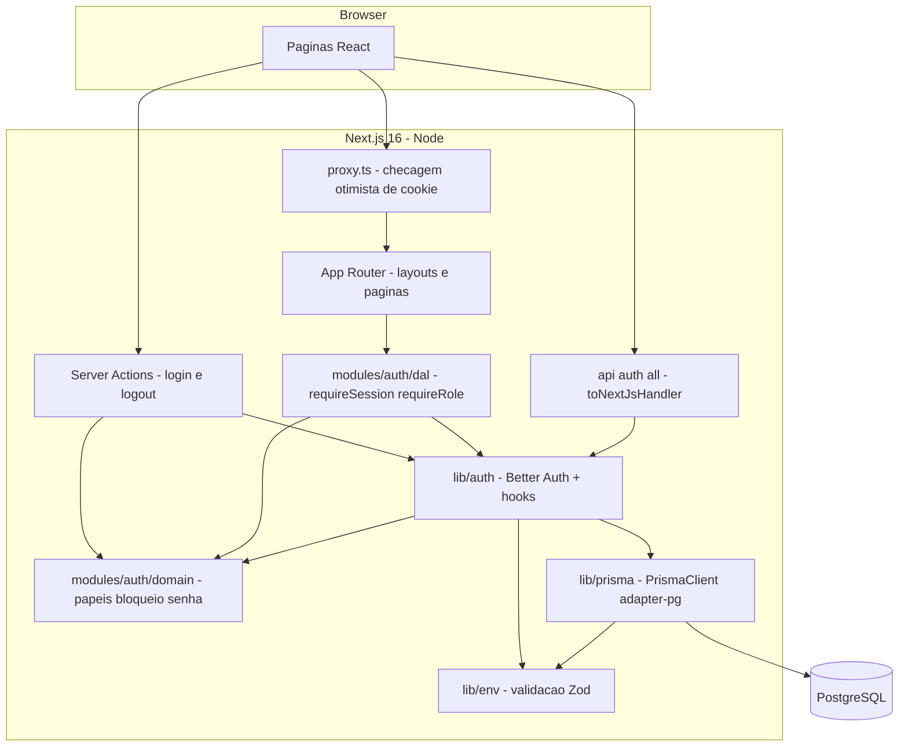
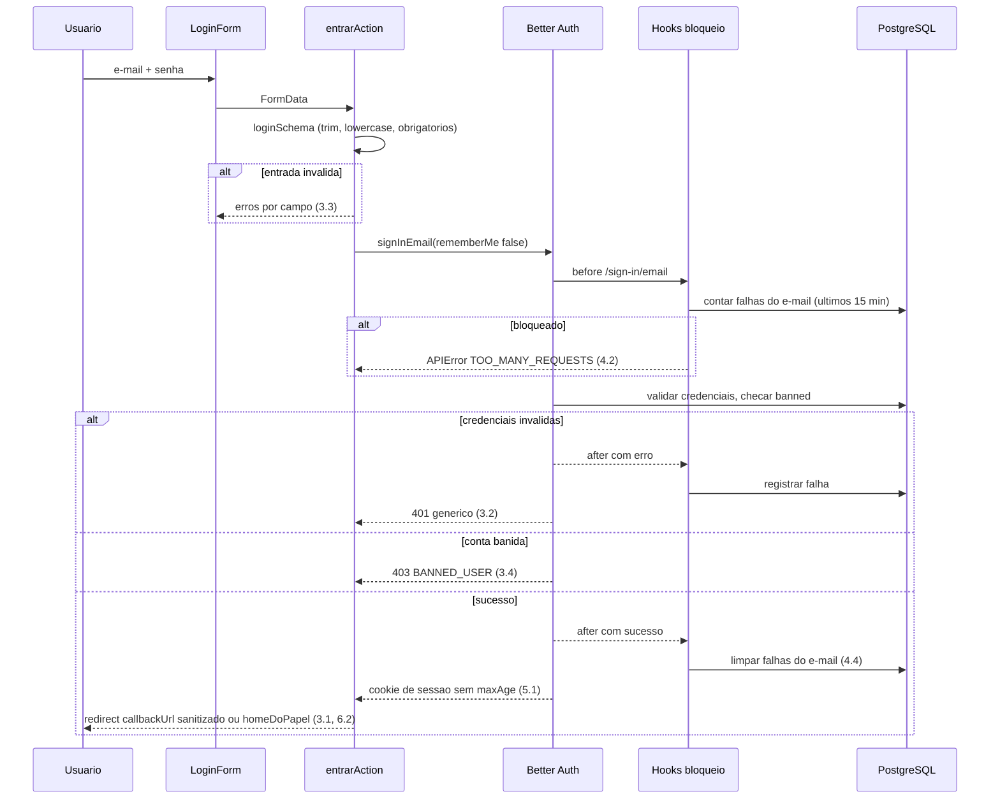
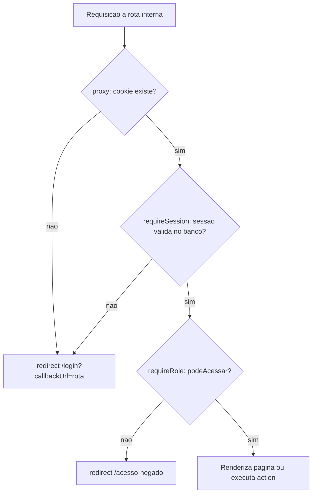

# Design: fundacao-autenticacao

## Overview

**Propósito**: entregar a fundação técnica do acutis-catequese, que tem duas partes:
- um ambiente de desenvolvimento reproduzível, com verificação automática de qualidade;
- controle de acesso com login por e-mail e senha, dois papéis (`coordenacao` e `catequista`), sessão que dura apenas enquanto o navegador está aberto, bloqueio após tentativas falhas e proteção de todas as áreas internas.

**Usuários**:
- a coordenação e os catequistas, que fazem login e navegam conforme o papel;
- o desenvolvedor e a banca, que clonam, executam e verificam o projeto.

**Impacto**: o repositório passa de "somente documentação" para uma aplicação Next.js executável. As specs seguintes consomem três coisas desta: a sessão, os papéis e o guard de autorização.

### Goals
- Clonar o repositório e rodar a aplicação seguindo apenas o README, com Postgres em Docker.
- Rodar no CI, a cada push ou PR, as verificações de lint, tipos, testes unitários, de integração e e2e.
- Fazer login, logout, bloqueio por tentativas e controle por papel de forma segura, sem autorização que dependa apenas do cliente.

### Non-Goals
- Criar, editar ou banir contas de catequistas (spec `cadastro-catequistas`).
- Troca de senha, recuperação por e-mail, login social e autocadastro.
- Deploy em produção (Vercel + Neon): fica para depois da primeira release funcional. Esta spec só garante que a configuração é feita por variáveis de ambiente.

## Boundary Commitments

### This Spec Owns
- A estrutura do projeto e as ferramentas: `package.json`, TypeScript, ESLint, Prettier, Vitest, Playwright, Docker Compose e o workflow de CI.
- O cliente Prisma, as migrações das tabelas de autenticação (`user`, `session`, `account`, `verification`) e a tabela `login_attempt`.
- A configuração do Better Auth: e-mail e senha, papéis, sessão, hooks de bloqueio e mensagem para contas banidas.
- **Contratos que esta spec estabiliza para as specs seguintes**:
  - `Papel` (`"coordenacao" | "catequista"`);
  - `SessaoUsuario`;
  - `requireSession()` e `requireRole(...)`;
  - `senhaSchema`;
  - `homeDoPapel()`;
  - o layout interno com `menuPorPapel`.
- As páginas `/login`, `/acesso-negado`, `/coordenacao` e `/catequista` (as duas últimas por enquanto são placeholders de boas-vindas).
- O seed idempotente com a conta inicial de coordenação.

### Out of Boundary
- Banir e desbanir usuários e criar contas de catequistas. Esta spec só **respeita** o campo `banned` no login.
- Itens de menu das funcionalidades de domínio. Cada spec adiciona o seu item em `menuPorPapel`.
- Qualquer entidade de domínio (catequista, catequizando, turma, encontro, presença).

### Allowed Dependencies
- Bibliotecas: `next@16`, `react@19`, `better-auth@1.7`, `@prisma/client`, `@prisma/adapter-pg` e `prisma@^7.10` (não usar a 8), `zod`, `pg`.
- Ferramentas de desenvolvimento: `vitest@^4`, `@playwright/test`, `eslint`, `prettier`, `tsx`, `dotenv`.
- Regra de dependência: `src/modules/*/domain` **não importa** Next, Prisma nem Better Auth.

### Revalidation Triggers
Mudanças que obrigam as specs seguintes a revalidar a integração com esta:
- mudança no tipo `Papel` ou na hierarquia de `podeAcessar`;
- mudança na assinatura de `requireSession` ou `requireRole`, ou no formato de `SessaoUsuario`;
- mudança em `senhaSchema` (usado por `cadastro-catequistas`);
- mudança no modelo `user` (campos `role` e `banned`) ou em novas variáveis de ambiente obrigatórias.

## Architecture

### Architecture Pattern & Boundary Map

**Monolito Next.js** com um núcleo de domínio puro e uma camada de acesso a dados (DAL), organizado por funcionalidade (`src/modules/<modulo>`).
- Páginas e Server Actions são finas: validam a entrada, chamam a DAL ou o domínio e depois renderizam ou redirecionam.
- O `proxy.ts` faz apenas uma **verificação otimista**, isto é, confere se o cookie existe. A autorização definitiva está sempre em `requireSession` e `requireRole`.



- **Conformidade com o steering**: organização por funcionalidade; domínio separado da interface e da persistência; TypeScript strict sem `any`; textos em pt-BR.

### Technology Stack

| Camada | Escolha / Versão | Papel nesta spec | Notas |
|---|---|---|---|
| Frontend | React 19 + Next.js 16.3 (App Router) | Páginas de login, acesso negado, inicial por papel e layout | Server Components por padrão; o formulário de login é um Client Component com `useActionState` |
| Backend | Server Actions + Better Auth 1.7 | Login, logout, sessão, papéis e bloqueio | `nextCookies()` por último na lista de plugins |
| Dados | PostgreSQL 17 + Prisma 7.10 (`@prisma/adapter-pg`) | Tabelas de autenticação e `login_attempt` | Client gerado em `src/generated/prisma` |
| Validação | Zod | Variáveis de ambiente, formulário de login, senha | Mesmos schemas no cliente e no servidor |
| Infra local | Docker Compose | Postgres de desenvolvimento | Volume nomeado |
| CI | GitHub Actions | Lint, tipos, unitários, integração, e2e | Postgres como service container |
| Testes | Vitest 4, Playwright 1.63 | Unitários e integração; e2e | Veja a Testing Strategy |

## File Structure Plan

### Directory Structure
```
.
├── .github/workflows/ci.yml           # CI: lint, typecheck, test, test:e2e com Postgres service
├── docker-compose.yml                 # Postgres 17 de desenvolvimento
├── .env.example                       # Todas as variáveis, sem segredos reais (1.2)
├── package.json                       # Scripts: dev, build, start, lint, typecheck, test, test:e2e, db:*
├── tsconfig.json                      # strict, alias @/* -> src/*
├── eslint.config.mjs / .prettierrc
├── next.config.ts
├── prisma.config.ts                   # schema, migrations, seed; carrega dotenv
├── vitest.config.ts                   # environment node, alias @, projetos unit e integration
├── playwright.config.ts               # webServer build+start, projeto setup (storageState por papel)
├── prisma/
│   ├── schema.prisma                  # Modelos do Better Auth + LoginAttempt
│   ├── migrations/                    # Geradas por prisma migrate
│   └── seed.ts                        # Conta inicial de coordenação, idempotente (1.4, 1.5)
├── src/
│   ├── proxy.ts                       # Checagem otimista de cookie; redireciona para /login?callbackUrl=
│   ├── lib/
│   │   ├── env.ts                     # Valida process.env com Zod; falha nomeando a variável (1.3)
│   │   ├── prisma.ts                  # Singleton PrismaClient com adapter-pg
│   │   ├── auth.ts                    # Instância Better Auth: e-mail/senha, admin, sessão, hooks, nextCookies
│   │   └── auth-client.ts             # createAuthClient + adminClient (uso futuro no cliente)
│   ├── modules/auth/
│   │   ├── domain/
│   │   │   ├── papeis.ts              # Papel, podeAcessar, homeDoPapel, rótulos em pt-BR
│   │   │   ├── bloqueio.ts            # avaliarBloqueio (política 5/15/15), puro
│   │   │   ├── senha.ts               # senhaSchema (mínimo 8)
│   │   │   ├── credenciais.ts         # loginSchema (e-mail trim+lowercase, senha obrigatória)
│   │   │   └── callback-url.ts        # sanitizarCallbackUrl (somente caminhos internos)
│   │   ├── dal.ts                     # getSessao, requireSession, requireRole (server-only)
│   │   ├── tentativas-login.ts        # Persistência de LoginAttempt (contar, registrar, limpar)
│   │   ├── actions.ts                 # entrarAction, sairAction (Server Actions)
│   │   └── mensagens.ts               # Mapeia códigos de erro para mensagens em pt-BR
│   ├── components/
│   │   ├── layout/
│   │   │   ├── app-shell.tsx          # Cabeçalho (nome, papel, Sair) e menu (8.1–8.3)
│   │   │   └── menu-por-papel.ts      # Itens de menu por papel (as specs seguintes adicionam itens)
│   │   └── auth/
│   │       ├── login-form.tsx         # Client Component: campos, erros, acessível (3.3, 8.6)
│   │       └── sair-button.tsx        # Formulário com sairAction
│   └── app/
│       ├── layout.tsx                 # <html lang="pt-BR">, fontes e estilos globais
│       ├── globals.css                # Estilos base responsivos (8.5)
│       ├── page.tsx                   # "/" redireciona para homeDoPapel ou /login
│       ├── login/page.tsx             # Redireciona se já estiver autenticado (3.5)
│       ├── acesso-negado/page.tsx     # Página 403 com link para a página inicial (6.3)
│       ├── api/auth/[...all]/route.ts # toNextJsHandler(auth)
│       └── (interno)/
│           ├── layout.tsx             # requireSession() + AppShell
│           ├── coordenacao/page.tsx   # requireRole("coordenacao"), boas-vindas
│           └── catequista/page.tsx    # requireRole("catequista"), boas-vindas
└── tests/
    ├── unit/auth/                     # papeis, bloqueio, senha, credenciais, callback-url, env
    ├── integration/auth/              # login, bloqueio, banido, logout, seed, requireRole
    ├── integration/setup.ts           # migrate deploy + limpeza do banco de teste
    └── e2e/
        ├── auth.setup.ts              # Login por papel e storageState
        ├── login.spec.ts
        ├── acesso.spec.ts
        └── layout.spec.ts
```

### Modified Files
- `README.md`: instruções reais de setup, comandos de teste e variáveis de ambiente (1.1, 2.3).
- `.gitignore`: acrescentar `src/generated/`, `test-results/`, `playwright-report/`, `.next/`.

## System Flows

### Login



- Uma conta banida não conta como tentativa falha: o bloqueio considera apenas credenciais inválidas.
- O redirecionamento pós-login usa `callbackUrl` somente se ele passar por `sanitizarCallbackUrl` e se `podeAcessar` permitir para aquele papel. Caso contrário, vai para `homeDoPapel`.

### Autorização de uma rota interna



## Requirements Traceability

| Req | Resumo | Componentes | Interfaces | Fluxos |
|---|---|---|---|---|
| 1.1 | Do clone à aplicação rodando pelo README | README, docker-compose, package.json, prisma.config | scripts `db:up`, `db:migrate`, `db:seed`, `dev` | — |
| 1.2 | `.env.example` sem segredos | .env.example, env.ts | `envSchema` | — |
| 1.3 | Falha nomeando a variável ausente | env.ts | `carregarEnv()` | — |
| 1.4 | Seed cria a coordenação | prisma/seed.ts | `auth.api.createUser` | — |
| 1.5 | Seed idempotente | prisma/seed.ts | busca por e-mail antes de criar | — |
| 1.6 | Sem segredos versionados | .gitignore, .env.example, CI com secrets de teste | — | — |
| 2.1 | CI completo em push/PR | ci.yml | jobs `qualidade`, `testes`, `e2e` | — |
| 2.2 | Falha identifica a etapa | ci.yml | steps nomeados | — |
| 2.3 | Comandos locais separados | package.json, README | `lint`, `typecheck`, `test:unit`, `test:integration`, `test:e2e` | — |
| 2.4 | Testes cobrindo os Req 3–6 | tests/ | — | — |
| 3.1 | Login válido leva à página inicial do papel | entrarAction, homeDoPapel | `entrarAction` | Login |
| 3.2 | Mensagem genérica | mensagens.ts, entrarAction | `mensagemDeErroLogin` | Login |
| 3.3 | Campos obrigatórios | loginSchema, LoginForm | `loginSchema` | Login |
| 3.4 | Conta bloqueada ou inativa | auth.ts (`bannedUserMessage`), mensagens.ts | código `BANNED_USER` | Login |
| 3.5 | Usuário logado em /login é redirecionado | login/page.tsx | `getSessao` | — |
| 3.6 | E-mail sem distinção de maiúsculas, com trim | loginSchema, Better Auth | `normalizarEmail` | Login |
| 4.1 | 5 falhas em 15 min bloqueiam | bloqueio.ts, hooks em auth.ts, tentativas-login.ts | `avaliarBloqueio` | Login |
| 4.2 | Recusa mesmo com senha correta | hook before | `APIError TOO_MANY_REQUESTS` | Login |
| 4.3 | Libera após o período | bloqueio.ts | `avaliarBloqueio(agora)` | — |
| 4.4 | Sucesso zera a contagem | hook after, tentativas-login.ts | `limparFalhas` | Login |
| 5.1 | Sessão mantida entre páginas | auth.ts (`rememberMe: false`), dal.ts | `getSessao` | — |
| 5.2 | Fechar o navegador exige novo login | cookie sem `maxAge` | — | — |
| 5.3 | Sair encerra e redireciona | sairAction, SairButton | `sairAction` | — |
| 5.4 | Sessão encerrada é rejeitada | dal.ts (validação no banco), signOut revoga | `requireSession` | Autorização |
| 6.1 | Um papel por conta | schema `user.role`, papeis.ts | `Papel` | — |
| 6.2 | Sem login vai ao login e volta à página pedida | proxy.ts, requireSession, callback-url.ts | `sanitizarCallbackUrl` | Autorização, Login |
| 6.3 | Acesso negado com link | requireRole, acesso-negado/page | `requireRole` | Autorização |
| 6.4 | Ação direta sem permissão é rejeitada | requireRole dentro de cada action | `requireRole` | Autorização |
| 6.5 | Coordenação acessa áreas de catequista | papeis.ts | `podeAcessar` | Autorização |
| 7.1 | Senha com mínimo de 8 | senha.ts, auth.ts (`minPasswordLength`) | `senhaSchema` | — |
| 7.2 | Criação com senha curta é recusada | seed.ts, `senhaSchema` | `senhaSchema.safeParse` | — |
| 7.3 | Senha armazenada de forma irreversível | Better Auth (scrypt) | — | — |
| 8.1 | Nome, papel e Sair | AppShell | `SessaoUsuario` | — |
| 8.2 | Menu da coordenação | menu-por-papel.ts | `menuPorPapel` | — |
| 8.3 | Menu do catequista | menu-por-papel.ts | `menuPorPapel` | — |
| 8.4 | Textos em pt-BR | todas as páginas, mensagens.ts, `lang="pt-BR"` | — | — |
| 8.5 | Sem rolagem horizontal a partir de 360 px | globals.css, AppShell | — | — |
| 8.6 | Teclado e rótulos acessíveis | LoginForm, AppShell | — | — |

## Components and Interfaces

| Componente | Camada | Intenção | Reqs | Dependências | Contratos |
|---|---|---|---|---|---|
| env | lib | Validar e expor as variáveis de ambiente | 1.2, 1.3 | Zod (P0) | Service |
| prisma | lib | Cliente único do banco | 1.1 | adapter-pg (P0), env (P0) | — |
| auth | lib | Configuração do Better Auth e hooks de bloqueio | 3, 4, 5, 6.1, 7 | prisma, domain/*, tentativas-login (P0) | Service |
| domain/papeis | domain | Papéis, hierarquia e página inicial | 3.1, 6.1, 6.5, 8.2, 8.3 | nenhuma | Service |
| domain/bloqueio | domain | Política 5/15/15 | 4.1–4.3 | nenhuma | Service |
| domain/senha, credenciais, callback-url | domain | Validação de entrada | 3.3, 3.6, 6.2, 7.1, 7.2 | Zod | Service |
| dal | módulo | Sessão e autorização no servidor | 5.1, 5.4, 6.2–6.4 | auth (P0), papeis (P0) | Service |
| tentativas-login | módulo | Persistir as falhas por e-mail | 4.1, 4.4 | prisma (P0) | Service |
| actions | módulo | Login e logout | 3.1–3.4, 5.3 | auth, dal, domain (P0) | Service |
| mensagens | módulo | Textos de erro em pt-BR | 3.2, 3.4, 4.2 | nenhuma | Service |
| proxy | app | Redirecionamento otimista | 6.2 | better-auth/cookies (P1) | — |
| AppShell, menu-por-papel | UI | Layout e navegação | 8.1–8.6 | dal (P0) | State |
| LoginForm, SairButton | UI | Formulários | 3.3, 5.3, 8.6 | actions (P0) | — |
| páginas (login, acesso-negado, coordenacao, catequista, raiz) | UI | Rotas | 3.5, 6.3, 8 | dal (P0) | — |
| seed | script | Conta inicial | 1.4, 1.5, 7.2 | auth, senhaSchema (P0) | Batch |
| ci.yml | infra | Verificação automática | 2.1, 2.2 | GitHub Actions | Batch |

### Domínio (`src/modules/auth/domain`)

#### papeis.ts
```typescript
export const PAPEIS = ["coordenacao", "catequista"] as const;
export type Papel = (typeof PAPEIS)[number];

export const ROTULO_PAPEL: Record<Papel, string> = {
  coordenacao: "Coordenação",
  catequista: "Catequista",
};

/** A coordenação satisfaz qualquer exigência de catequista (6.5). */
export function podeAcessar(papel: Papel, permitidos: readonly Papel[]): boolean;

export function homeDoPapel(papel: Papel): "/coordenacao" | "/catequista";

export function isPapel(valor: unknown): valor is Papel;
```
- Invariante: `podeAcessar("coordenacao", ["catequista"]) === true` e `podeAcessar("catequista", ["coordenacao"]) === false`.

#### bloqueio.ts
```typescript
export const POLITICA_BLOQUEIO = {
  maxFalhas: 5,
  janelaMs: 15 * 60_000,
  duracaoBloqueioMs: 15 * 60_000,
} as const;

export type ResultadoBloqueio =
  | { bloqueado: false }
  | { bloqueado: true; liberaEm: Date };

/**
 * falhas: instantes das falhas do e-mail (qualquer ordem).
 * O bloqueio começa na 5ª falha dentro de uma janela de 15 min e dura 15 min a partir dela.
 */
export function avaliarBloqueio(falhas: readonly Date[], agora: Date): ResultadoBloqueio;
```
- Regra: ordena as falhas; procura a falha mais recente `f` tal que existam ≥ 5 falhas em `[f − janela, f]`. Se `agora < f + duração`, o e-mail está bloqueado.
- A consulta usa as falhas das últimas `janelaMs + duracaoBloqueioMs` (30 min).

#### senha.ts, credenciais.ts e callback-url.ts
```typescript
export const senhaSchema: z.ZodString; // min(8, "A senha deve ter no mínimo 8 caracteres")

export const loginSchema: z.ZodObject<{
  email: z.ZodPipeline; // trim().toLowerCase().min(1, "Informe o e-mail").email("E-mail inválido")
  senha: z.ZodString;   // min(1, "Informe a senha"); o tamanho mínimo não é checado no login
}>;
export type Credenciais = z.infer<typeof loginSchema>;

/** Retorna o caminho só se começar com "/" e não com "//" nem "/\\"; senão retorna null. */
export function sanitizarCallbackUrl(valor: string | null | undefined): string | null;
```

### Infraestrutura (`src/lib`)

#### env.ts
```typescript
const envSchema = z.object({
  DATABASE_URL: z.string().url(),
  BETTER_AUTH_SECRET: z.string().min(32),
  BETTER_AUTH_URL: z.string().url(),
  SEED_COORDENACAO_EMAIL: z.string().email().optional(),
  SEED_COORDENACAO_SENHA: z.string().optional(),
  SEED_COORDENACAO_NOME: z.string().optional(),
  AUTH_RATE_LIMIT: z.enum(["on", "off"]).default("on"),
});
export type Env = z.infer<typeof envSchema>;

/** Lança um Error com a mensagem "Variável de ambiente ausente ou inválida: NOME (motivo)" (1.3). */
export function carregarEnv(fonte?: NodeJS.ProcessEnv): Env;
export const env: Env;
```
- As variáveis `SEED_*` são obrigatórias apenas no seed, que as valida por conta própria.

#### auth.ts (configuração do Better Auth)
- `database`: `prismaAdapter(prisma, { provider: "postgresql" })`.
- `emailAndPassword`: `{ enabled: true, disableSignUp: true, minPasswordLength: 8, maxPasswordLength: 128 }`.
- `session.expiresIn`: 12 h, como limite no servidor. O cookie é sem `maxAge` porque o login usa `rememberMe: false`.
- `plugins`:
  - `admin({ ac, roles: { coordenacao, catequista }, adminRoles: ["coordenacao"], defaultRole: "catequista", bannedUserMessage })`;
  - `nextCookies()`, que tem de ser o **último** da lista.
- `rateLimit`: `{ enabled: env.AUTH_RATE_LIMIT === "on", storage: "database" }`.
- `hooks.before`: em `/sign-in/email`, normaliza o e-mail, chama `listarFalhasRecentes`, depois `avaliarBloqueio`, e lança `APIError("TOO_MANY_REQUESTS", { message: MSG_BLOQUEIO })` se o e-mail estiver bloqueado.
- `hooks.after`: em `/sign-in/email`, se o resultado for erro de credencial (401), chama `registrarFalha(email)`; se for sucesso, chama `limparFalhas(email)`. Um erro `BANNED_USER` não é registrado como falha.

### Módulo de autenticação (`src/modules/auth`)

#### dal.ts (server-only)
```typescript
export interface SessaoUsuario {
  userId: string;
  nome: string;
  email: string;
  papel: Papel;
}

/** Sessão validada no banco, ou null. Memoizada por requisição (React cache). */
export function getSessao(): Promise<SessaoUsuario | null>;

/** Sem sessão: redirect(`/login?callbackUrl=${caminhoAtual}`). */
export function requireSession(caminhoAtual?: string): Promise<SessaoUsuario>;

/** Sem permissão: redirect("/acesso-negado"). Deve ser chamada em toda página e action protegida (6.4). */
export function requireRole(
  permitidos: readonly Papel[],
  caminhoAtual?: string,
): Promise<SessaoUsuario>;
```
- Se o papel gravado no banco não for válido (`!isPapel`), a sessão é tratada como não autorizada e o usuário vai para `/acesso-negado`.

#### tentativas-login.ts (server-only)
```typescript
export function listarFalhasRecentes(email: string, agora: Date): Promise<Date[]>;
export function registrarFalha(email: string, quando?: Date): Promise<void>;
export function limparFalhas(email: string): Promise<void>;
```

#### actions.ts
```typescript
export type EstadoLogin = {
  erro?: string;
  errosCampos?: Partial<Record<"email" | "senha", string>>;
  email?: string;
};

export function entrarAction(anterior: EstadoLogin, dados: FormData): Promise<EstadoLogin>;
export function sairAction(): Promise<never>; // signOut + redirect("/login")
```
- `entrarAction` lê `callbackUrl` do FormData, chama `auth.api.signInEmail({ body: { email, password, rememberMe: false }, headers })` e mapeia o `APIError` com `mensagemDeErroLogin`.

#### mensagens.ts
| Situação | Código | Mensagem |
|---|---|---|
| Credenciais inválidas ou e-mail inexistente | 401 `INVALID_EMAIL_OR_PASSWORD` | "E-mail ou senha inválidos." |
| Conta banida | 403 `BANNED_USER` | "Seu acesso está desabilitado. Procure a coordenação." |
| E-mail bloqueado | 429 | "Muitas tentativas de login. Aguarde alguns minutos e tente novamente." |
| Erro inesperado | 5xx | "Não foi possível entrar agora. Tente novamente em instantes." |

### UI

- **AppShell**: um Server Component que recebe `SessaoUsuario`. Mostra um cabeçalho com o nome, o `ROTULO_PAPEL` e o `SairButton`, e a navegação `menuPorPapel(papel)`. Usa `<header>`, `<nav aria-label="Principal">` e `<main>`. No celular, o menu vira uma lista que quebra linha, sem menu hambúrguer.
- **menu-por-papel.ts**: `menuPorPapel(papel: Papel): ItemMenu[]`, com `ItemMenu = { rotulo: string; href: string }`. Por enquanto, cada papel tem só o item "Início". As specs seguintes acrescentam os seus itens aqui.
- **LoginForm**:
  - usa `useActionState(entrarAction)`;
  - `<label>` associado a cada campo, com `autocomplete="username"` e `autocomplete="current-password"` e `required`;
  - erros ligados aos campos por `aria-describedby`;
  - a mensagem geral fica em `role="alert"`;
  - o botão é desabilitado enquanto o formulário é enviado.
- **Páginas**:
  - `/` redireciona para `homeDoPapel` ou para `/login`;
  - `/login` redireciona se o usuário já tiver sessão;
  - `/acesso-negado` traz link para `homeDoPapel` (ou para `/login` se não houver sessão).

### proxy.ts
- `matcher`: todas as rotas, exceto `api`, `_next`, `login`, `acesso-negado`, `favicon.ico` e arquivos estáticos.
- Se `getSessionCookie(req)` não existir, redireciona para `/login?callbackUrl=<pathname>`.
- Não verifica papel: isso fica a cargo da DAL.

### Seed (`prisma/seed.ts`)
- **Gatilho**: `npm run db:seed`, que também é chamado pelo `prisma migrate reset`.
- **Entrada**: variáveis `SEED_COORDENACAO_*`, que são obrigatórias aqui. Se faltar alguma, o seed falha com a mensagem que nomeia a variável. A senha é validada com `senhaSchema` (7.2).
- **Idempotência**: se já existir um usuário com o e-mail normalizado, o seed apenas avisa ("conta já existe") e não altera nada. Se não existir, chama `auth.api.createUser({ body: { email, password, name, role: "coordenacao" } })`.

## Data Models

### Logical Data Model
- **User**, **Session**, **Account** e **Verification**: modelos gerados pelo Better Auth, com as colunas extras do plugin `admin`.
  - `user.role` é uma string que só aceita `coordenacao` ou `catequista`.
  - `user.banned`, `banReason` e `banExpires` controlam o bloqueio da conta.
- **LoginAttempt**: uma linha por tentativa de login com falha (`email` já normalizado e `createdAt`). Não tem relação com `user`, porque o e-mail pode não existir.

### Physical Data Model

```prisma
model LoginAttempt {
  id        String   @id @default(cuid())
  email     String
  createdAt DateTime @default(now())

  @@index([email, createdAt])
  @@map("login_attempt")
}
```
- `limparFalhas` remove todas as linhas do e-mail.
- Tentativas com mais de 30 minutos são irrelevantes. A limpeza periódica fica para depois; o volume é desprezível.

## Error Handling

### Error Strategy
- **Entrada inválida**: validada com Zod, e o formulário mostra erros por campo sem chamar o Better Auth.
- **Erros do Better Auth** (`APIError`): mapeados por status e código em `mensagens.ts`. O servidor nunca expõe a mensagem original.
- **Erros inesperados**: a action registra `console.error` com o contexto (sem a senha) e o usuário recebe a mensagem genérica.
- **Configuração**: `carregarEnv` falha logo na inicialização (1.3).
- **Autorização**:
  - sem sessão, redireciona para o login;
  - sem papel permitido, redireciona para `/acesso-negado`;
  - em actions, `requireRole` roda **antes** de qualquer escrita (6.4).

### Monitoring
- Nesta fase, apenas os logs do servidor (`console.error`) e os relatórios do CI (artefato do Playwright). Não há monitoramento externo.

## Testing Strategy

### Unit (Vitest, `tests/unit`)
- `podeAcessar`: a coordenação acessa rotas de catequista, o catequista não acessa rotas da coordenação, e `homeDoPapel` devolve a página certa para cada papel (6.5, 3.1).
- `avaliarBloqueio`:
  - 4 falhas não bloqueiam;
  - 5 falhas em 15 min bloqueiam;
  - 5 falhas espalhadas por mais de 15 min não bloqueiam;
  - o bloqueio termina 15 min após a 5ª falha (4.1, 4.3).
- `loginSchema` e `senhaSchema`:
  - `"  Maria@Paroquia.org "` vira `"maria@paroquia.org"`;
  - campos vazios geram as mensagens em pt-BR;
  - uma senha de 7 caracteres é recusada (3.3, 3.6, 7.1).
- `sanitizarCallbackUrl`: aceita `/catequista`; recusa `//evil.com`, `https://evil.com` e `/\evil` (6.2).
- `carregarEnv`: sem `DATABASE_URL`, lança um erro que contém "DATABASE_URL" (1.3).

### Integração (Vitest + Postgres de teste, `tests/integration`)
- **Login**:
  - com credenciais válidas, a sessão é criada e o cookie não tem `Max-Age` nem `Expires` (3.1, 5.2);
  - com senha errada, a resposta é a mensagem genérica, igual à de um e-mail inexistente (3.2).
- **Bloqueio**:
  - 5 falhas e depois a senha correta resultam em 429;
  - avançar o relógio 15 min libera o login;
  - um login bem-sucedido após 4 falhas zera a contagem (4.1–4.4).
- **Conta banida**: o login é recusado com `BANNED_USER` e isso não conta como tentativa falha (3.4).
- **Logout**: depois de `signOut`, o mesmo token não gera sessão válida (5.3, 5.4).
- **`requireRole` em action**: um catequista chamando uma action restrita à coordenação cai em redirect e nada é gravado (6.4).
- **Seed**: rodar duas vezes deixa 1 usuário com o papel `coordenacao`, e a senha fica gravada como hash, nunca igual ao texto original (1.4, 1.5, 7.3). Uma senha curta faz o seed falhar (7.2).

### E2E (Playwright, `tests/e2e`)
- A coordenação faz login, cai em `/coordenacao` e vê o nome, "Coordenação" e "Sair". Ao clicar em "Sair", volta para `/login` (3.1, 8.1, 5.3).
- Acessar `/catequista` sem login leva a `/login?callbackUrl=/catequista`. Depois do login como catequista, o usuário cai em `/catequista` (6.2).
- Um catequista que acessa `/coordenacao` vê "Acesso negado" com link para `/catequista`. A coordenação consegue acessar `/catequista` (6.3, 6.5).
- Com o formulário vazio, aparecem os erros por campo. É possível navegar por Tab até "Entrar" e enviar com Enter (3.3, 8.6).
- Numa viewport de 360 px nas páginas de login, inicial e acesso negado, `scrollWidth <= clientWidth` (8.5).

### CI (`.github/workflows/ci.yml`)
- Roda em `push` e `pull_request`.
- Jobs nomeados:
  - `Qualidade` (lint + typecheck);
  - `Testes` (unit + integration com o service Postgres 17);
  - `E2E` (build, migrate deploy, seed, playwright), que publica o relatório como artefato.
- As variáveis de teste ficam definidas no próprio workflow. Nenhuma credencial real é usada (1.6, 2.1, 2.2).

## Security Considerations
- **Senhas**: armazenadas com scrypt pelo Better Auth (7.3), nunca registradas em log e nunca devolvidas na resposta.
- **Enumeração de contas**: a mesma mensagem e o mesmo registro de falha valem para e-mails inexistentes e existentes (3.2).
- **Força bruta**: o bloqueio por e-mail (Req 4) se soma ao rate limit por IP do Better Auth em produção.
- **Sessão**:
  - cookie `HttpOnly`, `SameSite=Lax` e `Secure` em produção;
  - sem `maxAge` (Req 5);
  - validade máxima de 12 h no servidor;
  - o logout revoga a sessão no banco.
- **Autorização**: nunca depende apenas do `proxy` ou da interface. É repetida na DAL em toda página e action (6.4).
- **Open redirect**: `callbackUrl` aceita apenas caminhos internos.
- **LGPD**: esta spec não armazena dados de catequizandos. Os dados guardados são nome e e-mail dos usuários, mais os e-mails das tentativas de login, que são temporários.
