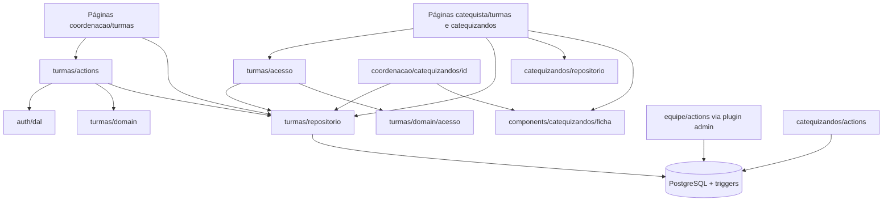
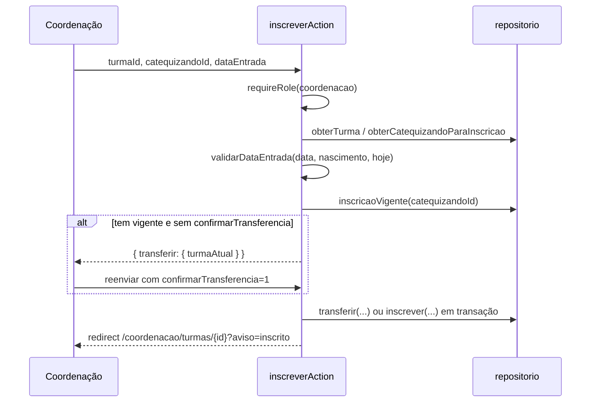
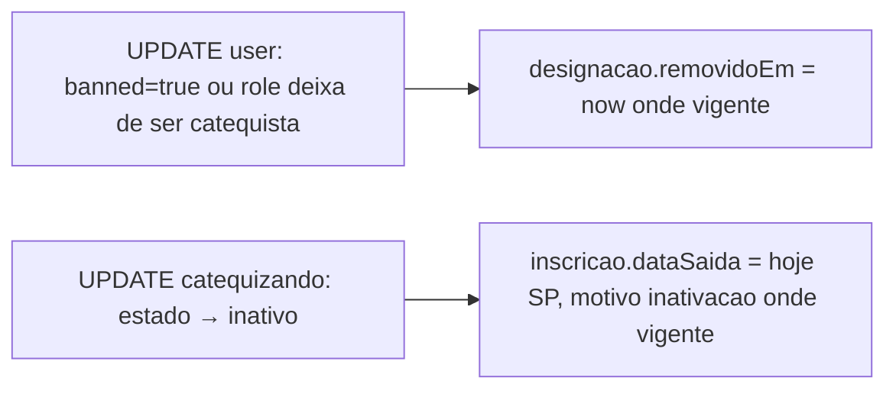

# Design: gestao-turmas

## Overview
Esta spec organiza a catequese em turmas:
- a coordenação cria, edita e encerra turmas;
- a coordenação designa os catequistas responsáveis;
- a coordenação inscreve, desliga e transfere catequizandos, preservando todo o histórico;
- o catequista vê as próprias turmas e as fichas dos inscritos nelas, somente para consulta.

A spec também entrega a **regra de acesso por turma**, que será reutilizada por `programa-catequese` e `controle-presenca`.

A inativação de catequistas e de catequizandos, que acontece em specs já entregues, afeta as turmas. Esse efeito é garantido por **triggers no PostgreSQL**, sem que os módulos `equipe` e `catequizandos` importem o módulo `turmas` (regra do `structure.md`). As decisões estão em `research.md`.

### Goals
- Turmas, designações e inscrições com histórico completo e regras de unicidade garantidas pelo banco.
- Acesso por turma correto e reutilizável.
- Efeitos da inativação automáticos e atômicos.

### Non-Goals
- Encontros, presença e reposição de temas em outra turma.
- Link público de autocadastro.
- Reabertura de turma.
- Edição de fichas pelo catequista.

## Boundary Commitments

### This Spec Owns
- As tabelas `turma`, `designacao` e `inscricao`, os enums `DiaSemana` e `MotivoSaida`, os índices parciais e os triggers de inativação.
- O módulo `src/modules/turmas`: domain, repositório, actions, acesso e mensagens.
- A UI em `src/app/(interno)/coordenacao/turmas/**`, `src/app/(interno)/catequista/turmas/**`, `src/app/(interno)/catequista/catequizandos/[id]` e `src/components/turmas/**`.
- O componente de leitura `FichaCatequizando`, extraído da página de detalhe da coordenação.
- A seção "Turma" na página do catequizando da coordenação (5.6).
- Os itens de menu "Turmas" e "Minhas turmas".

### Out of Boundary
- As regras de cadastro, validação e estados de membros e de catequizandos, que ficam com as specs de cadastro.
- Encontros e presença.

### Allowed Dependencies
- `@/modules/auth/dal` (`requireSession`, `requireRole`) e `@/modules/auth/domain/papeis`.
- `@/modules/compartilhado/*` e `@/components/comum/*`.
- Prisma, Zod e Next.
- As tabelas `user`, `catequizando` e `perfil_membro` são **lidas** pelo repositório de turmas e pelos triggers. O módulo `turmas` não importa os módulos `equipe` nem `catequizandos`.
- A camada `app` pode compor `turmas` com `catequizandos` (ficha do catequista e seção "Turma").

### Revalidation Triggers
- Mudança na forma de inativar membros (`banned`, `role`) ou catequizandos (`estado`): revalidar os triggers.
- Mudança em `podeVerTurma` ou `podeVerCatequizando`: revalidar `programa-catequese` e `controle-presenca`.
- Mudança no `FichaCatequizando`: revalidar a página de detalhe de `cadastro-catequizandos`.

## Architecture

### Architecture Pattern & Boundary Map


### Technology Stack

| Camada | Escolha | Papel |
|---|---|---|
| Web | Next.js 16 | Páginas, Server Actions |
| Dados | Prisma 7 + PostgreSQL 17 | Tabelas, índices parciais e triggers (SQL na migração) |
| Validação | Zod 4 | Schemas de turma e de datas |
| Testes | Vitest + Playwright | Ver Testing Strategy |

## File Structure Plan

### Directory Structure
```
src/modules/turmas/
├── domain/
│   ├── turma.ts        # DIAS_SEMANA, criarTurmaSchema({ anoAtual }), formatarHorario, ordenarTurmas
│   ├── inscricao.ts    # validarDataEntrada, validarDataSaida, MOTIVOS_SAIDA, ROTULO_MOTIVO
│   ├── acesso.ts       # regra pura: podeVerTurmaRegra, podeVerCatequizandoRegra
│   └── filtros.ts      # filtrarTurmas (situação, ciclo), cicloPadrao
├── repositorio.ts      # server-only: turmas, designações, inscrições, candidatos, histórico
├── acesso.ts           # server-only: podeVerTurma(sessao, turmaId), podeVerCatequizando(sessao, id)
├── actions.ts          # "use server": criar, editar, encerrar, designar, remover, inscrever, transferir, desligar
└── mensagens.ts        # códigos de aviso e textos
src/components/turmas/
├── lista-turmas.tsx
├── filtros-turmas.tsx
├── formulario-turma.tsx
├── designar-catequista.tsx     # select de catequistas elegíveis + botão
├── inscrever-catequizando.tsx  # busca (GET) + seleção + data de entrada + oferta de transferência
├── inscritos.tsx               # vigentes e anteriores, com links de contato
└── acoes-turma.tsx             # Confirmacao: encerrar, remover catequista, desligar (com data)
src/components/catequizandos/ficha-catequizando.tsx   # leitura da ficha (extraído)
src/app/(interno)/coordenacao/turmas/
├── page.tsx
├── nova/page.tsx
└── [id]/{page.tsx, editar/page.tsx, not-found.tsx}
src/app/(interno)/catequista/turmas/{page.tsx, [id]/page.tsx}
src/app/(interno)/catequista/catequizandos/[id]/page.tsx
tests/unit/turmas/{turma,inscricao,acesso,filtros,mensagens}.test.ts
tests/unit/components/turmas/*.test.tsx
tests/integration/turmas/{helpers,repositorio,triggers,turmas-actions,inscricoes-actions,acesso}.test.ts
tests/e2e/turmas.spec.ts
```

### Modified Files
- `prisma/schema.prisma` e a migração `*_turmas`, que traz modelos, enums, SQL dos índices parciais e dos triggers.
- `tests/integration/setup.ts` e `tests/e2e/preparar-banco.ts`: incluir `turma`, `designacao` e `inscricao` no TRUNCATE.
- `src/components/layout/menu-por-papel.ts` e os testes do menu e do app-shell: "Turmas" para a coordenação e "Minhas turmas" para o catequista.
- `src/app/(interno)/coordenacao/catequizandos/[id]/page.tsx`: passa a usar `FichaCatequizando` e ganha a seção "Turma" (turma atual e histórico).
- `src/app/(interno)/catequista/page.tsx`: ganha um link para "Minhas turmas".
- `src/app/globals.css`: estilos das turmas.

## System Flows

### Inscrição com transferência


### Efeitos da inativação (triggers)


## Requirements Traceability

| Req | Componentes | Verificação |
|---|---|---|
| 1.1, 1.4 | actions (`requireRole`), páginas da coordenação | integração, e2e |
| 1.2, 1.3 | `acesso.ts`, páginas do catequista | unit (regra), integração (acesso), e2e |
| 1.5 | menu-por-papel | unit |
| 2.1–2.6 | domain/turma, repositório (`nomeEmUso`), criar e editar | unit, integração |
| 3.1–3.5 | domain/filtros, lista-turmas, filtros-turmas, página | unit, e2e |
| 4.1–4.5 | designar e remover, repositório (elegíveis), lista e página | integração, unit (componente) |
| 4.6 | trigger em `user` | integração (inativar e rebaixar pela action da equipe) |
| 5.1–5.5 | inscrever, transferir, domain/inscricao, inscrever-catequizando | unit, integração |
| 5.6 | seção "Turma" na página do catequizando | integração (histórico), e2e |
| 6.1–6.4 | desligar, domain/inscricao, acoes-turma | unit, integração |
| 6.5 | trigger em `catequizando` | integração (inativar pela action dos catequizandos) |
| 7.1–7.6 | página [id], inscritos, acoes-turma, not-found | unit (componente), e2e |
| 8.1–8.4 | encerrar (transação), actions recusam turma encerrada | integração, e2e |
| 9.1–9.4 | catequista/turmas, catequista/catequizandos/[id], acesso | integração, e2e |
| 10.1–10.4 | UI, `formatarHorario`, `formatarData` | unit, e2e |
| 11.1–11.2 | domain/turma (`vagas`), FormularioTurma | unit |
| 11.3–11.4 | `estaLotada`, `formatarOcupacao`, ListaTurmas, página | unit, e2e |
| 11.5–11.6 | inscreverAction (`confirmarLotacao`), InscreverCatequizando | integração, unit (componente), e2e |
| 11.7 | editarTurmaAction sem restrição de vagas | integração |

## Components and Interfaces

### Domínio (`src/modules/turmas/domain`)

#### turma.ts
```ts
export const DIAS_SEMANA = ["domingo","segunda","terca","quarta","quinta","sexta","sabado"] as const;
export type DiaSemana = (typeof DIAS_SEMANA)[number];
export const ROTULO_DIA: Record<DiaSemana, string>; // "Domingo", "Segunda-feira", …
export interface TurmaDados {
  nome: string;            // trim, 2–80
  ciclo: number;           // inteiro, 2000..anoAtual+1
  diaSemana: DiaSemana;
  horario: string;         // "HH:MM" 00:00–23:59
  local?: string;          // trim, até 120; "" → undefined
  observacoes?: string;    // trim, até 1000; "" → undefined
  vagas?: number;          // inteiro 1..500; "" → undefined (sem limite)
}
export function estaLotada(inscritosVigentes: number, vagas: number | null): boolean; // vagas definidas e inscritos >= vagas
export function formatarOcupacao(inscritosVigentes: number, vagas: number): string;   // "12 de 20 vagas"
export function criarTurmaSchema(opcoes: { anoAtual: number }): z.ZodType<TurmaDados>;
export function formatarHorario(hhmm: string): string; // "19:30"
export function ordenarTurmas<T extends { diaSemana: DiaSemana; horario: string; nome: string }>(t: readonly T[]): T[];
```
Mensagens:
- nome vazio: "Informe o nome";
- ciclo fora do intervalo: "Informe um ano entre 2000 e {anoAtual+1}";
- dia inválido: "Escolha o dia da semana";
- horário inválido: "Informe um horário válido (ex.: 19:30)";
- vagas inválidas: "Informe um número de vagas entre 1 e 500, ou deixe em branco".

Erros de nome vazio não são fatais, conforme a nota da spec anterior sobre `abort`.

#### inscricao.ts
```ts
export const MOTIVOS_SAIDA = ["desligamento","transferencia","encerramento","inativacao"] as const;
export type MotivoSaida = (typeof MOTIVOS_SAIDA)[number];
export const ROTULO_MOTIVO: Record<MotivoSaida, string>;
export function validarDataEntrada(data: DataCivil, nascimento: DataCivil, hoje: DataCivil): string | null; // mensagem ou null
export function validarDataSaida(data: DataCivil, entrada: DataCivil, hoje: DataCivil): string | null;
```
A mensagem de erro é "Data inválida": para a entrada, quando a data é futura ou anterior ao nascimento; para a saída, quando é futura ou anterior à entrada.

#### acesso.ts (puro)
```ts
export interface Ator { id: string; papel: Papel }
export function podeVerTurmaRegra(ator: Ator, designadosVigentes: readonly string[]): boolean;
export function podeVerCatequizandoRegra(ator: Ator, catequistasDasTurmasVigentes: readonly string[]): boolean;
```
- A coordenação sempre pode.
- O catequista pode quando o próprio id está na lista.

#### filtros.ts
```ts
export type FiltroSituacaoTurma = "abertas" | "encerradas" | "todas";
export function cicloPadrao(ciclos: readonly number[], anoAtual: number): number; // o mais recente existente, ou anoAtual
export function filtrarTurmas<T extends { encerrada: boolean; ciclo: number }>(
  turmas: readonly T[], filtro: { situacao: FiltroSituacaoTurma; ciclo: number | "todos" }): T[];
```

### Módulo (`src/modules/turmas`)

#### repositorio.ts (server-only)
```ts
export interface TurmaResumo {
  id: string; nome: string; ciclo: number; diaSemana: DiaSemana; horario: string; local: string | null;
  encerrada: boolean; catequistas: { id: string; nome: string }[]; inscritosVigentes: number;
  vagas: number | null;
}
export interface InscritoResumo {
  inscricaoId: string; catequizandoId: string; nome: string; dataNascimento: DataCivil; telefone: string;
  dataEntrada: DataCivil; dataSaida: DataCivil | null; motivoSaida: MotivoSaida | null;
}
export interface TurmaDetalhe extends TurmaResumo {
  observacoes: string | null; encerradaEm: DataCivil | null;
  vigentes: InscritoResumo[]; anteriores: InscritoResumo[];
}
export function listarTurmas(): Promise<TurmaResumo[]>;
export function listarTurmasDoCatequista(userId: string): Promise<TurmaResumo[]>; // abertas, designação vigente
export function obterTurma(id: string): Promise<TurmaDetalhe | null>;        // id não-UUID → null
export function nomeEmUso(nome: string, ciclo: number, ignorarId?: string): Promise<boolean>; // entre abertas, sem diferenciar caixa
export function criarTurma(d: TurmaDados): Promise<string>;
export function atualizarTurma(id: string, d: TurmaDados): Promise<void>;
export function encerrarTurma(id: string, hoje: DataCivil): Promise<number>; // transação; devolve quantos inscritos foram desligados
export function catequistasElegiveis(turmaId: string): Promise<{ id: string; nome: string }[]>; // ativos, papel catequista, não designados
export function designar(turmaId: string, userId: string): Promise<void>;
export function removerDesignacao(turmaId: string, userId: string): Promise<boolean>;
export function catequizandosParaInscricao(termo: string): Promise<{ id: string; nome: string; dataNascimento: DataCivil; turmaAtual: { id: string; nome: string } | null }[]>; // só ativos
export function inscricaoVigente(catequizandoId: string): Promise<{ id: string; turmaId: string; turmaNome: string; dataEntrada: DataCivil } | null>;
export function inscrever(turmaId: string, catequizandoId: string, entrada: DataCivil): Promise<void>;
export function transferir(turmaId: string, catequizandoId: string, data: DataCivil): Promise<void>; // transação
export function desligar(inscricaoId: string, saida: DataCivil): Promise<boolean>;
export function historicoDoCatequizando(catequizandoId: string): Promise<{ turmaId: string; turmaNome: string; ciclo: number; dataEntrada: DataCivil; dataSaida: DataCivil | null; motivoSaida: MotivoSaida | null }[]>;
export function designadosVigentes(turmaId: string): Promise<string[]>;
export function catequistasDoCatequizando(catequizandoId: string): Promise<string[]>; // de turmas com inscrição vigente
```
- As leituras de catequistas consideram apenas designações vigentes.
- As violações de índice (P2002) em `criarTurma`, `inscrever` e `designar` são convertidas em `false` ou num erro de domínio pelo chamador.

#### acesso.ts (server-only)
```ts
export async function podeVerTurma(sessao: SessaoUsuario, turmaId: string): Promise<boolean>;
export async function podeVerCatequizando(sessao: SessaoUsuario, catequizandoId: string): Promise<boolean>;
```
Os dois compõem o repositório com a regra pura. As páginas do catequista chamam `requireSession`, depois o helper e, se o resultado for negativo, `redirect("/acesso-negado")`.

#### actions.ts ("use server")
```ts
export type EstadoTurma = {
  errosCampos?: Partial<Record<string, string>>; erro?: string; valores?: Record<string, string>;
  transferir?: { turmaAtualNome: string };
  lotada?: { inscritos: number; vagas: number };
};
export async function criarTurmaAction(anterior: EstadoTurma, dados: FormData): Promise<EstadoTurma>;
export async function editarTurmaAction(id: string, anterior: EstadoTurma, dados: FormData): Promise<EstadoTurma>;
export async function encerrarTurmaAction(id: string, anterior: EstadoTurma): Promise<EstadoTurma>;
export async function designarCatequistaAction(turmaId: string, anterior: EstadoTurma, dados: FormData): Promise<EstadoTurma>;
export async function removerCatequistaAction(turmaId: string, userId: string, anterior: EstadoTurma): Promise<EstadoTurma>;
export async function inscreverAction(turmaId: string, anterior: EstadoTurma, dados: FormData): Promise<EstadoTurma>; // catequizandoId, dataEntrada, confirmarTransferencia?, confirmarLotacao?
export async function desligarAction(turmaId: string, inscricaoId: string, anterior: EstadoTurma, dados: FormData): Promise<EstadoTurma>; // dataSaida
```
- **Todas as actions:**
  - chamam `requireRole(["coordenacao"])` primeiro;
  - chamam `redirect` fora do try/catch;
  - registram no log só ids e `e.name`.
- **Turma encerrada:** qualquer alteração devolve `erro: MSG_TURMA_ENCERRADA` (8.3).
- **Designação:** o catequista escolhido precisa estar em `catequistasElegiveis`. Se não estiver, a action devolve um erro.
- **Inscrição:**
  - o catequizando precisa estar ativo;
  - a data de entrada é validada;
  - se houver inscrição vigente em outra turma e não vier `confirmarTransferencia=1`, a action devolve `{ transferir }`;
  - se houver inscrição vigente na mesma turma, devolve o erro `MSG_JA_INSCRITO`;
  - se a turma de destino estiver lotada (`estaLotada`) e não vier `confirmarLotacao=1`, devolve `{ lotada }` sem gravar (11.5). A lotação é checada antes da transferência, e cada confirmação é um campo separado, para os dois avisos poderem aparecer em sequência;
  - reduzir as vagas abaixo dos inscritos é permitido (11.7).
- **Redirects:** todos voltam para `/coordenacao/turmas/{id}?aviso=…`.

#### mensagens.ts
| Código | Texto |
|---|---|
| `turma-criada` | "Turma criada." |
| `alteracoes-salvas` | "Alterações salvas." |
| `turma-encerrada` | "Turma encerrada." |
| `catequista-designado` | "Catequista designado." |
| `catequista-removido` | "Catequista removido." |
| `inscrito` | "Catequizando inscrito." |
| `transferido` | "Catequizando transferido." |
| `desligado` | "Catequizando desligado." |

Constantes:
- `MSG_NOME_EM_USO`: "Já existe uma turma aberta com este nome neste ciclo."
- `MSG_TURMA_ENCERRADA`: "Esta turma está encerrada e não pode ser alterada."
- `MSG_JA_INSCRITO`: "Este catequizando já está inscrito nesta turma."
- `MSG_TRANSFERIR(turma)`: "Já inscrito na turma {turma}. Deseja transferir?"
- `MSG_LOTADA(inscritos, vagas)`: "Turma lotada ({inscritos} de {vagas} vagas)."
- `MSG_ERRO_INESPERADO`.
- `mensagemDeAviso(unknown)`.

### UI

#### Componentes (`src/components/turmas`)
- **`ListaTurmas({ turmas })`:** em cada linha, nome como link, ciclo, "Quarta-feira, 19:30", local, catequistas (ou selo "Sem catequista" quando a turma está aberta e sem nenhum), número de inscritos (ou "12 de 20 vagas" quando há vagas), selo "Lotada" e selo "Encerrada". A mesma lista serve à coordenação e ao catequista, recebendo por prop a base do link.
- **`FiltrosTurmas({ situacao, ciclo, ciclos })`:** formulário GET com `situacao` e `ciclo`.
- **`FormularioTurma({ modo, acao, valoresIniciais? })`:** padrão dos formulários anteriores, com `select` de dia da semana e `input type="time"`.
- **`DesignarCatequista({ acao, elegiveis })`:** `select` e botão "Designar". Quando não há elegíveis, mostra "Nenhum catequista disponível".
- **`InscreverCatequizando({ turmaId, termo, candidatos, acao, hoje })`:**
  - busca por formulário GET com `q` na página da turma;
  - lista de candidatos, cada um com a turma atual quando houver;
  - para cada candidato, um formulário com data de entrada (padrão hoje) e o botão "Inscrever";
  - o estado `transferir` mostra um alerta com "Transferir para esta turma", que é o submit com `confirmarTransferencia=1` e fica depois do botão principal, pela nota da 4.2 da spec anterior;
  - o estado `lotada` mostra um alerta com `MSG_LOTADA` e "Inscrever mesmo assim" (`confirmarLotacao=1`), também depois do botão principal. As confirmações já dadas seguem como campos ocultos no reenvio.
- **`Inscritos({ vigentes, anteriores, hoje, baseFicha, acoes? })`:**
  - vigentes em ordem alfabética, com idade, telefone e links de ligação e de WhatsApp;
  - anteriores em uma seção à parte, com período e motivo;
  - `baseFicha` é `/coordenacao/catequizandos` ou `/catequista/catequizandos`;
  - com `acoes`, cada vigente tem "Desligar" (Confirmacao com o campo data de saída).
- **`AcoesTurma`:** usa `Confirmacao` para:
  - "Encerrar turma", com o texto "{n} catequizandos serão desligados";
  - "Remover" catequista, nomeando o catequista e a turma;
  - "Desligar" catequizando.

  O componente comum `Confirmacao` ganha a prop opcional `children`, para campos extras dentro do formulário do diálogo (a data de saída). Isso é uma extensão compatível.

#### Páginas
- **`/coordenacao/turmas`:**
  - filtros validados: `situacao` padrão `abertas`; `ciclo` padrão `cicloPadrao`;
  - aviso, lista, "Nova turma" e estado vazio com "Limpar filtros".
- **`/coordenacao/turmas/nova`** e **`[id]/editar`:** usam `FormularioTurma`. A edição de uma turma encerrada leva a um aviso somente leitura.
- **`/coordenacao/turmas/[id]`:**
  - dados da turma e situação;
  - catequistas com "Remover" e `DesignarCatequista`;
  - inscrição e inscritos;
  - "Editar" e "Encerrar";
  - numa turma encerrada, as ações ficam ocultas;
  - `notFound()` e a página `not-found` "Turma não encontrada".
- **`/catequista/turmas`:** usa `requireRole(["catequista"])` e `listarTurmasDoCatequista`, com o estado vazio "Você ainda não tem turmas designadas.".
- **`/catequista/turmas/[id]`:** usa `requireRole(["catequista"])`, `podeVerTurma`, que redireciona para `/acesso-negado` quando nega, e `obterTurma`, com os mesmos componentes e sem ações.
- **`/catequista/catequizandos/[id]`:** usa `requireRole(["catequista"])`, `podeVerCatequizando` e `obterCatequizando`, e mostra `<FichaCatequizando>` sem ações.
- **`/coordenacao/catequizandos/[id]`:** passa a usar `FichaCatequizando` e ganha a seção "Turma", com a turma atual (link) e o histórico (turma, ciclo, período, motivo).

Todas as páginas chamam `requireRole` com o caminho exato e usam o título "… — Acutis Catequese".

## Data Models

### Physical Data Model
```prisma
enum DiaSemana { domingo segunda terca quarta quinta sexta sabado  @@map("dia_semana") }
enum MotivoSaida { desligamento transferencia encerramento inativacao  @@map("motivo_saida") }

model Turma {
  id          String      @id @default(uuid())
  nome        String
  ciclo       Int
  diaSemana   DiaSemana
  horario     String      // "HH:MM"
  local       String?
  observacoes String?
  vagas       Int?
  encerradaEm DateTime?   @db.Date
  createdAt   DateTime    @default(now())
  updatedAt   DateTime    @updatedAt
  designacoes Designacao[]
  inscricoes  Inscricao[]
  @@index([ciclo])
  @@map("turma")
}

model Designacao {
  id          String    @id @default(uuid())
  turmaId     String
  userId      String
  designadoEm DateTime  @default(now())
  removidoEm  DateTime?
  turma       Turma     @relation(fields: [turmaId], references: [id], onDelete: Restrict)
  user        User      @relation(fields: [userId], references: [id], onDelete: Restrict)
  @@index([userId])
  @@map("designacao")
}

model Inscricao {
  id             String       @id @default(uuid())
  turmaId        String
  catequizandoId String
  dataEntrada    DateTime     @db.Date
  dataSaida      DateTime?    @db.Date
  motivoSaida    MotivoSaida?
  turma          Turma        @relation(fields: [turmaId], references: [id], onDelete: Restrict)
  catequizando   Catequizando @relation(fields: [catequizandoId], references: [id], onDelete: Restrict)
  @@index([turmaId])
  @@map("inscricao")
}
```
SQL manual na migração:
```sql
CREATE UNIQUE INDEX inscricao_vigente_unica ON inscricao ("catequizandoId") WHERE "dataSaida" IS NULL;
CREATE UNIQUE INDEX designacao_vigente_unica ON designacao ("turmaId","userId") WHERE "removidoEm" IS NULL;
CREATE UNIQUE INDEX turma_nome_aberta_unica ON turma (lower(nome), ciclo) WHERE "encerradaEm" IS NULL;

CREATE FUNCTION turmas_remover_designacoes() RETURNS trigger AS $$
BEGIN
  IF (COALESCE(NEW.banned,false) AND NOT COALESCE(OLD.banned,false))
     OR (OLD.role = 'catequista' AND NEW.role IS DISTINCT FROM 'catequista') THEN
    UPDATE designacao SET "removidoEm" = now() WHERE "userId" = NEW.id AND "removidoEm" IS NULL;
  END IF;
  RETURN NEW;
END $$ LANGUAGE plpgsql;
CREATE TRIGGER user_remove_designacoes AFTER UPDATE OF banned, role ON "user"
  FOR EACH ROW EXECUTE FUNCTION turmas_remover_designacoes();

CREATE FUNCTION turmas_desligar_inativado() RETURNS trigger AS $$
BEGIN
  IF NEW.estado = 'inativo' AND OLD.estado <> 'inativo' THEN
    UPDATE inscricao SET "dataSaida" = (now() AT TIME ZONE 'America/Sao_Paulo')::date, "motivoSaida" = 'inativacao'
      WHERE "catequizandoId" = NEW.id AND "dataSaida" IS NULL;
  END IF;
  RETURN NEW;
END $$ LANGUAGE plpgsql;
CREATE TRIGGER catequizando_desliga_inscricao AFTER UPDATE OF estado ON catequizando
  FOR EACH ROW EXECUTE FUNCTION turmas_desligar_inativado();
```
- O relacionamento `User.designacoes` e `Catequizando.inscricoes` são adicionados só como campos de relação no schema, sem mudar colunas.
- A reativação não restaura designações nem inscrições (4.6 e 6.5 dizem "remover" e "encerrar").

## Error Handling
- **Validação:** `errosCampos` e `valores`.
- **Regras de negócio:** turma encerrada, nome em uso, catequista não elegível, catequizando não ativo, já inscrito e datas inválidas voltam como `erro`, sem gravar nada.
- **Violação de índice por concorrência (P2002):** vira a mensagem da regra correspondente.
- **Inexistente:** as páginas chamam `notFound()`, e as actions devolvem `MSG_ERRO_INESPERADO`.
- **Acesso negado do catequista:** redirect para `/acesso-negado`.

## Testing Strategy

### Unit
- **`turma`:** obrigatórios, vagas (vazio = sem limite; 0, 501 e 2,5 recusados; `estaLotada` e `formatarOcupacao`), ciclo com limite 2000 e ano atual + 1, horário ("7:30" inválido, "07:30" e "23:59" válidos, "24:00" inválido), `ordenarTurmas` e `formatarHorario`.
- **`inscricao`:** data de entrada futura ou antes do nascimento; data de saída antes da entrada ou futura; a mesma data é aceita.
- **`acesso`:** coordenação sempre pode; catequista só quando designado.
- **`filtros`:** `cicloPadrao` e a combinação de situação com ciclo.
- **`mensagens`:** códigos conhecidos e desconhecidos.
- **Componentes:** lista (selos "Sem catequista" e "Encerrada"), filtros, formulário, inscritos (vigentes, anteriores, links, ações opcionais), inscrever (alerta de transferência com o botão depois do principal), `Confirmacao` com `children`, e o menu dos dois papéis.

### Integração (acutis_test)
- **Repositório:**
  - `nomeEmUso` sem diferenciar caixa, só entre turmas abertas;
  - os três índices parciais recusam duplicidade;
  - `encerrarTurma` desliga todos com o motivo `encerramento`;
  - histórico;
  - elegíveis excluem inativos, coordenação e já designados.
- **Triggers:**
  - inativar um catequista pela `inativarMembroAction` remove a designação;
  - rebaixar para catequista, ou promover a coordenação, pela `editarMembroAction`, remove a designação;
  - inativar um catequizando pela `inativarCatequizandoAction` encerra a inscrição com o motivo `inativacao` e a data de hoje;
  - reativar não restaura.
- **Actions:**
  - catequista é rejeitado em todas;
  - criar e editar, com nome em uso;
  - uma turma encerrada recusa alterações;
  - designar e remover;
  - inscrever: catequizando inativo recusado, data inválida, já inscrito, transferência (sem confirmação devolve `transferir`; com confirmação, fecha a anterior e abre a nova com a mesma data);
  - lotação: turma cheia sem confirmação devolve `lotada` e não grava; com `confirmarLotacao=1` grava; lotação e transferência juntas exigem as duas confirmações;
  - reduzir as vagas abaixo dos inscritos salva e mantém todos;
  - desligar com data;
  - encerrar.
- **Acesso:** `podeVerTurma` e `podeVerCatequizando` para catequista designado, não designado e removido, e para a coordenação.

### E2E
- A coordenação cria uma turma, designa um catequista (criado pelo helper, como na equipe) e inscreve um catequizando.
- A página do catequizando mostra a turma.
- O catequista vê "Minhas turmas", abre a turma e abre a ficha em modo leitura.
- O catequista acessando outra turma, ou a ficha de um não inscrito, vê "Acesso negado".
- Transferência entre duas turmas.
- Turma com 1 vaga: a segunda inscrição mostra "Turma lotada" e "Inscrever mesmo assim" grava; a turma aparece como "Lotada".
- Encerrar pelo diálogo mostra "Encerrada" e zero inscritos vigentes.
- Nenhuma rolagem horizontal a 360 px na lista, na página da turma e em "Minhas turmas".
- Os e2e das specs anteriores continuam verdes.

## Security Considerations
- Três barreiras:
  - `requireRole` nas actions;
  - `podeVerTurma` e `podeVerCatequizando` nas páginas do catequista;
  - nenhuma action disponível para o catequista.
- O catequista vê a ficha completa só dos inscritos vigentes nas turmas dele (LGPD: mínimo necessário para o acompanhamento). O acesso é reavaliado a cada requisição (9.4).
- Os triggers usam `SECURITY INVOKER`, que é o padrão, e não recebem entrada de usuário.
