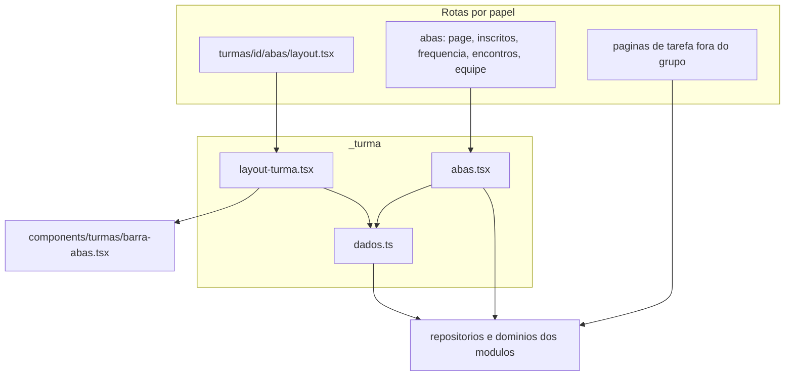

# Design Document

## Overview
**Purpose**: Esta feature organiza a página de uma turma em abas por rota, para que a coordenação e os catequistas achem rápido o que procuram, inclusive no celular.
**Users**: A coordenação e os catequistas responsáveis, ao abrir uma turma.
**Impact**: Hoje a página `/{papel}/turmas/[id]` empilha de cinco a oito blocos. Ela passa a ter um cabeçalho e uma barra de abas (Resumo, Inscritos, Frequência, Encontros, Equipe e link), e cada aba é uma página própria. As páginas de tarefa (chamada, visitantes, criar e editar encontro, editar turma, fila e revisão de ficha) ficam sem abas, com um link de volta. Não há mudança de dados, de regra de negócio nem de acesso.

### Goals
- Cabeçalho e barra de abas iguais para os dois papéis, com a aba atual identificada e a quantidade de fichas pendentes (1, 11).
- Cada bloco atual vai para uma aba, sem mudar o comportamento (2 a 6, 10).
- As ações voltam para a aba onde o resultado aparece (8) e as páginas de tarefa têm link de volta (7).
- O acesso continua checado em cada aba e em cada página de tarefa (9).

### Non-Goals
- Novas funcionalidades, dados ou abas; mudar regras de acesso, de inscrição, de frequência ou de autocadastro; redesenhar a lista de turmas.

## Boundary Commitments

### This Spec Owns
- A estrutura de rotas das cinco abas, o layout compartilhado, o cabeçalho da turma e a barra de abas.
- A distribuição dos blocos existentes pelas abas e o indicador de pendentes.
- Os textos e destinos dos links de volta das páginas de tarefa.
- Os **destinos** dos redirects das ações da turma e do autocadastro (o caminho da aba), não a lógica das ações.
- O tradutor de avisos das abas (`avisoDaTurma`).

### Out of Boundary
- Regras e dados de turmas, inscrições, catequistas, encontros, presença e autocadastro.
- O conteúdo interno dos blocos (`DadosTurma`, `Inscritos`, `SecaoLink`, `ProximoEncontro`, `FrequenciaTurma`, `Cronograma`).
- A lista de turmas, o formulário de turma e as páginas de tarefa, além do link de volta.

### Allowed Dependencies
- A camada `src/app/(interno)/**` (layouts, páginas e `_turma`) pode importar repositórios, domínios e componentes dos módulos, como as páginas atuais fazem; é a camada de composição.
- `@/modules/auth/dal` (`requireRole`), `@/modules/turmas/acesso` (`podeVerTurma`), `@/modules/programa/repositorio` (`dadosDaTurma`, `listarEncontros`), `@/modules/autocadastro/repositorio` (`obterLinkDaTurma`), `next/navigation`, `react` (`cache`).
- Proibido: módulos de domínio (`src/modules/**`) importarem de `src/app/(interno)/_turma`. As ações só ganham caminhos novos, sem importar a UI.

### Revalidation Triggers
- Mudança nos caminhos das abas (`inscritos`, `frequencia`, `encontros`, `equipe`): afeta as ações de `turmas` e de `autocadastro` e qualquer link para a turma.
- Mudança no contrato de `SecaoLink`, `Inscritos`, `DadosTurma` ou `Cronograma`.
- A divisão de `BlocoFrequenciaDaTurma` (`controle-presenca`) e o cabeçalho de `PaginaCronograma` (`programa-catequese`).
- Qualquer nova ação da turma que redirecione para a página principal: deve escolher a aba.

## Architecture

### Existing Architecture Analysis
- Páginas por papel finas, componentes compartilhados em `_encontros`, `_presenca` e `_pendentes`; `requireRole` com o caminho exato em cada rota; `?aviso=` para confirmações.
- A página principal hoje busca todos os dados de todos os blocos, mesmo os que o usuário não vê no momento.
- Layouts do Next não re-renderizam entre rotas irmãs: o acesso fica em cada página (ver `research.md`).

### Architecture Pattern & Boundary Map


**Architecture Integration**:
- **Padrão escolhido**: layout em grupo de rotas `(abas)` + páginas finas por papel + componentes compartilhados, o mesmo desenho das specs anteriores.
- **Direção de dependência**: rotas por papel → `_turma` → componentes e módulos. Os módulos não conhecem a UI.
- **Padrões preservados**: `requireRole` com caminho exato; `?aviso=`; textos em `mensagens.ts`; ações em Server Actions.
- **Componentes novos**: `BarraAbas` (cliente), `CabecalhoTurma`, `LayoutDaTurma`, as cinco abas, `avisoDaTurma` e `carregarTurmaDaAba`.
- **Conformidade com o steering**: TypeScript strict, sem `any`; design system "Acolhedor"; toda regra testada.

### Technology Stack

| Layer | Choice / Version | Role in Feature | Notes |
|-------|------------------|-----------------|-------|
| Frontend | Next.js 16 (App Router), React Server Components | Layout em grupo de rotas e páginas das abas | Um componente cliente só para a barra |
| Navegação | `useSelectedLayoutSegment` (`next/navigation`) | Identifica a aba atual | Sem estado próprio |
| Backend | Server Actions existentes | Só mudam os destinos de redirect | Sem rota de API |
| Testes | Vitest, Playwright | Barra, páginas das abas e navegação | Viewport de 360 px no e2e |

## File Structure Plan

### Directory Structure
```
src/app/(interno)/_turma/
├── abas-config.ts      # Papel e ABAS (rótulos e segmentos): módulo puro, importável por componente cliente
├── dados.ts            # carregarTurmaDaAba, cabecalhoDaTurma (cache), avisoDaTurma; reexporta Papel e ABAS
├── layout-turma.tsx    # LayoutDaTurma: autoriza, lê nome e pendentes, renderiza cabeçalho, barra e children
└── abas.tsx            # AbaResumo, AbaInscritos, AbaFrequencia, AbaEquipe (as quatro abas novas); AbaEncontros usa PaginaCronograma
src/components/turmas/
├── barra-abas.tsx      # "use client": nav com links, aria-current e contagem de pendentes
└── cabecalho-turma.tsx # link "← Voltar para as turmas" (ou "minhas turmas") e h1 com o nome da turma
src/app/(interno)/coordenacao/turmas/[id]/(abas)/
├── layout.tsx          # fino: chama LayoutDaTurma com papel "coordenacao"
├── page.tsx            # Resumo (movida de turmas/[id]/page.tsx)
├── inscritos/page.tsx
├── frequencia/page.tsx
├── encontros/page.tsx  # movida de turmas/[id]/encontros/page.tsx
└── equipe/page.tsx
src/app/(interno)/catequista/turmas/[id]/(abas)/   # mesma estrutura, papel "catequista"
src/app/(interno)/catequista/turmas/[id]/not-found.tsx   # turma não encontrada, link para "minhas turmas"
tests/unit/components/turmas/barra-abas.test.tsx
tests/integration/turmas/abas.test.ts
tests/e2e/abas-turma.spec.ts
```

### Modified Files
- `src/app/(interno)/_encontros/paginas.tsx`: em `PaginaCronograma`, remove o link de volta e o `h1` da turma (viram o cabeçalho do layout), usa `h2` "Encontros" com "Novo encontro"; nas páginas de novo e de editar, o link passa a "← Voltar para Encontros".
- `src/app/(interno)/_presenca/blocos.tsx`: divide `BlocoFrequenciaDaTurma` em `BlocoChamadaDeHoje` e `BlocoFrequenciaDaTurma`; `hrefOrdenar` aponta para `/{papel}/turmas/{id}/frequencia?ordem=`.
- `src/app/(interno)/_presenca/paginas.tsx`: o link de volta da chamada passa a "← Voltar para Encontros" (o de visitantes continua "Voltar para a chamada").
- `src/app/(interno)/_pendentes/paginas.tsx`: a fila volta para `/{area}/turmas/{id}/equipe` ("Voltar para Equipe e link"); a revisão continua voltando para a fila.
- `src/app/(interno)/coordenacao/turmas/[id]/editar/page.tsx`: link de volta "← Voltar para Resumo".
- `src/modules/turmas/actions.ts`: destinos de inscrever e desligar → `/inscritos`; designar e remover → `/equipe`; criar, editar e encerrar continuam na principal.
- `src/modules/autocadastro/actions.ts`: `paginaDaTurma(sessao, turmaId, aba?)`; ações de link → `equipe`; confirmar ficha → `inscritos`; confirmar e descartar chamam `revalidatePath(base, "layout")`.
- `src/app/globals.css`: estilos da barra de abas (bloco "Abas da turma", só acréscimo).
- Testes existentes que procuram blocos na página principal (lista em Testing Strategy).

## System Flows

### Abrir uma turma e trocar de aba
```mermaid
sequenceDiagram
    participant U as Usuário
    participant L as layout (abas)
    participant P as página da aba
    U->>L: abre /papel/turmas/id
    L->>L: requireRole e podeVerTurma
    L->>L: nome da turma e pendentes
    L-->>U: cabeçalho e barra de abas
    P->>P: requireRole e podeVerTurma
    P->>P: carrega só os dados da aba
    P-->>U: conteúdo da aba Resumo
    U->>P: clica em outra aba
    Note over L,P: o layout é mantido; só a página troca
    P->>P: requireRole e podeVerTurma
    P-->>U: conteúdo da nova aba
```

Decisões do fluxo:
- O layout checa o acesso porque numa carga direta ele roda junto com a página; cada página checa de novo porque o layout não re-renderiza ao trocar de aba.
- Cada página carrega só os dados da própria aba.

### Retorno das ações
| Ação | Destino |
|------|---------|
| Criar, editar, encerrar turma | `/{papel}/turmas/{id}` (Resumo) |
| Inscrever, desligar, confirmar ficha | `/{papel}/turmas/{id}/inscritos` |
| Designar, remover catequista; gerar, desativar, regenerar link; alterar expiração | `/{papel}/turmas/{id}/equipe` |
| Ações de encontro, chamada, visitantes; corrigir ou descartar ficha | continuam voltando para a própria página |

## Requirements Traceability

| Requirement | Summary | Components | Interfaces | Flows |
|-------------|---------|------------|------------|-------|
| 1.1 | Cabeçalho e barra ao abrir a turma | LayoutDaTurma, CabecalhoTurma, BarraAbas | `LayoutDaTurma` | Abrir a turma |
| 1.2 | Cinco abas na ordem, nos dois papéis | BarraAbas, `ABAS` | `ABAS` | — |
| 1.3 | Endereço principal mostra o Resumo | `(abas)/page.tsx`, AbaResumo | — | Abrir a turma |
| 1.4 | Aba atual por texto e atributo | BarraAbas | `aria-current` | — |
| 1.5 | Endereço próprio por aba | estrutura de rotas | — | — |
| 1.6 | Contagem de pendentes na aba Equipe e link | LayoutDaTurma, BarraAbas | `pendentes` | — |
| 1.7 | Mesmo cabeçalho e barra ao trocar de aba | layout do grupo `(abas)` | — | Abrir a turma |
| 2.1 | Dados da turma no Resumo | AbaResumo, DadosTurma | — | — |
| 2.2 | Próximo encontro com link para Encontros | AbaResumo, ProximoEncontro | — | — |
| 2.3 | Encontro de hoje com link da chamada | AbaResumo, BlocoChamadaDeHoje | `BlocoChamadaDeHoje` | — |
| 2.4 | Editar e Encerrar só para a coordenação | AbaResumo | — | — |
| 2.5 | Turma encerrada sem ações | AbaResumo | — | — |
| 3.1 | Inscritos vigentes e anteriores | AbaInscritos, Inscritos | — | — |
| 3.2 | Inscrever e desligar para a coordenação | AbaInscritos | — | Retorno das ações |
| 3.3 | Busca de inscrição na própria aba | AbaInscritos | `?q=` | — |
| 3.4 | Catequista só consulta | AbaInscritos | — | — |
| 3.5 | Turma encerrada sem ações | AbaInscritos | — | — |
| 4.1 | Frequência da turma e lista | AbaFrequencia, BlocoFrequenciaDaTurma | — | — |
| 4.2 | Ordenação na própria aba | AbaFrequencia | `?ordem=` | — |
| 4.3 | Consultável em turma encerrada | AbaFrequencia | — | — |
| 4.4 | "Sem encontros registrados" | FrequenciaTurma (existente) | — | — |
| 5.1 | Cronograma na aba Encontros | `(abas)/encontros/page.tsx`, PaginaCronograma | — | — |
| 5.2 | Cabeçalho e barra com Encontros ativa | layout do grupo | — | Abrir a turma |
| 5.3 | Turma encerrada só consulta | PaginaCronograma (existente) | — | — |
| 6.1 | Catequistas responsáveis | AbaEquipe | — | — |
| 6.2 | Designar e remover para a coordenação | AbaEquipe | — | Retorno das ações |
| 6.3 | Bloco do link de autocadastro | AbaEquipe, SecaoLink | — | — |
| 6.4 | Pendentes e link para a fila | AbaEquipe, SecaoLink | — | — |
| 6.5 | Turma encerrada sem ações | AbaEquipe | — | — |
| 7.1 | Páginas de tarefa sem cabeçalho e abas | rotas fora do grupo `(abas)` | — | — |
| 7.2 | Links de volta com os textos definidos | páginas de tarefa modificadas | — | — |
| 7.3 | Voltar mostra a página de origem | páginas de tarefa | — | — |
| 8.1 | Criar, editar, encerrar → Resumo | `turmas/actions.ts` | `redirect` | Retorno das ações |
| 8.2 | Inscrever, desligar → Inscritos | `turmas/actions.ts` | `redirect` | Retorno das ações |
| 8.3 | Designar, remover → Equipe e link | `turmas/actions.ts` | `redirect` | Retorno das ações |
| 8.4 | Ações do link → Equipe e link | `autocadastro/actions.ts` | `paginaDaTurma` | Retorno das ações |
| 8.5 | Confirmar ficha → Inscritos | `autocadastro/actions.ts` | `paginaDaTurma` | Retorno das ações |
| 8.6 | Demais retornos inalterados | ações de encontro, chamada, visitantes e fichas | — | — |
| 8.7 | Mensagem no topo da aba | páginas das abas, `avisoDaTurma` | `avisoDaTurma` | — |
| 9.1 | Acesso em cada aba e página de tarefa | `carregarTurmaDaAba`, LayoutDaTurma | `carregarTurmaDaAba` | Abrir a turma |
| 9.2 | Catequista sem acesso → "Acesso negado" | `carregarTurmaDaAba` | `podeVerTurma` | — |
| 9.3 | Turma inexistente → não encontrada para a coordenação; "Acesso negado" para o catequista (a regra de acesso nega antes de saber se a turma existe) | `not-found.tsx` por papel; `podeVerTurma` | — | — |
| 9.4 | Só as ações que o papel já tinha | abas por papel | — | — |
| 9.5 | Mesma estrutura para os dois papéis | `_turma` compartilhado | — | — |
| 10.1 | Tudo continua disponível em alguma aba | distribuição dos blocos | — | — |
| 10.2 | Endereços existentes continuam | rotas movidas sem mudar a URL | — | — |
| 10.3 | Links existentes chegam à turma | links existentes para a principal | — | — |
| 10.4 | Parâmetros antigos ignorados na principal | `(abas)/page.tsx` | — | — |
| 11.1 | pt-BR e design system | BarraAbas, CabecalhoTurma, CSS | — | — |
| 11.2 | 360 px, abas quebram em linhas | CSS da barra | — | — |
| 11.3 | Teclado com foco visível | BarraAbas (links nativos) | — | — |
| 11.4 | Área de toque de 44 px | CSS da barra | — | — |
| 11.5 | Datas e horários no formato brasileiro | blocos existentes | — | — |

## Components and Interfaces

| Component | Layer | Intent | Req Coverage | Key Dependencies (P0/P1) | Contracts |
|-----------|-------|--------|--------------|--------------------------|-----------|
| `BarraAbas` | UI (cliente) | Links das abas com aba atual e contagem | 1.2, 1.4, 1.6, 11.3, 11.4 | `next/navigation` (P0) | State |
| `CabecalhoTurma` | UI | Link de volta e nome da turma | 1.1 | — | — |
| `LayoutDaTurma` | App (servidor) | Autoriza, lê nome e pendentes, monta cabeçalho e barra | 1.1, 1.6, 1.7, 9.1 | `dados.ts` (P0) | Service |
| `carregarTurmaDaAba` / `cabecalhoDaTurma` / `avisoDaTurma` / `ABAS` | App (servidor) | Acesso, dados do cabeçalho e avisos compartilhados | 8.7, 9.1, 9.2 | auth/dal, turmas/acesso, programa/repositorio, autocadastro/repositorio (P0) | Service |
| `AbaResumo`, `AbaInscritos`, `AbaFrequencia`, `AbaEquipe` | App (servidor) | Conteúdo de cada aba, por papel | 2 a 6, 9.4 | blocos existentes (P0) | Service |
| Rotas por papel | App | Finas: `requireRole` e delegação | 1.3, 1.5, 9.1 | `_turma` (P0) | — |

### App

#### `_turma/dados.ts`

| Field | Detail |
|-------|--------|
| Intent | Acesso e dados compartilhados pelo layout e pelas abas |
| Requirements | 8.7, 9.1, 9.2, 9.3 |

**Contracts**: Service [x]

```typescript
export type Papel = "coordenacao" | "catequista";

export const ABAS: readonly {
  rotulo: "Resumo" | "Inscritos" | "Frequência" | "Encontros" | "Equipe e link";
  segmento: null | "inscritos" | "frequencia" | "encontros" | "equipe";
}[];

export interface CabecalhoDaTurma {
  nome: string;
  encerrada: boolean;
  pendentes: number;
}

/** Autoriza (requireRole e podeVerTurma) e devolve a sessão; sem acesso, redireciona para /acesso-negado. */
export function carregarTurmaDaAba(papel: Papel, turmaId: string, caminho: string): Promise<SessaoUsuario>;

/** Nome, situação e fichas pendentes; null se a turma não existe. Usa cache de requisição. */
export function cabecalhoDaTurma(turmaId: string): Promise<CabecalhoDaTurma | null>;

/** Traduz `?aviso=` com as mensagens de turmas e, depois, de autocadastro; null se desconhecido. */
export function avisoDaTurma(codigo: string | string[] | undefined): string | null;
```
- Pré-condições: `caminho` é o endereço exato da página (usado como retorno do login).
- Pós-condições: nenhum dado da turma é lido antes de `podeVerTurma` passar.

#### `_turma/layout-turma.tsx`

| Field | Detail |
|-------|--------|
| Intent | Cabeçalho persistente e barra de abas das cinco páginas |
| Requirements | 1.1, 1.6, 1.7, 9.1 |

```typescript
export function LayoutDaTurma(props: {
  papel: Papel;
  turmaId: string;
  children: React.ReactNode;
}): Promise<React.ReactElement>;
```
- Chama `carregarTurmaDaAba` com a base da turma, lê `cabecalhoDaTurma` (null → `notFound()`), e renderiza `CabecalhoTurma`, `BarraAbas` e `children`.
- Não lê `searchParams`.

#### `_turma/abas.tsx`

| Field | Detail |
|-------|--------|
| Intent | Conteúdo das abas Resumo, Inscritos, Frequência e Equipe e link |
| Requirements | 2.1 a 2.5, 3.1 a 3.5, 4.1 a 4.4, 6.1 a 6.5, 9.4, 9.5 |

```typescript
type PropsAba = { papel: Papel; turmaId: string; aviso: string | string[] | undefined };

export function AbaResumo(p: PropsAba): Promise<React.ReactElement>;
export function AbaInscritos(p: PropsAba & { termo: string }): Promise<React.ReactElement>;
export function AbaFrequencia(p: PropsAba & { ordem: OrdemFrequencia }): Promise<React.ReactElement>;
export function AbaEquipe(p: PropsAba): Promise<React.ReactElement>;
```
- Cada função chama `carregarTurmaDaAba` antes de ler dados, usa `avisoDaTurma` no topo e mostra as ações de alteração só para `papel === "coordenacao"` em turma aberta (como a página atual).
- `AbaResumo`: `DadosTurma`, `ProximoEncontro` (link para `encontros`), `BlocoChamadaDeHoje` e, para a coordenação, "Editar" e "Encerrar".
- `AbaInscritos`: seção "Inscrever catequizando" (coordenação, turma aberta) e `Inscritos`; a busca por `?q=` fica na própria aba.
- `AbaFrequencia`: `BlocoFrequenciaDaTurma` com `hrefOrdenar` para `/frequencia?ordem=`.
- `AbaEquipe`: seção "Catequistas" (com designar e remover para a coordenação) e `SecaoLink` com as ações de link e o link para a fila (`/pendentes`).
- A aba Encontros é `PaginaCronograma` (sem mudar a assinatura).

#### Rotas por papel
- `(abas)/layout.tsx`: `LayoutDaTurma` com o papel.
- Cada `page.tsx` chama `requireRole` com o caminho exato e delega à aba; só a página principal ignora `?q` e `?ordem`.

### UI

#### `BarraAbas`

| Field | Detail |
|-------|--------|
| Intent | Navegação entre as abas com a atual identificada |
| Requirements | 1.2, 1.4, 1.6, 11.1 a 11.4 |

**Contracts**: State [x]

```typescript
export function BarraAbas(props: { base: string; pendentes: number }): React.ReactElement;
```
- Componente cliente. Usa `useSelectedLayoutSegment()`: `null` é Resumo; os demais valores casam com `ABAS`.
- Renderiza `<nav aria-label="Seções da turma">` com uma lista de `Link`; a atual leva `aria-current="page"` e destaque visual com texto (peso e borda), nunca só cor.
- Quando `pendentes > 0`, o item "Equipe e link" mostra a contagem ao lado do nome e texto oculto visualmente para leitores de tela ("N fichas pendentes").
- CSS: itens em linha com quebra (`flex-wrap`), altura mínima de 44 px, foco visível, sem rolagem horizontal a partir de 360 px.

#### `CabecalhoTurma`
- Props: `{ papel: Papel; nome: string }`. Mostra "← Voltar para as turmas" (coordenação) ou "← Voltar para minhas turmas" (catequista) e o `h1` com o nome.

**Implementation Notes**
- Integração: a barra e o cabeçalho ficam no layout; os avisos ficam em cada página, logo abaixo da barra (8.7).
- Validação: `?ordem=` continua normalizado por `ordemDaBusca`.
- Risco: a contagem de pendentes só se atualiza ao entrar no grupo ou quando uma ação revalida o layout.

## Data Models
Sem mudanças. A feature não cria nem altera tabelas, e lê os dados que as abas já liam.

## Error Handling

### Error Strategy
Manter o tratamento atual: acesso negado por redirect, turma inexistente por `notFound()` e erros de ação por mensagem no formulário.

### Error Categories and Responses
- **Permissão**: sem acesso à turma → "Acesso negado", em qualquer aba ou página de tarefa, antes de ler dados (9.1, 9.2).
- **Não encontrado**: turma inexistente → para a coordenação, `turmas/[id]/not-found.tsx` (o `notFound()` do layout e o das abas caem nele); para o catequista, `podeVerTurma` nega antes e a tela é "Acesso negado", sem revelar se a turma existe (9.3); encontro inexistente → `encontros/not-found.tsx`, como hoje (9.3).
- **Aviso desconhecido**: `?aviso=` inválido não gera mensagem.

### Monitoring
Sem novos logs. As ações mantêm os logs atuais.

## Testing Strategy

### Unit Tests
- `BarraAbas`: cinco itens na ordem com os hrefs certos; `aria-current="page"` só na aba do segmento (null → Resumo; "inscritos", "frequencia", "encontros", "equipe"); contagem só em "Equipe e link" e só quando maior que zero, com texto oculto para leitor de tela; sem `role="tablist"`.
- `avisoDaTurma`: mensagens de turmas, depois de autocadastro; desconhecido e array.
- `blocos`: `BlocoChamadaDeHoje` e `BlocoFrequenciaDaTurma` (hrefOrdenar na aba `frequencia`).

### Integration Tests
- `tests/integration/turmas/abas.test.ts`: renderiza cada aba nos dois papéis com banco real e sessão simulada: conteúdo certo em cada aba e ações só para a coordenação em turma aberta; turma encerrada sem ações; catequista de outra turma → "Acesso negado" em cada aba; turma inexistente → não encontrada; página principal ignora `?q` e `?ordem`; contagem de pendentes no layout.
- Redirects: designar e remover → `/equipe`; inscrever e desligar → `/inscritos`; ações do link → `/equipe`; confirmar ficha → `/inscritos` com revalidação do layout; descartar e corrigir ficha continuam na fila e na revisão.
- Atualizar `paginas-turma-ficha.test.ts`, `cronograma-chamada.test.ts`, `pagina-chamada.test.ts`, `designacoes-actions.test.ts`, `inscricoes-actions.test.ts`, `autocadastro/actions-link.test.ts` e `actions-confirmacao.test.ts` para os novos destinos e textos.

### E2E/UI Tests
- `tests/e2e/abas-turma.spec.ts`: a coordenação abre uma turma, percorre as cinco abas e confere o conteúdo e a aba atual; inscreve um catequizando e volta para Inscritos com a confirmação; designa um catequista e volta para Equipe e link; abre "Fazer chamada" e usa "Voltar para Encontros".
- 360 px: a barra quebra em linhas e a página não rola na horizontal, nas cinco abas.
- Teclado: percorrer as abas com Tab e abrir uma com Enter.
- Catequista: vê as cinco abas, sem ações de alteração; a contagem de pendentes aparece na aba Equipe e link.
- Atualizar `turmas.spec.ts`, `autocadastro.spec.ts`, `programa.spec.ts`, `presenca.spec.ts`, `presenca-visitante.spec.ts` e `presenca-limite.spec.ts` para as abas.

## Security Considerations
- O acesso por turma é checado no layout e em cada página de aba e de tarefa, a cada requisição; nenhuma checagem fica só no layout.
- O layout só lê o nome da turma e a contagem de pendentes depois de `podeVerTurma`.
- Nenhuma ação nova e nenhuma permissão nova: o catequista não ganha acesso a nada.
- Os caminhos de redirect são montados no servidor a partir do papel da sessão e do id validado, sem aceitar destino vindo do cliente.
