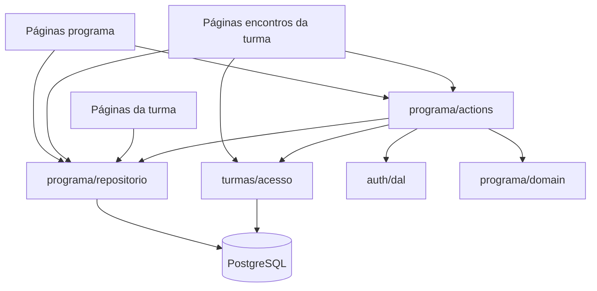
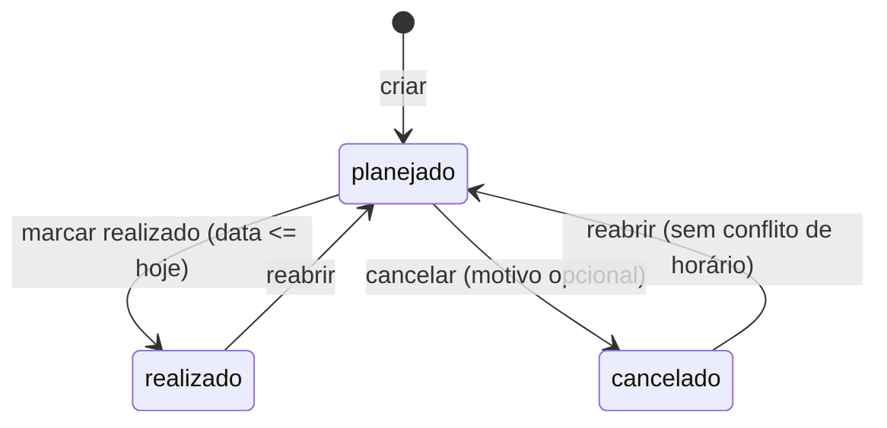
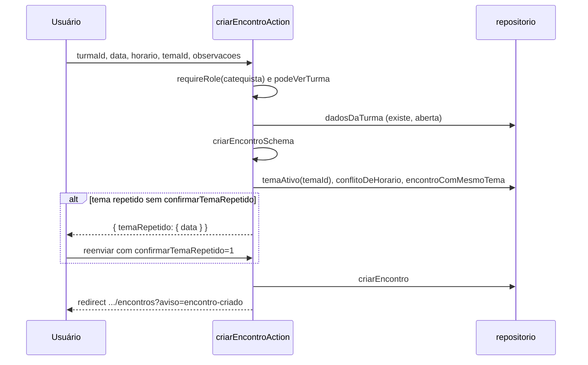

# Design: programa-catequese

## Overview
Esta spec registra o programa da catequese e os encontros das turmas:
- a coordenação mantém o **programa comum**, uma lista única e ordenada de temas;
- cada turma ganha um **cronograma de encontros**, com data, horário, tema opcional e situação (planejado, realizado ou cancelado);
- a coordenação gerencia os encontros de todas as turmas, e o catequista, os das turmas em que é responsável;
- encontros de turmas diferentes sobre o mesmo tema ficam **equivalentes**, base para a reposição em `controle-presenca`.

A autorização reutiliza `podeVerTurma`, publicado por `gestao-turmas`. As decisões estão em `research.md`.

### Goals
- Programa ordenado, com temas desativáveis sem perder histórico.
- Cronograma por turma com transições de situação explícitas e testáveis.
- Progresso da turma e equivalência entre turmas calculados a partir do tema.

### Non-Goals
- Chamada, frequência e reposição.
- Materiais, anexos e calendário externo.
- Programas por ciclo ou por turma.
- Mudança automática de situação pela data.

## Boundary Commitments

### This Spec Owns
- As tabelas `tema` e `encontro`, o enum `SituacaoEncontro` e os índices `tema_chave_unica` e `encontro_horario_unico`.
- O módulo `src/modules/programa`: domain, repositório, actions e mensagens.
- A UI em `src/app/(interno)/coordenacao/programa/**`, `src/app/(interno)/catequista/programa/**`, `src/app/(interno)/coordenacao/turmas/[id]/encontros/**`, `src/app/(interno)/catequista/turmas/[id]/encontros/**` e `src/components/programa/**`.
- O bloco "Próximo encontro" nas páginas da turma (coordenação e catequista).
- O item de menu "Programa".
- A função `formatarDataComDia` em `compartilhado/datas`.

### Out of Boundary
- Turmas, designações e inscrições, e a regra de acesso por turma (`gestao-turmas`).
- Presença, frequência e reposição (`controle-presenca`).

### Allowed Dependencies
- `@/modules/auth/dal` (`requireRole`) e `@/modules/auth/domain/papeis`.
- `@/modules/turmas/acesso` (`podeVerTurma`), conforme a exceção do `structure.md`. Nenhum outro arquivo de `@/modules/turmas`.
- `@/modules/compartilhado/*` e `@/components/comum/*`.
- A tabela `turma` é **lida** pelo repositório do programa (nome, horário, encerramento). O programa nunca escreve nela.
- A camada `app` compõe `programa` com `turmas` nas páginas da turma (bloco "Próximo encontro").

### Revalidation Triggers
- Mudança em `podeVerTurma` ou na forma de encerrar turmas: revalidar as actions e páginas de encontros.
- Mudança no contrato de equivalência (`encontrosEquivalentes`) ou na situação do encontro: revalidar `controle-presenca`.
- Mudança em `formatarDataComDia`: revalidar as telas que a usam.

## Architecture

### Architecture Pattern & Boundary Map


### Technology Stack

| Camada | Escolha | Papel |
|---|---|---|
| Web | Next.js 16 | Páginas e Server Actions |
| Dados | Prisma 7 + PostgreSQL 17 | Tabelas e índices (SQL manual na migração) |
| Validação | Zod 4 | Schemas de tema e de encontro |
| Testes | Vitest + Playwright | Ver Testing Strategy |

## File Structure Plan

### Directory Structure
```
src/modules/programa/
├── domain/
│   ├── tema.ts         # criarTemaSchema, chaveDoTitulo, numerarTemas, vizinhoParaMover
│   ├── encontro.ts     # SITUACOES, ROTULO_SITUACAO, criarEncontroSchema, motivoSchema, TRANSICOES, podeEditar, validarRealizacao, aguardandoConfirmacao, proximoEncontro, ordenarEncontros
│   └── progresso.ts    # calcularProgresso (realizados, total, pendentes)
├── repositorio.ts      # server-only: temas, encontros, dados da turma, equivalentes
├── actions.ts          # "use server": ações de tema e de encontro
└── mensagens.ts        # códigos de aviso e textos
src/components/programa/
├── lista-temas.tsx          # programa ordenado; com `gestao`, botões subir/descer, editar, desativar/reativar, excluir
├── formulario-tema.tsx
├── acoes-tema.tsx           # Confirmacao: desativar, reativar, excluir
├── encontros-equivalentes.tsx
├── cronograma.tsx           # lista cronológica, "Próximo encontro", "Aguardando confirmação", ações opcionais
├── formulario-encontro.tsx  # data, horário, tema, observações; aviso de tema repetido
├── acoes-encontro.tsx       # Confirmacao: realizado, cancelar (motivo), reabrir
├── progresso-turma.tsx      # "{realizados} de {total} temas" + temas pendentes (details)
└── proximo-encontro.tsx     # bloco da página da turma
src/app/(interno)/coordenacao/programa/
├── page.tsx
├── novo/page.tsx
└── [temaId]/{page.tsx, editar/page.tsx, not-found.tsx}
src/app/(interno)/catequista/programa/page.tsx
src/app/(interno)/coordenacao/turmas/[id]/encontros/
├── page.tsx
├── novo/page.tsx
└── [encontroId]/editar/page.tsx
src/app/(interno)/catequista/turmas/[id]/encontros/
├── page.tsx
├── novo/page.tsx
└── [encontroId]/editar/page.tsx
tests/unit/programa/{tema,encontro,progresso,mensagens}.test.ts
tests/unit/compartilhado/datas.test.ts            # caso novo de formatarDataComDia
tests/unit/components/programa/*.test.tsx
tests/integration/programa/{helpers,repositorio,temas-actions,encontros-actions}.test.ts
tests/e2e/programa.spec.ts
```

### Modified Files
- `prisma/schema.prisma` e a migração `*_programa`: enum, modelos, relação `Turma.encontros` (só campo de relação) e o SQL dos índices.
- `tests/integration/setup.ts` e `tests/e2e/preparar-banco.ts`: incluir `encontro` e `tema` no TRUNCATE.
- `src/modules/compartilhado/datas.ts`: `formatarDataComDia`.
- `src/components/layout/menu-por-papel.ts` e os testes do menu e do app-shell: "Programa" para os dois papéis.
- `src/app/(interno)/coordenacao/turmas/[id]/page.tsx` e `src/app/(interno)/catequista/turmas/[id]/page.tsx`: bloco `ProximoEncontro` com link para o cronograma.
- `src/app/globals.css`: estilos do programa e do cronograma.

## System Flows

### Situação do encontro


### Criação de encontro com tema repetido


## Requirements Traceability

| Req | Componentes | Verificação |
|---|---|---|
| 1.1, 1.5 | actions de tema (`requireRole(["coordenacao"])`) | integração |
| 1.2 | `/coordenacao/programa`, `/catequista/programa` | e2e |
| 1.3, 1.4, 1.5 | actions e páginas de encontro (`requireRole` + `podeVerTurma`) | integração, e2e |
| 1.6 | menu-por-papel | unit |
| 2.1–2.4 | domain/tema, `chaveEmUso`, criar e editar tema, FormularioTema | unit, integração |
| 2.5 | `atualizarTema` (encontros leem o tema por relação) | integração |
| 2.6 | `vizinhoParaMover`, `moverTema` (transação), `numerarTemas` | unit, integração |
| 2.7, 3.6 | ListaTemas, `listarTemas` (contagem), `numerarTemas` | unit (componente), integração |
| 3.1–3.5 | desativar, reativar, excluir; AcoesTema | integração, unit (componente) |
| 4.1–4.4, 4.9 | criarEncontroSchema, `temasParaSelecao`, FormularioEncontro | unit, integração |
| 4.5, 4.6 | `encontroComMesmoTema`, `confirmarTemaRepetido` | integração, unit (componente), e2e |
| 4.7 | índice `encontro_horario_unico`, `conflitoDeHorario` | integração |
| 4.8, 5.7 | `podeEditar`, editarEncontroAction | unit, integração |
| 5.1–5.5, 5.8 | TRANSICOES, `validarRealizacao`, `mudarSituacao`, AcoesEncontro | unit, integração |
| 5.6 | `aguardandoConfirmacao`, Cronograma | unit |
| 6.1, 6.2, 6.6, 6.7 | `ordenarEncontros`, `proximoEncontro`, Cronograma, páginas | unit, e2e |
| 6.3 | ProximoEncontro nas páginas da turma | unit (componente), e2e |
| 6.4, 6.5 | `calcularProgresso`, ProgressoTurma | unit |
| 7.1, 7.2 | actions recusam turma encerrada; páginas sem ações | integração, e2e |
| 8.1–8.3 | `encontrosEquivalentes`, EncontrosEquivalentes, `/coordenacao/programa/[temaId]` | integração, e2e |
| 9.1–9.4 | UI, `formatarDataComDia`, `formatarHorario` | unit, e2e |

## Components and Interfaces

### Domínio (`src/modules/programa/domain`)

#### tema.ts
```ts
export interface TemaDados { titulo: string; descricao?: string } // titulo trim 2–120; descricao trim até 2000, "" → undefined
export function criarTemaSchema(): z.ZodType<TemaDados>;
export function chaveDoTitulo(titulo: string): string;        // normalizarBusca(titulo)
export function numerarTemas<T extends { ativo: boolean; posicao: number }>(
  temas: readonly T[]): (T & { numero: number | null })[];   // ativos por posição, 1..n; desativados ao fim, numero null
export function vizinhoParaMover<T extends { id: string; ativo: boolean; posicao: number }>(
  temas: readonly T[], id: string, direcao: "subir" | "descer"): T | null; // vizinho ativo, ou null no limite
```
Mensagens: "Informe o título", "O título deve ter entre 2 e 120 caracteres", "A descrição deve ter no máximo 2000 caracteres".

#### encontro.ts
```ts
export const SITUACOES = ["planejado", "realizado", "cancelado"] as const;
export type SituacaoEncontro = (typeof SITUACOES)[number];
export const ROTULO_SITUACAO: Record<SituacaoEncontro, string>; // "Planejado", "Realizado", "Cancelado"
export interface EncontroDados { data: DataCivil; horario: string; temaId?: string; observacoes?: string }
export function criarEncontroSchema(): z.ZodType<EncontroDados>; // data obrigatória; horario "HH:MM"; temaId UUID ou "" → undefined; observacoes até 2000
export const motivoSchema: z.ZodType<string | undefined>;        // trim, até 200, "" → undefined
export const TRANSICOES: Record<"realizar" | "cancelar" | "reabrir", { de: readonly SituacaoEncontro[]; para: SituacaoEncontro }>;
export function podeEditar(e: { situacao: SituacaoEncontro }): boolean;            // só planejado
export function validarRealizacao(data: DataCivil, hoje: DataCivil): string | null; // data futura → "Este encontro ainda não aconteceu."
export function aguardandoConfirmacao(e: { situacao: SituacaoEncontro; data: DataCivil }, hoje: DataCivil): boolean;
export function ordenarEncontros<T extends { data: DataCivil; horario: string }>(e: readonly T[]): T[];
export function proximoEncontro<T extends { situacao: SituacaoEncontro; data: DataCivil; horario: string }>(
  e: readonly T[], hoje: DataCivil): T | null;                                      // primeiro planejado com data >= hoje
```
- `TRANSICOES`: realizar `planejado → realizado`; cancelar `planejado → cancelado`; reabrir `realizado | cancelado → planejado`.
- Mensagens: "Informe a data", "Informe um horário válido (ex.: 19:30)", "As observações devem ter no máximo 2000 caracteres", "O motivo deve ter no máximo 200 caracteres".

#### progresso.ts
```ts
export interface Progresso { realizados: number; total: number; pendentes: { id: string; titulo: string; numero: number }[] }
export function calcularProgresso(
  temasAtivos: readonly { id: string; titulo: string; numero: number }[],
  encontros: readonly { temaId: string | null; situacao: SituacaoEncontro }[]): Progresso;
```
`total` é o número de temas ativos; `realizados` conta os temas ativos com ao menos um encontro realizado; `pendentes` é o restante, na ordem do programa (6.4, 6.5, 3.6).

### Módulo (`src/modules/programa`)

#### repositorio.ts (server-only)
```ts
export interface TemaResumo { id: string; titulo: string; descricao: string | null; ativo: boolean; posicao: number; encontros: number }
export interface EncontroResumo {
  id: string; turmaId: string; data: DataCivil; horario: string; situacao: SituacaoEncontro;
  observacoes: string | null; motivoCancelamento: string | null;
  tema: { id: string; titulo: string; ativo: boolean; numero: number | null } | null;
}
export interface DadosTurma { id: string; nome: string; horario: string; encerrada: boolean }
export interface EncontroEquivalente { id: string; turmaId: string; turmaNome: string; data: DataCivil; horario: string; situacao: SituacaoEncontro }

// temas
export function listarTemas(): Promise<TemaResumo[]>;                 // ordenados por posição, com contagem de encontros
export function obterTema(id: string): Promise<TemaResumo | null>;   // id não-UUID → null
export function chaveEmUso(chave: string, ignorarId?: string): Promise<boolean>;
export function criarTema(d: TemaDados): Promise<string>;            // posição = maior + 1, numa transação
export function atualizarTema(id: string, d: TemaDados): Promise<void>;
export function trocarPosicoes(a: string, b: string): Promise<void>; // transação
export function definirAtivo(id: string, ativo: boolean): Promise<boolean>;
export function excluirTema(id: string): Promise<"excluido" | "em-uso" | "inexistente">;
export function temasParaSelecao(incluirId?: string): Promise<{ id: string; titulo: string; numero: number | null; ativo: boolean }[]>; // ativos + o desativado em uso (4.9)
export function encontrosEquivalentes(temaId: string): Promise<EncontroEquivalente[]>; // não cancelados, turmas abertas, cronológico

// encontros
export function dadosDaTurma(turmaId: string): Promise<DadosTurma | null>; // lê a tabela turma
export function listarEncontros(turmaId: string): Promise<EncontroResumo[]>;
export function obterEncontro(id: string): Promise<EncontroResumo | null>;
export function encontroComMesmoTema(turmaId: string, temaId: string, ignorarId?: string): Promise<DataCivil | null>; // não cancelado
export function conflitoDeHorario(turmaId: string, data: DataCivil, horario: string, ignorarId?: string): Promise<boolean>;
export function criarEncontro(turmaId: string, d: EncontroDados): Promise<string>;
export function atualizarEncontro(id: string, d: EncontroDados): Promise<boolean>;  // só se planejado
export function mudarSituacao(id: string, de: readonly SituacaoEncontro[], para: SituacaoEncontro,
  extras?: { motivoCancelamento?: string | null }): Promise<boolean>;            // update condicional; reabrir limpa o motivo
```
- O número exibido de cada tema (`numero`) vem de `numerarTemas`.
- As violações de índice (P2002) em `criarTema`, `atualizarTema`, `criarEncontro`, `atualizarEncontro` e `mudarSituacao` sobem para o chamador.

#### actions.ts ("use server")
```ts
export type EstadoPrograma = {
  errosCampos?: Partial<Record<string, string>>; erro?: string; valores?: Record<string, string>;
  temaRepetido?: { data: string }; // dd/mm/aaaa do encontro existente
};
// temas — requireRole(["coordenacao"])
export async function criarTemaAction(anterior: EstadoPrograma, dados: FormData): Promise<EstadoPrograma>;
export async function editarTemaAction(id: string, anterior: EstadoPrograma, dados: FormData): Promise<EstadoPrograma>;
export async function moverTemaAction(id: string, direcao: "subir" | "descer"): Promise<void>;
export async function desativarTemaAction(id: string, anterior: EstadoPrograma): Promise<EstadoPrograma>;
export async function reativarTemaAction(id: string, anterior: EstadoPrograma): Promise<EstadoPrograma>;
export async function excluirTemaAction(id: string, anterior: EstadoPrograma): Promise<EstadoPrograma>;
// encontros — requireRole(["catequista"]) (aceita a coordenação) e podeVerTurma
export async function criarEncontroAction(turmaId: string, base: string, anterior: EstadoPrograma, dados: FormData): Promise<EstadoPrograma>;
export async function editarEncontroAction(turmaId: string, encontroId: string, base: string, anterior: EstadoPrograma, dados: FormData): Promise<EstadoPrograma>;
export async function marcarRealizadoAction(turmaId: string, encontroId: string, base: string, anterior: EstadoPrograma): Promise<EstadoPrograma>;
export async function cancelarEncontroAction(turmaId: string, encontroId: string, base: string, anterior: EstadoPrograma, dados: FormData): Promise<EstadoPrograma>;
export async function reabrirEncontroAction(turmaId: string, encontroId: string, base: string, anterior: EstadoPrograma): Promise<EstadoPrograma>;
```
- **Todas as actions:**
  - chamam `requireRole` primeiro; as de encontro chamam `podeVerTurma(sessao, turmaId)` em seguida e, se negar, `redirect("/acesso-negado")` (1.4);
  - chamam `redirect` fora do try/catch e registram no log só ids e `e.name`.
- **`base`**: a base do cronograma (`/coordenacao/turmas/{id}/encontros` ou `/catequista/turmas/{id}/encontros`), validada contra os dois prefixos permitidos para o `turmaId` recebido; qualquer outro valor vira a base da coordenação. Os redirects voltam para `{base}?aviso=…`.
- **Encontro:**
  - turma inexistente → `MSG_ERRO_INESPERADO`; turma encerrada → `MSG_TURMA_ENCERRADA` (7.1);
  - o encontro precisa pertencer à turma; senão `MSG_ERRO_INESPERADO`;
  - tema informado precisa estar ativo, exceto quando é o tema atual do encontro em edição (4.9); senão erro de campo `MSG_TEMA_INDISPONIVEL`;
  - conflito de horário → erro de campo em `horario`: `MSG_CONFLITO_HORARIO` (também via P2002);
  - tema repetido sem `confirmarTemaRepetido=1` → `{ temaRepetido }` sem gravar (4.5);
  - editar exige `podeEditar` (5.7); senão `MSG_SO_PLANEJADO`.
- **Situação:** a transição usa `TRANSICOES`; se o update condicional não afetar nenhuma linha, devolve `MSG_SITUACAO_MUDOU`. Realizar checa `validarRealizacao` (5.2). Reabrir um cancelado que conflita devolve `MSG_CONFLITO_HORARIO`.
- **Tema:** título em uso pela `chave` (2.4, inclusive via P2002); excluir um tema em uso devolve `MSG_TEMA_EM_USO`, e a página oferece a desativação (3.4).

#### mensagens.ts
| Código | Texto |
|---|---|
| `tema-criado` | "Tema criado." |
| `alteracoes-salvas` | "Alterações salvas." |
| `tema-desativado` | "Tema desativado." |
| `tema-reativado` | "Tema reativado." |
| `tema-excluido` | "Tema excluído." |
| `encontro-criado` | "Encontro criado." |
| `encontro-realizado` | "Encontro realizado." |
| `encontro-cancelado` | "Encontro cancelado." |
| `encontro-reaberto` | "Encontro reaberto." |

Constantes:
- `MSG_TITULO_EM_USO`: "Já existe um tema com este título."
- `MSG_TEMA_EM_USO`: "Este tema já foi usado em encontros e não pode ser excluído. Você pode desativá-lo."
- `MSG_TEMA_INDISPONIVEL`: "Escolha um tema ativo do programa."
- `MSG_TEMA_REPETIDO(data)`: "Este tema já tem encontro nesta turma em {data}."
- `MSG_CONFLITO_HORARIO`: "Já existe um encontro desta turma nesse dia e horário."
- `MSG_SO_PLANEJADO`: "Só encontros planejados podem ser alterados."
- `MSG_SITUACAO_MUDOU`: "A situação deste encontro mudou. Recarregue a página."
- `MSG_TURMA_ENCERRADA`: "Esta turma está encerrada e não pode ser alterada."
- `MSG_ERRO_INESPERADO` e `mensagemDeAviso(unknown)`, no padrão dos outros módulos.

### UI

#### Componentes (`src/components/programa`)
- **`ListaTemas({ temas, gestao? })`:** lista ordenada com número (ou selo "Desativado"), título como link (para a coordenação, `/coordenacao/programa/{id}`), descrição e "{n} encontros". Com `gestao`, cada ativo tem "Subir" e "Descer" (formulários que chamam `moverTemaAction`; desabilitados no limite), "Editar" e `AcoesTema`.
- **`FormularioTema({ modo, acao, valoresIniciais? })`:** título e descrição, no padrão dos formulários anteriores.
- **`AcoesTema`:** `Confirmacao` para "Desativar" e "Excluir" (nomeando o tema; o excluir só aparece quando o tema não tem encontros) e um botão "Reativar" para desativados.
- **`EncontrosEquivalentes({ encontros, baseTurma })`:** tabela com turma (link), data com dia, horário e situação.
- **`Cronograma({ encontros, hoje, base, acoes? })`:** lista cronológica com data com dia, horário, tema ("{n}. {título}", "Desativado" quando for o caso, ou "Sem tema do programa"), selo de situação, selo "Próximo encontro" e selo "Aguardando confirmação". O motivo aparece nos cancelados. Com `acoes`, cada encontro mostra as ações que a situação permite ("Editar", `AcoesEncontro`).
- **`FormularioEncontro({ modo, acao, temas, valoresIniciais })`:** data, horário (padrão o da turma), `select` de tema com "Sem tema do programa", observações. O estado `temaRepetido` mostra um alerta com `MSG_TEMA_REPETIDO` e o submit "Salvar mesmo assim" (`confirmarTemaRepetido=1`), depois do botão principal.
- **`AcoesEncontro`:** "Marcar como realizado" (botão de formulário), "Cancelar encontro" (`Confirmacao` com campo de motivo como `children`, nomeando data e tema) e "Reabrir" (`Confirmacao` nomeando data e tema). Erros de campo viram `erro` num wrapper, como em `DesligarCatequizando`.
- **`ProgressoTurma({ progresso })`:** "{realizados} de {total} temas" e `<details>` "Ver temas pendentes" com a lista.
- **`ProximoEncontro({ encontro, linkCronograma })`:** data com dia, horário e tema do próximo encontro, ou "Nenhum encontro planejado", com link "Ver cronograma".

#### Páginas
- **`/coordenacao/programa`:** aviso, "Novo tema" e `ListaTemas` com `gestao`. **`/catequista/programa`:** `ListaTemas` sem gestão e sem links (1.2).
- **`/coordenacao/programa/novo`** e **`[temaId]/editar`:** `FormularioTema`.
- **`/coordenacao/programa/[temaId]`:** dados do tema, `AcoesTema` e `EncontrosEquivalentes` (8.2); `notFound()` → "Tema não encontrado".
- **`/{papel}/turmas/[id]/encontros`:** `requireRole`, `podeVerTurma` (nega → `/acesso-negado`), `dadosDaTurma` (inexistente → `notFound()`), `ProgressoTurma`, `Cronograma`; "Novo encontro" e `acoes` só com a turma aberta (6.6, 7.1). O estado vazio mostra "Nenhum encontro planejado" e, com a turma aberta, o link para criar o primeiro.
- **`/{papel}/turmas/[id]/encontros/novo`** e **`[encontroId]/editar`:** `FormularioEncontro`; turma encerrada ou encontro não planejado mostram aviso somente leitura.
- **Páginas da turma:** ganham `ProximoEncontro` com link para o cronograma (6.3).

Todas as páginas chamam `requireRole` com o caminho exato e usam o título "… — Acutis Catequese".

## Data Models

### Physical Data Model
```prisma
enum SituacaoEncontro { planejado realizado cancelado  @@map("situacao_encontro") }

model Tema {
  id        String     @id @default(uuid())
  titulo    String
  chave     String     // normalizarBusca(titulo)
  descricao String?
  posicao   Int
  ativo     Boolean    @default(true)
  createdAt DateTime   @default(now())
  updatedAt DateTime   @updatedAt
  encontros Encontro[]
  @@unique([chave], map: "tema_chave_unica")
  @@index([posicao])
  @@map("tema")
}

model Encontro {
  id                 String           @id @default(uuid())
  turmaId            String
  temaId             String?
  data               DateTime         @db.Date
  horario            String           // "HH:MM"
  observacoes        String?
  situacao           SituacaoEncontro @default(planejado)
  motivoCancelamento String?
  createdAt          DateTime         @default(now())
  updatedAt          DateTime         @updatedAt
  turma              Turma            @relation(fields: [turmaId], references: [id], onDelete: Restrict)
  tema               Tema?            @relation(fields: [temaId], references: [id], onDelete: Restrict)
  @@index([turmaId, data])
  @@index([temaId])
  @@map("encontro")
}
```
SQL manual na migração:
```sql
CREATE UNIQUE INDEX encontro_horario_unico ON encontro ("turmaId", data, horario) WHERE situacao <> 'cancelado';
```
- `Turma.encontros` entra só como campo de relação, sem mudar colunas de `turma`.
- `onDelete: Restrict` no tema garante que um tema usado não seja excluído (3.4).

## Error Handling
- **Validação:** `errosCampos` e `valores`.
- **Regras de negócio:** título em uso, tema indisponível, conflito de horário, tema repetido, só planejado, situação mudou, data futura e turma encerrada voltam como erro, sem gravar.
- **Concorrência (P2002, update condicional sem efeito):** viram a mensagem da regra correspondente.
- **Inexistente:** as páginas chamam `notFound()`; as actions devolvem `MSG_ERRO_INESPERADO`.
- **Acesso negado:** redirect para `/acesso-negado`, nas páginas e nas actions.

## Testing Strategy

### Unit
- **`tema`:** título vazio, curto e longo; descrição longa; `chaveDoTitulo("Batismo")` igual a `chaveDoTitulo("batísmo ")`; `numerarTemas` com desativado no meio (numeração contínua, desativados ao fim); `vizinhoParaMover` nos limites e pulando desativados.
- **`encontro`:** schema (data obrigatória, horário "7:30" e "24:00" recusados, `temaId` vazio → sem tema, observações longas); `TRANSICOES`; `podeEditar`; `validarRealizacao` com data futura, hoje e passada; `aguardandoConfirmacao`; `proximoEncontro` ignorando cancelados, realizados e datas passadas, e escolhendo o mais cedo no mesmo dia pelo horário.
- **`progresso`:** tema realizado duas vezes conta uma; encontro sem tema não conta; tema desativado fora do total; pendentes na ordem do programa.
- **`datas`:** `formatarDataComDia` ("Sábado, 03/10/2026"), inclusive 29/02.
- **`mensagens`:** códigos conhecidos e desconhecidos; `MSG_TEMA_REPETIDO`.
- **Componentes:** `ListaTemas` (numeração, "Desativado", botões desabilitados no limite, sem ações sem `gestao`); `FormularioEncontro` (alerta de tema repetido com o botão depois do principal, tema desativado em uso identificado); `Cronograma` (selos "Próximo encontro" e "Aguardando confirmação", "Sem tema do programa", motivo, ações conforme a situação e ausência sem `acoes`); `AcoesEncontro` (motivo enviado, erro como alerta); `ProgressoTurma`; `ProximoEncontro`; menu dos dois papéis.

### Integração (acutis_test)
- **Repositório:**
  - `chaveEmUso` e o índice `tema_chave_unica` recusando "Batismo" e "batismo";
  - `criarTema` no fim; `trocarPosicoes`; `excluirTema` devolvendo "em-uso" para tema usado (Restrict);
  - `encontro_horario_unico` recusando duplicidade e aceitando quando o primeiro está cancelado;
  - `mudarSituacao` condicional (segunda chamada devolve false); reabrir limpa o motivo;
  - `encontrosEquivalentes` exclui cancelados e turmas encerradas;
  - `temasParaSelecao` inclui o desativado em uso só quando pedido.
- **Actions de tema:** catequista rejeitado em todas; criar e editar com título em uso (com acento e caixa diferentes); mover; desativar e reativar; excluir em uso recusado e não usado excluído.
- **Actions de encontro:**
  - catequista designado aceito; catequista não designado redirecionado para `/acesso-negado` sem gravar; coordenação aceita;
  - turma encerrada recusa todas;
  - criar com tema desativado recusado; tema repetido sem e com confirmação; conflito de horário;
  - editar encontro realizado recusado;
  - realizar com data futura recusado; cancelar com motivo; reabrir realizado e cancelado; reabrir com conflito recusado;
  - `base` inválida cai na base da coordenação.

### E2E
- A coordenação cria três temas, reordena e desativa um; o catequista vê o programa sem ações.
- O catequista designado cria um encontro na turma, recebe o aviso de tema repetido e confirma; marca um encontro passado como realizado; o progresso mostra "1 de 2 temas".
- Cancelar com motivo e reabrir pelo diálogo.
- A página da turma mostra o "Próximo encontro".
- A página do tema lista os encontros de duas turmas (equivalência).
- O catequista não designado vê "Acesso negado" no cronograma de outra turma.
- Uso só com o teclado ao criar um encontro; nenhuma rolagem horizontal a 360 px no programa, no cronograma e no formulário.
- Os e2e das specs anteriores continuam verdes.

## Security Considerations
- Três barreiras: `requireRole` em toda action e página; `podeVerTurma` em toda action e página de encontros; a validação de `base` evita redirect para caminhos arbitrários.
- O acesso é reavaliado a cada requisição; ao perder a designação, o catequista perde o cronograma na próxima página.
- O programa não guarda dados pessoais.
